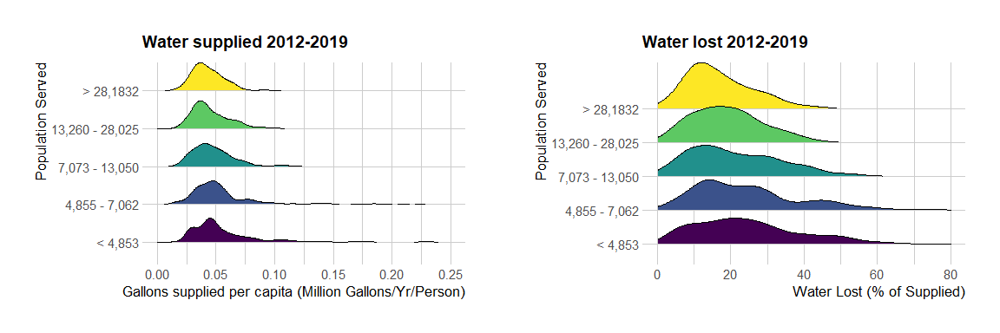

Georgia Data Inventory
================

##### A look at the water loss data for all years (2012-2019) for all municipalities broken down by population served

   

| Minimum Population | Maximum Population | Unique Municipalities | Mean Supplied Water (Mil Gal/Yr) | Mean Water Lost (%) |
|-------------------:|-------------------:|----------------------:|---------------------------------:|--------------------:|
|                410 |               4853 |                    77 |                            215.6 |                26.4 |
|               4855 |               7062 |                    75 |                            321.4 |                24.8 |
|               7073 |              13050 |                    71 |                            460.6 |                20.8 |
|              13260 |              28025 |                    62 |                            927.3 |                19.5 |
|              28132 |            1200000 |                    56 |                           5723.7 |                17.0 |

<!-- -->

------------------------------------------------------------------------

##### Looking at the supply and loss data through time, hover over the dots to view the municipality. It doesn’t look like there is a clear trend with time, but maybe the outliers are interesting?

   

------------------------------------------------------------------------

##### Crossplots of losses with length of mains, pressure, and number of connections broken down by population served

 

<script type="application/json" data-for="htmlwidget-ffedfa85f87ece432e03">{"x":{"data":[{"x":[25,48,38.7,108.4,74.2625,46.8,75.6,87,60.6,43,162,61,50,40,60.6,41.4,60,50.4,31.3,45,110,25.3,130,42,113,360,59,50,29.5,85,48,34.5,47,28,67.5,18,24,24.5,12,39,150,31,44,33.9,35.1,100,39,76,51.6,40.1,87.9,25,48,45,38.7,108.4,74.2625,46.8,87,41.9,43,159,61,50,50,40,232,41.4,148,50.4,31.3,45,110,25.25,40.3,42,360,58.4,38,29.5,85,48,34.5,47,28,18,24.3,55,24.5,12,53,38,150,31,44,35.1,39,76,37,51.6,73,165.2,157,87.6,25,48.5,45,38.7,74.2625,46.8,87,41.9,40,159,61,50,60.5,50,230,52,70,41.4,144,50,31.29,45,110,40.3,42,58.4,80,38,29.5,48,34.5,47,53.5,23,24.3,45,24,53,38,127,150,31,44,35.057,32.5,76,37,51.6,75,162.7,40.1,87.6,25,48,45,38.7,74,46.8,37.9,87,41.9,155,61,50,50,41.4,116.8,50,45,42,56.2,80,38,29.5,85,48,34.5,47,28,23,24.3,45,24,53,38,150,31,44,34,32.5,76,57.2,51.6,75,160.2,87.6,48,45,38.7,74,37.9,87,41.9,155,2520,50,50,41.4,45,42,55,80,38,29.5,85,48,34.5,47,28,23,24.3,40,24,53,38,150,31,44,30,31.8,76,57.2,65,75,155.5,87.6,48,45,38.24,73.8,37.9,87,57.1,41.9,104,50,50,41.4,40,42,55,80,38,29.5,85,48,34.5,47,27.9,23,24,34.4,23,53,38,150,31,44,30,31.76,76.3,57.1,65,73,150,120,48,38.2,36,73.8,15,87,57.14,30,104,230,60.5,51.7,70,41.39,40.9,56,75.38,40,72.1,54,80,38,29.5,85,48,34.5,46.95,30,27.8,23,24,34.4,23,35.3,53,38,150,31,41.8,24,39,76.3,57.1,73,143.7,40,46,38.24,36,73.8,15,87,55,30,104,125,60.5,51.7,70,41.39,40.9,55,75.38,40,70,54,80,38,29.5,85,48,34.5,46.95,30,23,24,34.4,23,25.52,50,38,150,31,41.8,24,39,76.3,29.6,73,140],"y":[30.5739555782313,14.4060469540043,51.2892140061532,10.6433701235336,36.7343638580876,5.16560394326379,72.6692597570685,79.5032615025575,68.5347449961615,66.8581614978735,51.6733797318058,28.01746126957,124.182996483516,67.8233410745364,40.0200609216827,78.5503859536082,74.6982420779421,58.7383419883808,48.0297044474849,10.9630601086957,8.71841012800777,12.05009,59.2305534355277,117.557289105519,128.452096118202,258.783037397959,30.1659333231643,15.1256559707904,31.9063362177502,45.0288172799314,51.0306782653061,31.2595067878903,52.3552308333333,12.4427750139729,112.57400974875,2.8770443732313,66.6570974718338,67.4677272727273,11.0412421717171,9.52051912981959,68.1655972514474,65.8152241766125,23.7937870466321,8.1432691625476,53.5827303061224,17.7760517957851,50.5622675990676,165.985352457004,92.5868899215002,17.4396163598901,170.729766171159,12.139759375,10.3718660059144,112.348907663043,64.0591761328778,16.4909521311471,39.1298835744711,6.77101021466213,73.4508417263428,209.453837762497,20.8253563981925,24.1324127865697,29.4439090909091,73.0619414285714,327.319387672064,63.0480332246452,69.4323281267417,48.3542305154639,19.0785113079091,40.7289323278205,42.6252961969737,13.3346744565218,21.256166199299,16.4686391329966,44.8181878455947,44.3951215797453,218.79042,6.45023290027352,55.4507039473685,17.9240385964912,51.3182431367771,82.3881828729411,31.3649267409241,21.389535,4.24532893777587,0.108097666975891,53.2721845572817,1.47067126088584,26.6812409793814,6.8569093371212,121.673080816428,31.9150655367503,50.3401517407895,50.3897607629659,12.1829831606218,61.833335,61.0273997863248,106.39237370203,18.9904737311558,79.8696529819472,15.7822395117632,25.24977660075,52.2984490942029,89.0407863988412,22.4995275,35.1594004419116,182.610250603805,48.0577554820243,31.7779652010638,13.0331505856499,81.4338240030808,221.582232657632,52.7723125,24.14141,66.457281010101,131.291756456044,67.5831721851574,300.695467044009,45.9266936345323,11.31207183886,63.8891090223081,83.89629,8.26905630523293,37.4049644871795,45.5955601097599,17.2411745995423,10.9926618577867,61.4051155533275,213.287963281066,12.6825219650747,27.5402616838488,36.3825525,13.5139695949432,48.1017117165648,32.5822403973089,89.7657258333333,10.1824349999999,0.0424908563175408,39.9019938333774,5.66691865914786,40.7726613402061,106.590239542825,16.3489684904897,95.0681356419012,21.4948994678934,39.3004257832207,23.8936966321243,76.0841206958763,75.8072028321678,102.836271390957,17.5994240326633,106.877223887995,0.725245772785819,20.0083136336507,17.8063096565934,98.9468149509804,12.9404995683333,56.25200059699,210.614857747678,37.597269967998,40.22803816643,6.0702212523529,14.8424375507614,88.5783653154049,187.047792118917,30.83718,29.3662001020408,103.682626291209,190.466611758242,62.6413325773196,14.0552337164845,24.8595866078205,35.1929100790514,107.063457222442,0.945832482642546,17.6383612972509,27.3689072368421,17.2455317337461,23.9068627923976,2.122595530303,28.7050061576542,121.730995789474,7.48218450584979,8.474714401868,38.192937697201,6.36123368421053,55.1125750419739,76.594052857276,10.7853417370129,15.2889151395939,33.731802103336,-21.3163840932642,65.8540689175258,72.4122685742036,108.703978317728,11.1450846482412,98.5878685441699,1.09749464646468,12.6745622368421,80.397,31.153,104.675,42.238,30.768,2.841,104.828,113.849,36.121,12.921,103.717,216.486,57.046,83.925,70.758,38.607,1.676,58.479,33.151,20.703,35.134,13.928,155.931,7.22,12.056,15.771,33.628,35.919,49.544,10.785,8.175,50.714,2.283,0.603,54.092,64.491,7.778,87.152,-28.745,10.223,54.1384664999999,28.5367479568528,44.8190407323232,56.8762763157894,51.3239735714286,46.3955109090909,29.9981099519808,29.8569736842105,87.2960974221267,35.7153461809045,108.659945,244.224051630435,53.6374409693878,21.0458275736842,67.512281314433,40.7255022727273,31.2102058676976,67.5596101923077,58.9925376623377,38.1537234615384,27.7630925,0.308108360576928,110.140186842105,23.4148934572327,3.88067142857141,1.25879563657894,27.8797491945608,40.2816622438976,55.9328980555971,11.1282936119032,94.4090378328955,47.3618532142857,26.338623989899,64.7510798969072,44.3565092171717,83.3181942803031,7.57479075757576,64.324572988771,-30.3688489646464,10.2412933333334,109.01285500449,40.466871201134,46.3002297368421,20.2479361428572,46.5962777173913,51.0917470418848,83.359501579596,56.8081877631579,51.363717044898,37.1928410526316,85.2815,105.627674210526,44.4076561713917,82.2168210526316,68.7868830102041,61.6581773979592,23.0829659183673,81.3386431578947,23.7368539157895,65.1167546532052,59.1239433838384,73.5204141666667,83.110595,41.5807423131313,30.2335876969697,16.9557917005076,4.30873743589743,77.5245258556013,20.7009223985411,12.7038443187551,2.69352395494898,6.03806139633286,35.2444752564102,36.3235575510204,13.2812153030303,61.8566708333333,7.73766027777779,18.4408895918367,37.4086649489796,6.78673020202021,82.4808948220065,7.8223875,107.978799316313,2.25487908888889,27.3987296969697,18.2955098232324,64.8615539846938,31.2605505412371,52.88961,24.8924285714285,32.6599329347826,43.8743696447368,91.1453226492929,42.1924728210526,36.9327670408163,14.5212993421053,509.581666666667,78.7055036842105,32.3097847280928,52.3293131578947,76.3718672802172,74.8518986566327,22.3127561224489,87.39498,36.519072228421,39.7104471746154,0.647634999999996,25.7000733333333,97.4757472258333,25.5862395707071,30.0529861111111,43.3103757902041,12.8181592820513,67.3726210526316,7.95093275707066,0.283803283214283,7.13965016731184,8.35424454102564,30.0844934335816,14.9098852272727,49.9717491666666,11.4176545454545,42.8581281632653,45.3780689795918,2.84260785714285,104.545992858333,12.88376001,134.384809419192,21.0021090750253,28.8785365910605,28.2127374494949],"text":["Alamo | 2019","Alma | 2019","Baldwin | 2019","Baxley | 2019","Blairsville | 2019","Brunswick Glynn Joint Water Sewer Commission - South Mainland | 2019","Byron | 2019","Cave Spring | 2019","Clarkesville | 2019","Claxton | 2019","Coosa Water Authority | 2019","Cusseta and Chattahoochee County (Unified Government) | 2019","Cuthbert | 2019","East Dublin | 2019","Gray | 2019","Greensboro | 2019","Hawkinsville | 2019","Hephzibah | 2019","Hogansville | 2019","Homerville | 2019","Lake Blackshear Area Water System | 2019","Leesburg | 2019","Lincoln County | 2019","Lyons | 2019","Manchester | 2019","Marion County | 2019","Metter | 2019","Millen | 2019","Monticello | 2019","Nashville | 2019","Oglethorpe | 2019","Palmetto | 2019","Pelham | 2019","Ringgold | 2019","Rockmart | 2019","Savannah - Savannah Quarters | 2019","Savannah - Whitemarsh | 2019","Social Circle | 2019","South Atlantic Utilities (Bryan County) | 2019","Statham | 2019","Talbot County | 2019","Tallapoosa | 2019","Temple | 2019","Tybee Island Water & Sewer Department | 2019","Unadilla | 2019","USA - Kings Bay Naval Base/UEM | 2019","USMC Marine Corps Logistics Base Albany | 2019","Vienna | 2019","Washington | 2019","Wrightsville | 2019","Adairsville | 2018","Alamo | 2018","Alma | 2018","Ashburn | 2018","Baldwin | 2018","Baxley | 2018","Blairsville | 2018","Brunswick Glynn Joint Water Sewer Commission - South Mainland | 2018","Cave Spring | 2018","Chickamauga | 2018","Claxton | 2018","Coosa Water Authority | 2018","Cusseta and Chattahoochee County (Unified Government) | 2018","Cuthbert | 2018","Dawson | 2018","East Dublin | 2018","Franklin County | 2018","Greensboro | 2018","Hart County Water and Sewer Authority | 2018","Hephzibah | 2018","Hogansville | 2018","Homerville | 2018","Lake Blackshear Area Water System | 2018","Leesburg | 2018","Louisville | 2018","Lyons | 2018","Marion County | 2018","Metter | 2018","Montezuma | 2018","Monticello | 2018","Nashville | 2018","Oglethorpe | 2018","Palmetto | 2018","Pelham | 2018","Ringgold | 2018","Savannah - Savannah Quarters | 2018","Savannah - Whitemarsh | 2018","Senoia | 2018","Social Circle | 2018","South Atlantic Utilities (Bryan County) | 2018","Sparta | 2018","Statham | 2018","Talbot County | 2018","Tallapoosa | 2018","Temple | 2018","Unadilla | 2018","USMC Marine Corps Logistics Base Albany | 2018","Vienna | 2018","Walthourville | 2018","Washington | 2018","West Point | 2018","White County Water & Sewerage Authority | 2018","Wrightsville | 2018","Adairsville | 2017","Alamo | 2017","Alma | 2017","Ashburn | 2017","Baldwin | 2017","Blairsville | 2017","Brunswick Glynn Joint Water Sewer Commission - South Mainland | 2017","Cave Spring | 2017","Chickamauga | 2017","Cleveland Waterworks | 2017","Coosa Water Authority Blairsville | 2017","Cusseta and Chattahoochee County (Unified Government) | 2017","Cuthbert | 2017","Dahlonega | 2017","Dawson | 2017","Franklin County | 2017","Glennville | 2017","Gray | 2017","Greensboro | 2017","Hart County Water and Sewer Authority | 2017","Hephzibah | 2017","Hogansville | 2017","Homerville | 2017","Lake Blackshear Area Water System | 2017","Louisville | 2017","Lyons | 2017","Metter | 2017","Millen | 2017","Montezuma | 2017","Monticello | 2017","Oglethorpe | 2017","Palmetto | 2017","Pelham | 2017","Port Wentworth | 2017","Savannah - Savannah Quarters | 2017","Savannah - Whitemarsh | 2017","Senoia | 2017","Social Circle | 2017","Sparta | 2017","Statham | 2017","Sylvania | 2017","Talbot County | 2017","Tallapoosa | 2017","Temple | 2017","Unadilla | 2017","USMC Marine Corps Logistics Base Albany | 2017","Vienna | 2017","Walthourville | 2017","Washington | 2017","West Point | 2017","White County Water & Sewerage Authority | 2017","Wrightsville | 2017","Adairsville | 2016","Alamo | 2016","Alma | 2016","Ashburn | 2016","Baldwin | 2016","Blairsville | 2016","Brunswick - Glynn County Joint W & S Commission - South Mainland | 2016","Butler | 2016","Cave Spring | 2016","Chickamauga | 2016","Coosa Water Authority | 2016","Cusseta and Chattahoochee County   (Unified Government) | 2016","Cuthbert | 2016","Dawson | 2016","Greensboro Water Department | 2016","Hart County Water and Sewer Authority | 2016","Hephzibah | 2016","Homerville | 2016","Lyons | 2016","Metter | 2016","Millen | 2016","Montezuma | 2016","Monticello | 2016","Nashville | 2016","Oglethorpe | 2016","Palmetto | 2016","Pelham | 2016","Ringgold | 2016","Savannah - Savannah Quarters | 2016","Savannah - Whitemarsh | 2016","Senoia | 2016","Social Circle | 2016","Sparta | 2016","Statham | 2016","Talbot County Water Works | 2016","Tallapoosa | 2016","Temple | 2016","Unadilla | 2016","USMC - Marine Corps Logistics Base | 2016","Vienna | 2016","Walthourville | 2016","Washington | 2016","West Point | 2016","White County Water & Sewerage Authority | 2016","Adairsville | 2015","Alma | 2015","Ashburn | 2015","Baldwin | 2015","Blairsville | 2015","Butler | 2015","Cave Spring | 2015","Chickamauga | 2015","Coosa Water Authority | 2015","Cusseta and Chattahoochee County   (Unified Government) | 2015","Cuthbert | 2015","Dawson | 2015","Greensboro Water Department | 2015","Homerville | 2015","Lyons | 2015","Metter | 2015","Millen | 2015","Montezuma | 2015","Monticello | 2015","Nashville | 2015","Oglethorpe | 2015","Palmetto | 2015","Pelham | 2015","Ringgold | 2015","Savannah - Savannah Quarters | 2015","Savannah - Whitemarsh | 2015","Senoia | 2015","Social Circle | 2015","Sparta | 2015","Statham | 2015","Talbot County Water Works | 2015","Tallapoosa | 2015","Temple | 2015","Unadilla | 2015","USMC - Marine Corps Logistics Base | 2015","Vienna | 2015","Walthourville | 2015","Washington | 2015","West Point | 2015","White County Water & Sewerage Authority | 2015","Adairsville | 2014","Alma | 2014","Ashburn | 2014","Baldwin GA | 2014","Blairsville Water System | 2014","Buttler | 2014","Cave Spring | 2014","Chattahoochee County Water System | 2014","Chickamauga Utilities | 2014","Coosa Water Authority | 2014","Cuthbert | 2014","Dawson | 2014","Greensboro | 2014","Homerville | 2014","Lyons | 2014","Metter | 2014","Millen | 2014","Montezuma | 2014","Monticello | 2014","Nashville | 2014","Oglethorpe | 2014","Palmetto | 2014","Pelham | 2014","Ringgold | 2014","Savannah Quarters | 2014","Savannah Whitemarsh | 2014","Senoia | 2014","Social Circle | 2014","Sparta | 2014","Statham | 2014","Talbot County Water Works | 2014","Tallapoosa | 2014","Temple | 2014","Unadilla | 2014","USMC - Marine Corps Logistics Base | 2014","Vienna | 2014","Walthourville | 2014","Washington | 2014","West Point | 2014","White County Water & Sewerage Authority | 2014","Adairsville | 2013","Alma | 2013","Baldwin | 2013","Blackshear | 2013","Blairsville | 2013","Butler | 2013","Cave Spring | 2013","Chattahoochee Co. | 2013","Cleveland | 2013","Coosa | 2013","Cuthbert | 2013","Dahlonega | 2013","Glennville | 2013","Gray | 2013","Greensboro | 2013","Hampton | 2013","Harlem | 2013","Hiawassee | 2013","Homerville | 2013","Lowndes Co. - North | 2013","Metter | 2013","Millen | 2013","Montezuma | 2013","Monticello | 2013","Nashville | 2013","Oglethorpe | 2013","Palmetto | 2013","Pelham | 2013","Rincon | 2013","Ringgold | 2013","Savannah-Savannah Quarters | 2013","Savannah-Whitemarsh | 2013","Senoia | 2013","Social Circle | 2013","South Monroe Co. | 2013","Sparta | 2013","Statham | 2013","Talbot Co. | 2013","Tallapoosa | 2013","Temple | 2013","Unadilla | 2013","USMC-Logistics Base | 2013","Vienna | 2013","Walthourville | 2013","West Point | 2013","White Co. | 2013","Adairsville | 2012","Alma | 2012","Baldwin | 2012","Blackshear | 2012","Blairsville | 2012","Butler | 2012","Cave Spring | 2012","Chattahoochee Co. | 2012","Cleveland | 2012","Coosa | 2012","Cuthbert | 2012","Dahlonega | 2012","Glennville | 2012","Gray | 2012","Greensboro | 2012","Hampton | 2012","Harlem | 2012","Hiawassee Water | 2012","Homerville | 2012","Lowndes Co. - North | 2012","Metter | 2012","Millen | 2012","Montezuma | 2012","Monticello | 2012","Nashville | 2012","Oglethorpe | 2012","Palmetto | 2012","Pelham | 2012","Rincon | 2012","Savannah-Quarters | 2012","Savannah-Whitemarsh | 2012","Senoia | 2012","Social Circle | 2012","South Monroe Co. | 2012","Sparta | 2012","Statham | 2012","Talbot Co. | 2012","Tallapoosa | 2012","Temple | 2012","Unadilla | 2012","USMC-Logistics Base | 2012","Vienna | 2012","Walthourville | 2012","West Point | 2012","White Co. | 2012"],"type":"scatter","mode":"markers","marker":{"autocolorscale":false,"color":"rgba(68,1,84,1)","opacity":0.6,"size":5.66929133858268,"symbol":"circle","line":{"width":0.94488188976378,"color":"rgba(0,0,0,1)"}},"hoveron":"points","name":"< 4,853","legendgroup":"< 4,853","showlegend":true,"xaxis":"x","yaxis":"y","hoverinfo":"text","frame":null},{"x":[74.2,45,322,81.22,36,56,127.8,141,76,72,41.9,40,65.5,121.49,66.3,70.1,50,64.8,60.15,238,27.7,52,24.1,73,155,75.4,40.5,85,75,39.8,38,50,70.3,65,72,53,49,127,82,71.6,50.8,59,73,166,74.2,75,320,81,36,54,124.3,140,75.5,75.6,72,60.6,40,64,126.9,66.1,70.1,58.8,27.7,52,24.1,69,60,77,75.4,24.8,128.6,43,82,85,75,113,151,39.8,50,142.9,59,50,172.5,67.5,72,47,127,82,71.6,50.8,96,82.6,74.2,75,314.9,81,108.4,120,36,54,120,140,75,81,70,60.6,64,126.33,66.1,58.8,24.1,65,60,77,75.4,128.6,43,81,85,75,113,150,39.8,85,139.9,50,163.7,67.5,70.3,27.7,47,82,71.57,50.8,82.2,74.2,75,313.4,81,108.4,120,36,54,122,140,75,81,71,60.6,40,64,125.8,66.1,60.5,58.26,27.7,52,24.1,63,60,70,75.4,128.6,43,76.2,82,75,113,150,45,136,53.5,50,154.2,67.5,69,47,80.5,71.4,100.2,81.4,74,74,312.9,81,108.4,120,36,52,122,140,75,80,70,60.6,40,77.5,125,65.5,60.5,57.9,27.7,52,24.1,60,60,70,75.4,128.6,41,72.1,82,75,107.5,150,45,134,53,50,152.8,67.5,66.6,47,80.5,71.4,100,79.2,74,74,311.9,81,108.35,120,36,50,119,140,74.7,50,70,60,30,64,123.6,52,60.5,57.94,27.7,51.37,61,24.1,56,60,70,75.4,72.1,82,75,107.5,150,45,134.5,52,50,130.2,66,50,47,80,77.78,100,78.5,74,45,74,61,311.9,108.08,120,50,100,140,74.7,70,300,41.9,60,63.2,123.6,52,50,68,145,58.6,57.8,34,40,27.7,61,24.1,41,60,82,42,75,107.5,150,45,134.5,45,130.2,66,70.3,47,77,33.7,75,66.4,161.7,64.6,77,74,45,74,61,311,107.7,104.5,50,100,140,74.7,75,275,41.9,69.8,61,120.4,47,50,68,145,58.6,57.8,34,40,27.7,59.9,24.1,41,60,75,42,75,105,150,45,134.5,45,128.9,66,70.3,47,76,30,71.4,100,66.4,64.6,77],"y":[50.7600084848484,112.222698152174,10.4001247263322,290.455142602041,14.8405544871795,22.6498480263158,138.648201445492,49.9304616346154,83.5937603709813,291.697445448718,209.789949283592,51.1298697339286,46.0078412242308,229.907130774166,95.4773234040404,88.7653328478017,348.401721647872,176.845923824722,18.8792224931766,55.9780774655128,52.3110822458628,25.2163926336113,67.2701570178201,24.3641480661933,15.918562670817,61.6880750020297,58.6884401974959,136.8107525,58.784983697411,27.7041774093191,109.645773815789,178.024082990196,207.498134777838,21.4500303947368,56.655128877551,123.434698073771,58.5751573736536,82.7779375708502,150.462987878692,18.6669138917526,76.3023242929293,49.6193857142857,-1.27708315301184,26.5424115709729,87.3986283080808,0.169216067632548,16.8445907708068,265.174304948373,12.1359150641025,104.571145233161,145.710695255611,60.1146918480138,82.6012604212457,72.3969356752067,197.517682134039,54.6058780350717,54.4590440306122,20.7429185886294,236.431496301596,92.7508214646464,80.02219473561,13.124534844736,61.9658733747045,12.1020251292947,84.8195391020254,28.4123523381422,106.702486894286,79.3922925,93.5634456166233,2.07176413428602,54.4711520493474,31.7236012974684,303.039295,43.6021550000001,44.4473112814289,32.7799102663707,164.321719583335,27.4663554263566,21.1111683247422,37.5797419387755,9.15309306447782,266.505632142857,24.4494759405556,157.132894644802,35.5141720323129,91.3331351484008,115.194784402834,141.781874210466,33.5873770360825,74.1509612626263,197.163989627072,2.59215897659064,66.4071653648009,18.9584203034252,12.5795555815372,273.707955079309,2.13052106685672,164.810583588083,18.5004833333334,126.127437725069,153.897204389568,55.7395294527202,77.6456852040817,44.6398891857201,60.2862875641026,44.5931864745916,109.891187055838,122.602341158733,99.6580689384553,12.783214360107,13.4319769466366,36.2239771369245,66.0288172061575,127.525345014479,72.3821965129252,44.5368354451499,45.0751406116223,349.43112,99.61814,46.4631682984814,124.588956553829,132.779517631207,39.4415394186047,5.34124623876764,47.0547130515306,153.004445462489,62.5461916049383,48.0898179290756,198.960003793901,17.209498783035,43.7894813094708,86.540090758658,-5.35749842783505,69.1272524242424,32.3744368323925,73.0682274999999,9.61206995098037,16.2630957027407,231.544541118408,1.61556112745102,153.974704779793,18.0141605769231,167.328665867347,110.939278302505,40.1157706048187,52.3574362675323,43.3988883581709,262.603106666667,40.3647098702958,46.8237490656566,65.9644116369768,96.5070383330692,67.3520027275036,74.7469650899729,17.9728656202476,9.35039499999999,34.9558949673511,33.1871874457637,20.1154778812692,31.9136778966491,43.7603588182628,59.7031718222601,50.4061448936912,46.0231353237247,244.641241805885,123.84879787234,53.5364894529499,119.073307325194,116.752223928693,25.5487802238991,26.9316998213265,47.4493570610687,34.5263976982097,108.596326388889,128.605702757732,30.6614325,34.6811597853454,74.7742431604747,5.89949388888885,76.7927027272727,27.7106685953105,2.306,15.452,26.96,179.382,3.715,133.063,-39.612,181.38,115.407,57.648,44.042,57.068,193.963,20.387,34.487,45.78,96.534,113.341,82.545,17.833,21.46,44.107,52.238,13.665,24.07,124.78,97.811,23.541,34.742,161.639,51.411,38.928,88.688,115.241,5.786,22.842,19.337,0.509,116.931,137.505,21.61,68.951,54.195,8.767,76.964,13.806,93.7365780013324,5.64075108216973,65.2285564698493,150.133818131829,25.5057251677668,122.177281836735,15.6530100975864,154.79397010101,156.313439273099,56.976630208482,34.194114199408,33.5605474242424,72.2933437755102,19.975614073238,44.4082539795918,4.96179204081632,120.838316479592,134.580556009913,90.7273622115038,19.6148935479605,12.5745544997896,60.2910332216495,54.118936305105,61.0758838383838,19.3918657312245,36.0540891196935,92.1870376648789,26.167433877551,42.5675952942307,112.577348320513,76.6435395858585,100.147609670686,126.069665151515,33.8157598218659,55.032278,15.8005084642342,85.0679580808081,84.241565,45.7830372963172,18.7223871212121,17.2736468555683,75.4415898979592,39.0476279117708,17.4176264204545,29.8183757575757,190.150143468421,44.3996087626263,24.8530899263636,16.3546135714286,67.3527357419598,26.1416015721649,114.426600408163,143.134816742424,161.766898979592,53.4701519528753,30.971807366119,239.530953242857,104.814332857143,136.245013968421,45.380597709596,32.7039101020408,105.785557244898,89.7243575547293,57.366873765913,101.793092126667,74.5055043939394,14.8960194999999,28.9699984090909,120.464693877551,25.1765119587629,10.2533830617347,34.5681777050505,52.1533673469388,41.7123472422681,58.1471099171717,69.27363,37.8273592783505,83.3234565285354,69.1740173408163,103.314681030808,21.669030777202,20.9221635204081,34.8837034020619,56.48392,103.6538053095,114.420428877551,33.519693377551,80.340505050505,48.2845782938776,43.7695779441624,23.8126028833334,38.7727335,77.1046707908163,32.6804773737374,198.436544078947,59.0597039473684,25.331,26.5758068367347,51.6345658040201,57.0137270103093,90.620835622449,87.1454150252525,122.329814285714,24.9777800530571,30.1625772461929,111.138685921053,73.1585154081633,106.154410526316,45.4802580571428,72.4542740463918,127.036169255102,106.31760969697,98.529482826087,51.1899808333333,84.5659177777778,14.1392284999999,48.6621572039395,136.79387755102,17.3795330263159,19.5361709134021,8.59505646938772,24.0441836734694,56.5744068556701,66.711329371134,73.7523157692307,44.2512867010309,34.6684595214647,144.450217346122,103.889602263131,21.732304871134,33.5874232653061,39.9130233505155,62.6017016666666,65.5257351515152,74.6512752852005,22.7538742189796,61.3210698684211,30.786717367347,46.1125881632653,19.6312764333333,34.2981973466666,102.49569255102,33.0762115151515],"text":["Adel | 2019","Ashburn | 2019","Banks County | 2019","Barnesville | 2019","Blackshear | 2019","Blakely | 2019","Blue Ridge Water & Sewer | 2019","Bowdon | 2019","Bremen | 2019","Camilla | 2019","Chickamauga | 2019","Cleveland Waterworks | 2019","Cochran | 2019","Commerce | 2019","Cornelia | 2019","Dahlonega | 2019","Dawson | 2019","Eastman | 2019","Folkston | 2019","Franklin County | 2019","Glen of Robin Hood | 2019","Glennville | 2019","Hapeville | 2019","Harlem | 2019","Hart County Water and Sewer Authority | 2019","Hiawassee | 2019","Louisville | 2019","Lowndes County Utilities - South Lowndes | 2019","Madison | 2019","McRae-Helena | 2019","Montezuma | 2019","Quitman | 2019","Sandersville | 2019","Senoia | 2019","South Monroe County Water System | 2019","Sparta | 2019","Stockbridge | 2019","Sylvania | 2019","Sylvester | 2019","Upson County Water Department | 2019","USAF - Moody Air Force Base | 2019","Waynesboro | 2019","West Point | 2019","White County Water & Sewerage Authority | 2019","Adel | 2018","Auburn | 2018","Banks County | 2018","Barnesville | 2018","Blackshear | 2018","Blakely | 2018","Blue Ridge Water & Sewer | 2018","Bowdon | 2018","Bremen | 2018","Byron | 2018","Camilla | 2018","Clarkesville | 2018","Cleveland Waterworks | 2018","Cochran | 2018","Commerce | 2018","Cornelia | 2018","Dahlonega | 2018","Folkston | 2018","Glen of Robin Hood | 2018","Glennville | 2018","Hapeville | 2018","Harlem | 2018","Hawkinsville | 2018","Hazlehurst | 2018","Hiawassee | 2018","Lakeland | 2018","Lincoln County | 2018","Locust Grove | 2018","Lowndes County Utilities - North Lowndes | 2018","Lowndes County Utilities - South Lowndes | 2018","Madison | 2018","Manchester | 2018","McCaysville | 2018","McRae-Helena | 2018","Millen | 2018","Pickens County Water | 2018","Port Wentworth | 2018","Quitman | 2018","Reynolds Water System | 2018","Rockmart | 2018","South Monroe County Water System | 2018","Stockbridge | 2018","Sylvania | 2018","Sylvester | 2018","Upson County Water Department | 2018","USAF - Mody Air Force Base | 2018","Utilities, Inc. of Georgia (Big Canoe Subdivision) | 2018","Waynesboro | 2018","Adel | 2017","Auburn | 2017","Banks County | 2017","Barnesville | 2017","Baxley | 2017","Big Canoe | 2017","Blackshear | 2017","Blakely | 2017","Blue Ridge Water & Sewer | 2017","Bowdon | 2017","Bremen | 2017","Byron | 2017","Camilla | 2017","Clarkesville | 2017","Cochran | 2017","Commerce | 2017","Cornelia | 2017","Folkston | 2017","Hapeville | 2017","Harlem | 2017","Hawkinsville | 2017","Hazlehurst | 2017","Hiawassee | 2017","Lincolnton County | 2017","Locust Grove | 2017","Lowndes County Utilities - North Lowndes | 2017","Lowndes County Utilities - South Lowndes | 2017","Madison | 2017","Manchester | 2017","McCaysville Water Department | 2017","McRae-Helena | 2017","Nashville | 2017","Pickens County Water | 2017","Quitman | 2017","Reynolds Water System | 2017","Rockmart | 2017","Sandersville | 2017","Savannah - Glen of Robin Hood / Montgomery Area | 2017","Stockbridge | 2017","Sylvester | 2017","Upson County Water Department | 2017","USAF - Moddy Air Force Base | 2017","Waynesboro | 2017","Adel | 2016","Auburn | 2016","Banks County | 2016","Barnesville | 2016","Baxley | 2016","Big Canoe Subdivision | 2016","Blackshear | 2016","Blakely | 2016","Blue Ridge Water & Sewer | 2016","Bowdon Water System | 2016","Bremen | 2016","Byron | 2016","Camilla | 2016","Clarkesville | 2016","Cleveland | 2016","Cochran Water Department | 2016","Commerce | 2016","Cornelia | 2016","Dahlonega / Dahlonega Water System | 2016","Folkston | 2016","Glen of Robin Hood / Montgomery Area | 2016","Glennville | 2016","Hapeville Water Department | 2016","Harlem | 2016","Hawkinsville | 2016","Hazlehurst | 2016","Hiawassee | 2016","Lincoln County Water System | 2016","Locust Grove | 2016","Lowndes County - North | 2016","Lowndes County - South | 2016","Madison | 2016","Manchester Water Works | 2016","McCaysville Water | 2016","McRae Water System | 2016","Pickens County | 2016","Port Wentworth | 2016","Quitman | 2016","Reynolds Water System | 2016","Rockmart | 2016","South Monroe County Water System | 2016","Stockbridge Water | 2016","Sylvester | 2016","Upson County Water | 2016","USAF - Moody Air Force Base - Main | 2016","Waynesboro | 2016","Adel | 2015","Auburn | 2015","Banks County | 2015","Barnesville | 2015","Baxley | 2015","Big Canoe Subdivision | 2015","Blackshear | 2015","Blakely | 2015","Blue Ridge Water & Sewer | 2015","Bowdon Water System | 2015","Bremen | 2015","Byron | 2015","Camilla | 2015","Clarkesville | 2015","Cleveland | 2015","Cochran Water Department | 2015","Commerce | 2015","Cornelia | 2015","Dahlonega / Dahlonega Water System | 2015","Folkston | 2015","Glen of Robin Hood / Montgomery Area | 2015","Glennville | 2015","Hapeville Water Department | 2015","Harlem | 2015","Hawkinsville | 2015","Hazlehurst | 2015","Hiawassee | 2015","Lincoln County Water System | 2015","Locust Grove | 2015","Lowndes County - North | 2015","Lowndes County - South | 2015","Madison | 2015","Manchester Water Works | 2015","McCaysville Water | 2015","McRae Water System | 2015","Pickens County | 2015","Port Wentworth | 2015","Quitman | 2015","Reynolds Water System | 2015","Rockmart | 2015","South Monroe County Water System | 2015","Stockbridge Water | 2015","Sylvester | 2015","Upson County Water | 2015","USAF - Moody Air Force Base - Main | 2015","Waynesboro | 2015","Adel | 2014","Auburn | 2014","Banks County | 2014","Barnesville | 2014","Baxley | 2014","Big Canoe Subdivison | 2014","Blackshear | 2014","Blakely | 2014","Blue Ridge Water & Sewer | 2014","Bowdon | 2014","Bremen | 2014","Byron | 2014","Camilla | 2014","Clarkesville | 2014","Cleveland | 2014","Cochran Water Department | 2014","Commerce | 2014","Cornelia | 2014","Dahlonega / Dahlonega Water System | 2014","Folkston | 2014","Glen of Robin Hood/ Montgomery Area | 2014","Glennville | 2014","Grovetown | 2014","Hapeville | 2014","Harlem | 2014","Hawkinsville | 2014","Hazlehurst | 2014","Hiawassee | 2014","Lowndes County - North | 2014","Lowndes County - South | 2014","Madison | 2014","Manchester Water Works | 2014","McCaysville Water Department | 2014","McRae/Water | 2014","Pickens County Water & Sewer Authority | 2014","Port Wentworth | 2014","Quitman | 2014","Reynolds Plantation | 2014","Rockmart | 2014","South Monroe County Water System | 2014","Stockbridge | 2014","Sylvester | 2014","Upson County Water | 2014","USAF - Moody Air Force Base - Main | 2014","Waynesboro | 2014","Adel | 2013","Ashburn | 2013","Auburn | 2013","Austell | 2013","Banks Co. | 2013","Baxley | 2013","Big Canoe Utilities | 2013","Blakely | 2013","Blue Ridge | 2013","Bowdon | 2013","Bremen | 2013","Camilla | 2013","Chattooga Co. | 2013","Chickamauga | 2013","Clarkesville | 2013","Cochran | 2013","Commerce | 2013","Cornelia | 2013","Dawson | 2013","Eastman | 2013","Eatonton Putnam | 2013","Effingham Co. | 2013","Folkston | 2013","Fort Oglethorpe | 2013","Garden City | 2013","Glen of Robin Hood | 2013","Grovetown | 2013","Hapeville | 2013","Hawkinsville | 2013","Hazlehurst | 2013","Lowndes Co. - South | 2013","Lyons | 2013","Madison | 2013","Manchester | 2013","McCaysville | 2013","McRae | 2013","Pickens Co. | 2013","Quitman | 2013","Reynolds Plantation | 2013","Rockmart | 2013","Sandersville | 2013","Stockbridge | 2013","Sylvester | 2013","Tybee Island | 2013","Upson Co. | 2013","USAF-Moody AB Main | 2013","USA-Hunter Army Airfield | 2013","Washington | 2013","Waynesboro | 2013","Adel | 2012","Ashburn | 2012","Auburn | 2012","Austell | 2012","Banks County | 2012","Baxley | 2012","Big Canoe Utilities | 2012","Blakely | 2012","Blue Ridge | 2012","Bowdon | 2012","Bremen | 2012","Camilla | 2012","Chattooga Co. | 2012","Chickamauga | 2012","Clarkesville | 2012","Cochran | 2012","Commerce | 2012","Cornelia | 2012","Dawson | 2012","Eastman | 2012","Eatonton Putnam | 2012","Effingham Co. | 2012","Folkston | 2012","Fort Oglethorpe | 2012","Garden City | 2012","Glen of Robin Hood | 2012","Grovetown | 2012","Hapeville | 2012","Hawkinsville | 2012","Hazlehurst | 2012","Lowndes Co. - South | 2012","Lyons | 2012","Madison | 2012","Manchester | 2012","McCaysville | 2012","McRae | 2012","Pickens Co. | 2012","Quitman | 2012","Reynolds Plantation | 2012","Rockmart | 2012","Sandersville | 2012","Stockbridge | 2012","Sylvester | 2012","Tybee Island | 2012","Upson Co. | 2012","USAF-Moody AB Main | 2012","USA-Hunter Army Airfield | 2012","Washington | 2012","Waynesboro | 2012"],"type":"scatter","mode":"markers","marker":{"autocolorscale":false,"color":"rgba(59,82,139,1)","opacity":0.6,"size":5.66929133858268,"symbol":"circle","line":{"width":0.94488188976378,"color":"rgba(0,0,0,1)"}},"hoveron":"points","name":"4,855 - 7,062","legendgroup":"4,855 - 7,062","showlegend":true,"xaxis":"x2","yaxis":"y2","hoverinfo":"text","frame":null},{"x":[88.3,79,62.01,161.5,76,120,85.9,48,300,130,57.2,132.6,125,240,97.14,127.71,130,50,38,51,41.08,85.115,77,400,188.6,125.75,134,157,127,48,83.81,103.2,151,90,297,144,52,200.1,86.9,1381.5,236,225,60,95.4,114,204,66.4,94.2,141,62.52,125,76,120,85.9,48,300,130,57.2,132.6,38,125,64.8,240,94.7,122.43,240,130,50,38,51,60.56,68.5,41.08,389.5,85.115,400,184.1,120.75,134,157,127,81.4,90,90,1381.5,70.3,234.5,225,60,95.4,114,204,33.9,66.4,100,141,75.2,61,124,74,120,85.9,48,300,130,57,132.6,38,122,64.8,235,94.7,122.14,237,125,50,38,51,68.5,40.9,386.7,85.115,400,184.1,120.5,134.2,157,127,88.88,90,90,234.5,95.4,225,60,114,204,33.9,66.4,100,141,72.5,61,120,74,120,85.9,48,300,135,135.1,38,122,64.76,230,66.75,122.29,237,125,50,38,41,70,67,40.9,382.7,85.115,400,181.5,120.04,134.2,158.3,100,55.96,127,82.4,90,90,1380,70.3,234.5,225,60,95.4,80,204,33.9,66.4,141,72.53,60.8,120,82,74,120,70,48,300,147,135.1,38,122,68,230,66.8,122.3,237,125,50,36,40,70,40.9,379.7,84.7,400,181.5,118.3,109.6,155.1,100,59,127,76.8,90,90,1380,70.3,234.5,225,60,95.4,80,204,33.9,66.4,141,59,61,120,82,74,120,85.9,48,300,147,132.6,38,121.8,68,145,58.6,125,227,125,50,35,40,70,40.9,370,84.7,400,180,117,133.8,151.2,100,56.3,127,76.8,90,90,30,70.3,234.5,225,60,95.4,80,204,33.7,66.4,134,54,81,120,81,74,50,120,85.86,48,147,132.6,38,121.7,122.5,227,91.6,50,368.5,84.7,400,177,117,119,148.5,56.3,127,74,76.76,90,480,51,90,234.5,87,54,225,60,95.4,80,400,100,134,64,81,120,81,74,50,120,85.86,48,147,136,38,121.7,122,227,91.6,50,368.5,84.7,400,175.047,105,118,146.8,56.3,127,73,60,90,452,51,72.7424242424242,234.5,87,54,225,60,95.4,83.7,400,100,134,64],"y":[212.174103743187,1.48174775876726,50.7656162192655,256.82670107628,40.6391405359225,87.9311956538126,78.8937255199366,76.6843352507437,126.504185436974,201.512927161654,11.2426062595164,158.839667047483,95.2511212028178,72.9565655927835,14.176963091179,25.1154856667749,113.120654041764,30.6631169978664,80.51807,35.1366486734694,84.3317034960743,38.6887009409165,66.4159999999999,212.050157199332,223.017262376262,85.2801246798615,16.2103417794139,103.513547887719,70.7389710350701,34.4561927581112,83.586473530006,313.4702025,139.847926704535,114.216325422889,92.4523721963385,36.0867590086735,143.756975561667,40.5360839452161,65.3624174975051,103.704811691919,25.5034396726205,163.98380863545,4.68263750000004,32.8138870558376,125.204343685856,80.6346135773427,33.1279736842105,189.140036638655,69.0072090449816,49.6187842586914,11.7675544117647,63.982587144641,106.039829193273,65.1348107871462,74.7091786609895,109.745385177067,196.100289078947,32.0397139303483,274.314769515627,58.3130033059468,50.7149824082936,58.5748550780543,73.0333921542307,10.9016577338279,41.3904777281036,160.805410442407,44.853180319339,17.454588487558,103.079540816327,28.2091384693877,46.694635182466,47.0972991773055,71.649922370726,95.5924447871269,46.940758947449,222.856643471105,199.434381390497,71.3854173148952,51.0463822091765,107.854243802107,97.786747483211,45.0884416836735,128.92924644325,28.4494355433835,-320.5774175,217.134174717728,17.9694536701182,131.892773297851,60.204639125,46.1304379187817,146.804901546392,74.9142310278168,19.8488359992269,126.40533593408,17.389,77.7858040209134,170.219674035088,11.7589550224868,25.3957031857692,57.396293754367,155.05451484808,81.1939441995947,62.4502492906212,121.726928924988,202.196075526316,7.34767171717171,189.790100859713,36.3048779867855,51.6614251368953,7.94540221758517,55.0826274437116,10.7532874241318,82.8011191743954,161.874928055388,43.6233981259518,23.4398228757364,105.460224489796,22.0362253571428,20.8471162778578,79.4077824509152,54.1240312668192,48.5196705678213,214.310838038273,166.07846959848,36.6141902760289,57.1378023905277,130.844251165397,107.694592048934,50.7356634468216,106.817826878905,33.4453986929295,25.7906703285608,35.3342613071067,113.754536268548,7.53937200000003,107.793112371134,71.9900470160781,35.9429145628785,53.5979963423711,24.414575,77.4405060535266,108.503676566416,65.8811791954208,-13.7844816297757,75.6219930551147,135.34969630462,190.78768698718,98.1547711855671,108.305952646632,192.362799868421,172.118184095568,29.1337211018709,117.142730022594,91.9628225827016,71.8864278340623,8.88412392060318,78.3816913392271,246.422698275862,358.544650356516,19.4997943967999,125.069183673469,46.2858743367347,67.1885081705154,43.3239651537638,61.8398941800769,68.7056632038212,70.4236951395309,149.254810262568,214.970075264992,55.2050730513086,50.7893292117968,198.633559265889,17.297975,41.4753352756893,103.252046750021,5.61842507507504,119.091639016207,36.5273813595938,3.95869399612783,186.312109875088,28.972759654192,83.4233012624641,141.693542371134,19.4230299999999,139.930870747423,102.99610625,31.7547502364386,33.1022709477672,72.2164033132345,149.455816478697,23.671,-8.87,12.484,90.202,159.323,103.85,222.404,106.436,215.31,106.528,32.816,275.1,108.009,96.385,0.428,68.745,270.147,189.389,72.488,127.767,32.967,60.341,42.937,53.608,70.326,138.51,199.828,38.544,28.208,173.813,15.456,36.635,123.013,73.333,115.523,35.389,80.915,134.399,35.671,101.625,11.521,33.628,166.508,84.033,16.4,26.989,153.752,116.438,26.9386808227848,21.1976312182741,31.6930994444444,82.3252900515464,136.711846694594,125.842905128955,54.858663877551,123.385374693878,212.275451610644,77.0598701278624,25.8245873554422,281.048804791101,152.353084481392,98.787866489899,9.61027532525398,39.3518317398174,253.118674036511,182.176254023251,96.0646243085106,72.9462065439673,17.6749548453608,88.7103882426316,38.4167176933405,82.3602275904204,51.5089498831567,113.95221622449,220.298391666667,26.59485,53.1454753205128,122.572077319588,20.1693897474747,5.68166924345493,79.259444868421,3.27928567042605,142.146063641583,28.8823103518246,91.6570055950965,175.992663214286,19.3530960552764,229.911140833333,40.9272751010101,45.3186559615384,188.69535229798,75.8612327525252,32.121425439392,25.5752898181818,134.143773536354,108.307705926396,69.3499571428572,15.8093436597938,32.2490729797979,66.7589019587629,32.535303030303,112.111359183673,148.075261215736,45.3013851020409,187.551202040816,23.7924145734238,13.9915631836735,153.461119175258,47.2575401589285,218.21467,41.7950895707071,125.967432978723,90.8327474747474,52.9938053112245,107.36163844898,170.945569658213,40.43284465,35.5642907173469,269.187215365835,9.89756388888886,35.7048249545455,33.0647536167512,83.7363551010101,113.518724393939,92.1210324120603,36.2734136734693,18.774316708619,52.5242053015075,23.4782450719048,23.2327667067382,156.060502079208,45.2236087667172,44.9237676020408,243.091493526316,73.883351777316,26.2926577626263,88.2475814458763,83.3142516161616,65.5438744897959,14.9135061734693,34.788286489899,44.3813893041237,41.8933787244898,102.423764336735,164.254220954315,47.0657869387755,168.000940510204,27.4173436032615,25.0241693877551,123.27822814433,58.7327397635716,230.084253299492,37.2810129040403,144.341330957447,67.3192693434343,53.8210714132653,96.7436653030303,154.966914833333,13.3019053061225,48.1625021428571,180.129117371134,25.4498122121212,91.1462271818182,34.8453218781726,50.3970116161617,115.663007676768,95.4993791457286,4.65003640510201,24.8829429605025,40.691626610161,6.82410666530426,16.4427031402631,100.598095,59.620013709596,27.6749354591836,273.512631710526,58.8121062373737,33.1605971414141,72.2361201417526,70.9589912878788],"text":["Adairsville | 2019","Auburn | 2019","Austell | 2019","Bainbridge | 2019","Buford | 2019","Cairo | 2019","Cedartown | 2019","Centerville | 2019","Chattooga County | 2019","Clayton | 2019","Consolidated Utilities, Inc. - Larmonch Utilities | 2019","Cordele | 2019","Douglas | 2019","Eatonton Putnam Water & Sewer Authority | 2019","Effingham County Surface Water System | 2019","Elberton | 2019","Fitzgerald | 2019","Forsyth | 2019","Fort Oglethorpe | 2019","Garden City | 2019","Hampton | 2019","Hartwell | 2019","Hazlehurst | 2019","Heard County Water Authority | 2019","Jasper | 2019","Jefferson | 2019","Jesup | 2019","Jones County Water System | 2019","Lavonia | 2019","Locust Grove | 2019","Loganville | 2019","Lowndes County Utilities - North Lowndes | 2019","McCaysville | 2019","McDonough | 2019","Oconee County-Watkinsville | 2019","Pickens County Water | 2019","Port Wentworth | 2019","Reynolds Water System | 2019","Richmond Hill | 2019","Rincon | 2019","Satilla Regional Water & Sewer Authority | 2019","Summerville | 2019","Swainsboro | 2019","The Landings Subdivision | 2019","Thomaston | 2019","Towns County Water and Sewerage Authority | 2019","USA - Hunter Army Airfield - Main | 2019","Utilities, Inc. of Georgia (Big Canoe Subdivision) | 2019","Vidalia | 2019","Austell | 2018","Braselton | 2018","Buford | 2018","Cairo | 2018","Cedartown | 2018","Centerville | 2018","Chattooga County | 2018","Clayton | 2018","Consolidated Utilities, Inc. - Larmonch Utilities | 2018","Cordele | 2018","Dallas | 2018","Douglas | 2018","Eastman | 2018","Eatonton Putnam Water & Sewer Authority | 2018","Effingham County Surface Water System | 2018","Elberton | 2018","Ellijay Gilmer County Water and Sewerage Authority | 2018","Fitzgerald | 2018","Forsyth | 2018","Fort Oglethorpe | 2018","Garden City | 2018","Gray | 2018","Grovetown | 2018","Hampton | 2018","Haralson County Water Authority | 2018","Hartwell | 2018","Heard County Water Authority | 2018","Jasper | 2018","Jefferson | 2018","Jesup | 2018","Jones County Water System | 2018","Lavonia | 2018","Loganville | 2018","McDonough | 2018","Richmond Hill | 2018","Rincon | 2018","Sandersville | 2018","Satilla Regional Water & Sewer Authority | 2018","Summerville | 2018","Swainsboro | 2018","The Landings Subdivision | 2018","Thomaston | 2018","Towns County Water and Sewerage Authority | 2018","Tybee Island Water & Sewer Department | 2018","USA - Hunter Army Airfield - Main | 2018","USA - Kings Bay Naval Base/UEM | 2018","Vidalia | 2018","Woodstock | 2018","Austell | 2017","Braselton | 2017","Buford | 2017","Cairo | 2017","Cedartown | 2017","Centerville | 2017","Chattooga County | 2017","Clayton | 2017","Consolidated Utilities, Inc. - Larmonch Utilities | 2017","Cordele | 2017","Dallas | 2017","Douglas | 2017","Eastman | 2017","Eatonton Putnam Water & Sewer Authority | 2017","Effingham County Surface Water System | 2017","Elberton | 2017","Ellijay Gilmer County Water and Sewerage Authority | 2017","Fitzgerald | 2017","Forsyth | 2017","Fort Oglethorpe | 2017","Garden City | 2017","Grovetown | 2017","Hampton | 2017","Haralson County Water Authority | 2017","Hartwell | 2017","Heard County Water Authority | 2017","Jasper | 2017","Jefferson | 2017","Jesup | 2017","Jones County Water System | 2017","Lavonia | 2017","Loganville | 2017","McDonough | 2017","Richmond Hill | 2017","Satilla Regional Water & Sewer Authority | 2017","Savannah - The Landing Subdivision | 2017","Summerville | 2017","Swainsboro | 2017","Thomaston | 2017","Towns County Water and Sewerage Authority | 2017","Tybee Island Water & Sewer Department | 2017","USA - Hunter Army Airfield - Main | 2017","USA - Kings Bay Naval Base/UEM | 2017","Vidalia | 2017","Woodstock | 2017","Austell Water System | 2016","Braselton Water System | 2016","Buford | 2016","Cairo | 2016","Cedartown | 2016","Centerville | 2016","Chattooga County Water District | 2016","Clayton | 2016","Cordele | 2016","Dallas | 2016","Douglas | 2016","Eastman | 2016","Eatonton Putnam Water & Sewer Authority | 2016","Effingham County Surface Water System | 2016","Elberton | 2016","Ellijay - Gilmer County Water and Sewerage Authority | 2016","Fitzgerald Utilities | 2016","Forsyth | 2016","Fort Oglethorpe | 2016","Garden City | 2016","Gray | 2016","Grovetown Water System | 2016","Hampton | 2016","Haralson County Water Authority | 2016","Hartwell | 2016","Heard County Water Authority | 2016","Jasper | 2016","Jefferson | 2016","Jesup | 2016","Jones County Water System | 2016","Kings Bay Naval Base | 2016","Larchmont Utilities | 2016","Lavonia | 2016","Loganville Water Department | 2016","McDonough | 2016","Richmond Hill | 2016","Rincon | 2016","Sandersville | 2016","Satilla Regional Water & Sewer Authority | 2016","Summerville | 2016","Swainsboro | 2016","The Landings Subdivision | 2016","Thomaston | 2016","Towns County Water and Sewerage Authority | 2016","Tybee Island Water & Sewer Dept. | 2016","USA - Hunter Army Airfield - Main | 2016","Vidalia | 2016","Woodstock Water | 2016","Austell Water System | 2015","Braselton Water System | 2015","Brunswick - Glynn County Joint W & S Commission - North Mainland | 2015","Buford | 2015","Cairo | 2015","Cedartown | 2015","Centerville | 2015","Chattooga County Water District | 2015","Clayton | 2015","Cordele | 2015","Dallas | 2015","Douglas | 2015","Eastman | 2015","Eatonton Putnam Water & Sewer Authority | 2015","Effingham County Surface Water System | 2015","Elberton | 2015","Ellijay - Gilmer County Water and Sewerage Authority | 2015","Fitzgerald Utilities | 2015","Forsyth | 2015","Fort Oglethorpe | 2015","Garden City | 2015","Gray | 2015","Hampton | 2015","Haralson County Water Authority | 2015","Hartwell | 2015","Heard County Water Authority | 2015","Jasper | 2015","Jefferson | 2015","Jesup | 2015","Jones County Water System | 2015","Kings Bay Naval Base | 2015","Larchmont Utilities | 2015","Lavonia | 2015","Loganville Water Department | 2015","McDonough | 2015","Richmond Hill | 2015","Rincon | 2015","Sandersville | 2015","Satilla Regional Water & Sewer Authority | 2015","Summerville | 2015","Swainsboro | 2015","The Landings Subdivision | 2015","Thomaston | 2015","Towns County Water and Sewerage Authority | 2015","Tybee Island Water & Sewer Dept. | 2015","USA - Hunter Army Airfield - Main | 2015","Vidalia | 2015","Woodstock Water | 2015","Austell Water System | 2014","Braselton Water System | 2014","Brunswick-Glynn County Joint Water and Sewer Commission - North Main | 2014","Buford | 2014","Cairo | 2014","Cedartown | 2014","Centerville | 2014","Chattooga County Water District #1 | 2014","Clayton | 2014","Cordele | 2014","Dallas | 2014","Douglas | 2014","Eastman | 2014","Eatonton Putnam Water & Sewer Authority | 2014","Effingham County Surface Water System | 2014","Elberton GA | 2014","Ellijay Gilmer County Water and Sewerage Authority | 2014","Fitzgerald Utilities | 2014","Forsyth | 2014","Fort Oglethorpe | 2014","Garden City | 2014","Gray | 2014","Hampton | 2014","Haralson County Water Authority | 2014","Hartwell | 2014","Heard County Water Authority | 2014","Jasper | 2014","Jefferson | 2014","Jesup | 2014","Jones County | 2014","Kings Bay Naval Base | 2014","Larchmont Utilities | 2014","Lavonia | 2014","Loganville Department of Utilities | 2014","McDonough WTP | 2014","Richmond Hill | 2014","Rincon | 2014","Sandersville | 2014","Satilla Regional Water & Sewer Authority | 2014","Summerville | 2014","Swainsboro | 2014","The Landings Subdivision | 2014","Thomaston | 2014","Towns County Water & Sewerage Authority | 2014","Tybee Island | 2014","USA - Hunter Army Airfield - Main | 2014","Vidalia | 2014","Woodstock | 2014","Barnesville | 2013","Braselton | 2013","Brunswick-Glynn Co. North | 2013","Buford | 2013","Byron | 2013","Cairo | 2013","Cedartown | 2013","Centerville | 2013","Clayton | 2013","Cordele | 2013","Dallas | 2013","Douglas | 2013","Elberton | 2013","Ellijay Gilmer Co. | 2013","Fairburn Utilities | 2013","Forsyth | 2013","Haralson Co. | 2013","Hartwell | 2013","Heard Co. | 2013","Jasper | 2013","Jefferson | 2013","Jesup | 2013","Jones Co. | 2013","Larchmont | 2013","Lavonia | 2013","Lee County | 2013","Loganville | 2013","McDonough | 2013","Notla | 2013","Port Wentworth | 2013","Richmond Hill | 2013","Satilla | 2013","Savannah-Georgetown Gateway | 2013","Savannah-Wilmington | 2013","Summerville | 2013","Swainsboro | 2013","The Landings Subdivision | 2013","Thomaston | 2013","Towns County | 2013","USN-Kings Bay Ga. Sub Base | 2013","Vidalia | 2013","Woodstock | 2013","Barnesville | 2012","Braselton | 2012","Brunswick-Glynn Co. North | 2012","Buford | 2012","Byron | 2012","Cairo | 2012","Cedartown | 2012","Centerville | 2012","Clayton | 2012","Cordele | 2012","Dallas | 2012","Douglas | 2012","Elberton | 2012","Ellijay Gilmer Co. | 2012","Fairburn Utilities | 2012","Forsyth | 2012","Haralson Co. | 2012","Hartwell | 2012","Heard Co. | 2012","Jasper | 2012","Jefferson | 2012","Jesup | 2012","Jones Co. | 2012","Larchmont | 2012","Lavonia | 2012","Lee Co. | 2012","Loganville | 2012","McDonough | 2012","Notla | 2012","Port Wentworth | 2012","Richmond Hill | 2012","Satilla | 2012","Savannah-Georgetown | 2012","Savannah-Wilmington | 2012","Summerville | 2012","Swainsboro | 2012","The Landings Subdiv | 2012","Thomaston | 2012","Towns Co. | 2012","USN-Kings Bay Ga. Sub Base | 2012","Vidalia | 2012","Woodstock | 2012"],"type":"scatter","mode":"markers","marker":{"autocolorscale":false,"color":"rgba(33,144,140,1)","opacity":0.6,"size":5.66929133858268,"symbol":"circle","line":{"width":0.94488188976378,"color":"rgba(0,0,0,1)"}},"hoveron":"points","name":"7,073 - 13,050","legendgroup":"7,073 - 13,050","showlegend":true,"xaxis":"x3","yaxis":"y3","hoverinfo":"text","frame":null},{"x":[176.4,420,155,127,145.85,281,150,244,235,99.38,184,351,38,310,230.6,240,193,71.5,94,153,212.8,75,391.4,410,180,238.8,85,250,221,219.9,545,500,109,88.3,101,56,130.96,247.33,266.24,278.5,285,613.5,72.22,161.7,92,80.7,140,176.4,161,420,155,145.85,280,150,243,235,99.38,180,303,230.6,191.19,71.49,93.1,153,212.8,405.7,191.58,420.16,179,238.8,85,250,218,219.89,533,301,149,500,107.5,97,87.9,101,56.71,130,268.4,278.5,285,613.5,72.22,161.7,92,80.7,140,161.5,160.5,420,155,145.85,280,150,242,230,100.3,180,305.125,230.6,188.19,71.1,93.1,152,212.8,402.7,187.98,419,179,238.8,100,79,250,214,219.48,532,149,500,107,97,86.5,131,690,57,130.96,264.2,278.5,285,610,72.2,161.7,80.7,297,140,146,420,162,155,145.85,275,148,241.73,230,95,160,347,301,230.2,187.17,71.1,92,152,212.8,400.7,184.398,409.99,179,238.8,77,200.6,214,219.48,525,290,149,500,106.5,97,85.1,131,690,57,262.5,278.5,285,610,72.2,161.7,80.7,140,146,164,412,155,144,274,142,241.7,230,74,160,347,300,230,184.4,70.9,92,152,212.8,400.7,185.4,409.9,176.8,238.8,77,200.6,214,219,500,296,149,500,106,78,83.4,122,678,57,261.3,278.5,285,610,72.2,161.7,80.7,140,145,163,412,155,144,274,142,242,230,74,160,344,300,224,183.868,91.6,92,152,212.7,400.25,180.9,408.9,173.7,237.5,75,200.6,240,202,480,290,149,500,110,78,82.5,88,696.1,54,257.83,278.5,285,610,72.2,161.7,80.7,140,143,163,412,155,274,140.3,242,230,404,74,160,300,340,300,224,183.19,92,125,152,212.7,400.25,180.85,408.6,173.65,238,100,200.6,240,185.31,310,149,500,109.5,78,82.5,480.27,144,223.25,265.4,278.5,285,610,72.22,100,79.5,140,140,161,412,155,271,140.3,241.7,209,400,74,160,300,340,250,222.6,182.64,92,125,142,212.7,400,180.85,398.9,173,237,100,200.6,240,185.31,288,149,500,109.25,78,82.4,480.27,127,221.5,256.1,278.5,285,610,72.22,161.7,78.3,140],"y":[205.966398092784,261.358881450328,35.7330773429048,1.41662150330921,83.2173290606577,65.8057817882099,82.2406642346939,228.279096620844,414.073121888432,266.972293228406,129.079446179681,193.9717810705,47.0256531232545,141.652794575949,328.316596052631,124.342449651056,98.2277122771403,103.449246363409,45.1973943764769,79.1443034858899,533.669397891877,46.2787767783862,67.518376059303,124.020459817257,1.27487536333492,381.916815367562,105.002392763158,474.830707535754,248.658271871872,221.946790538033,63.7371332553777,360.428492873149,91.1292781537165,75.1937619802443,191.605741356611,116.503126624971,0.740341634298058,107.504788658636,475.871763564659,82.7398927343908,542.505451857728,538.161860219103,-70.7850017857143,227.146842105263,30.0150878205128,117.630850886598,279.085791561383,206.345245510204,296.738947474747,200.814368904429,76.913468012965,6.2255188246525,41.5469543615522,316.996714438775,348.4370525,321.672108734851,71.6608344206887,310.189413065502,127.877685329114,433.843665921052,118.382781829729,105.228369366449,62.1586953030303,42.1850336353222,434.060774416025,106.073810376607,117.622358425042,41.1930638287965,56.4021187652647,348.954750567197,59.8361182106477,329.879995095093,190.17055581864,183.809811018388,57.91112,137.750994002525,147.682040885508,329.68622717094,100.952185515875,113.314486789522,44.5564855628003,120.830677569132,116.877500420366,16.6486773213287,375.566909516185,102.152236423015,217.358718559366,467.10388093257,25.4438809493797,489.941692600313,66.4185857031856,96.283213248731,155.832132895352,178.025898928571,238.445573358586,197.868896748252,86.4517699937293,3.4381609868021,33.5359317715717,242.39652755102,300.4880675,348.135598525414,216.556752584465,158.592251018988,73.9531401781527,335.555272177895,161.830306549187,68.929726439394,44.4270804751422,33.7893069873997,410.349118160941,133.647853346923,141.388801282352,99.2407490991272,31.2138692461935,279.03479807145,18.4664520909306,38.9778532265446,399.178293550523,171.201331360201,210.984970204082,74.15584,205.883252798982,269.356819540816,66.4038906811015,98.8560012299111,20.9694193441187,69.8629534668071,87.5271565998766,55.7940260713901,109.997800476388,357.65713,116.292822448474,199.776101201126,512.636119910056,11.1247324759904,80.1342108054227,39.9152533121826,130.37541465543,60.2366543862537,184.493050944847,247.854468945221,153.4416925,17.5565034792192,66.3866618760752,28.1563801671755,342.00759755102,278.394480721111,335.061445239464,226.492757700798,259.047038923365,204.703797858538,184.044241550633,297.717196730769,16.6617645214164,57.6421465669352,42.1786706402737,30.3004292766519,536.714017508883,136.889287654616,96.1271610204844,11.5040042770658,48.2382402495101,375.419493046506,28.6228464119171,246.702958285717,213.214809345088,126.78674372449,100.63563,84.1494257273677,190.181861108534,295.290095918367,49.3034931577645,62.3160958726162,20.9553619622885,79.052524106293,742.975196383686,39.487737886329,361.978125663265,114.939758246616,364.19680987564,419.752438119214,16.8110865146362,67.9822182854864,2.801025,11.5442967749732,175.652,162.109,205.436,21.057,59.151,81.428,244.505,214.087,296.827,121.365,221.869,174.16,162.297,215.954,59.687,7.174,4.727,40.269,501.646,142.593,194.833,39.61,35.149,330.944,22.511,188.692,220.474,144.053,83.908,87.304,181.991,303.939,63.219,13.014,26.708,115.037,195.992,49.18,355.473,109.76,335.89,14.973,87.507,77.332,86.134,59.436,213.388163175886,245.405068527919,234.898265541237,45.9154955536458,75.7573428787878,26.4291202746666,192.70208122449,228.231751713198,319.127217219224,69.8841666666666,192.854472653061,220.347763684211,145.054917171717,166.775398910256,75.2553903811111,68.0762288636363,57.8495897222222,103.600267896357,626.469156038071,155.122242217949,100.176663134321,52.3986801028535,91.52633909388,257.582802038806,20.8182668877551,203.829742386364,225.823204591837,154.187142857143,91.8591635301508,71.4683695485365,139.612919267677,303.12529505102,21.6972228613053,32.1954381909548,23.260077669903,5.73741650842595,318.702682586433,42.3414487563158,222.1724693921,113.95204173774,348.536893530103,185.684280561225,10.2854863015873,108.014189393939,70.9639920050762,15.5881355712561,176.077649545944,213.619880456853,167.284795876289,19.8325654545455,83.0182610897961,204.004016734694,304.797848571429,512.076343840206,270.266440326633,88.4383333333333,149.248746836734,171.75231165404,129.215895,194.753957550505,191.364343461538,120.204242887755,29.5894064141414,187.398415917352,107.06829742268,565.634314137056,128.526528717949,103.849361341206,37.1243563838384,27.6694760303029,267.100944897959,85.766778877551,307.76449772449,170.854509642857,174.351751269035,47.9894940703516,142.085434338182,177.282165656566,56.5250261012819,59.5506857782664,55.2406933573635,388.600105454546,59.6429474489795,17.7017820103093,259.773975806452,114.52868877551,286.350341351075,223.899056020408,79.484541122449,17.6193789333333,2.35015314720812,32.7635580154639,166.901076555137,182.642411294416,215.063850515464,17.6482175252524,108.900287397959,117.581536326531,260.285215306122,365.295102113403,244.98808,85.9786568421053,162.689917959184,208.195214090909,128.512525,175.74157875202,144.746396923077,112.737212377551,50.7869740909091,190.688327253528,93.7986695876287,530.710345532995,144.703405051282,138.456800155528,17.6803306565655,78.9576204828284,178.15039127551,74.7915971428571,232.512098020408,162.682314744898,229.651098901099,46.8426269974877,147.814417694444,140.182903055556,84.8384966025639,99.6079037908292,26.977002467811,375.581484848485,40.2135177631579,187.938475515464,193.846619565218,78.8009164795918,207.7496640174,282.264789081633,66.3915843877551,60.6357358500001,68.3690221924365,48.632253427835],"text":["Americus | 2019","Baldwin County Water & Sewer | 2019","Barrow County Water | 2019","Braselton | 2019","Brunswick Glynn Joint Water Sewer Commisson St Simons | 2019","Butts County | 2019","Canton | 2019","Carrollton | 2019","Cartersville | 2019","College Park | 2019","Covington | 2019","Dade County Water & Sewer Authority | 2019","Dallas | 2019","Demorest | 2019","Dublin | 2019","Ellijay Gilmer County Water and Sewerage Authority | 2019","Etowah Water & Sewer Authority | 2019","Fairburn | 2019","Fayetteville | 2019","Fort Valley Utility Commission | 2019","Griffin | 2019","Grovetown | 2019","Haralson County Water Authority | 2019","Harris County Waterworks | 2019","Kingsland | 2019","LaFayette | 2019","Lee County | 2019","Milledgeville | 2019","Monroe | 2019","Moultrie | 2019","Notla Water Authority | 2019","Polk County Water Authority | 2019","Pooler | 2019","Roswell | 2019","Savannah - Georgetown Gateway | 2019","Savannah - Wilmington | 2019","St. Marys | 2019","Statesboro | 2019","Thomasville | 2019","Thomson-McDuffie County | 2019","Tifton-Tift County Water System | 2019","Toccoa | 2019","Union City | 2019","USA - Fort Stewart | 2019","USAF - Robins Air Force Base - Main | 2019","Villa Rica | 2019","Waycross | 2019","Americus | 2018","Bainbridge | 2018","Baldwin County Water & Sewer | 2018","Barrow County Water | 2018","Brunswick Glynn Joint Water Sewer Commisson St Simons | 2018","Butts County | 2018","Canton | 2018","Carrollton | 2018","Cartersville | 2018","College Park | 2018","Covington | 2018","Demorest | 2018","Dublin | 2018","Etowah Water & Sewer Authority | 2018","Fairburn | 2018","Fayetteville | 2018","Fort Valley Utility Commission | 2018","Griffin | 2018","Harris County Waterworks | 2018","Hinesville | 2018","Jackson County | 2018","Kingsland | 2018","LaFayette | 2018","Lee County | 2018","Milledgeville | 2018","Monroe | 2018","Moultrie | 2018","Notla Water Authority | 2018","Oconee County-Watkinsville | 2018","Perry | 2018","Polk County Water Authority | 2018","Pooler | 2018","Powder Springs | 2018","Roswell | 2018","Savannah - Georgetown Gateway | 2018","Savannah - Wilmington | 2018","St. Marys | 2018","Thomasville | 2018","Thomson-McDuffie County | 2018","Tifton-Tift County Water System | 2018","Toccoa | 2018","Union City | 2018","USA - Fort Stewart | 2018","USAF - Robins Air Force Base - Main | 2018","Villa Rica | 2018","Waycross | 2018","Americus | 2017","Bainbridge | 2017","Baldwin County Water & Sewer | 2017","Barrow County Water | 2017","Brunswick Glynn Joint Water Sewer Commisson St Simons | 2017","Butts County | 2017","Canton | 2017","Carrollton | 2017","Cartersville | 2017","College Park | 2017","Covington | 2017","Demorest | 2017","Dublin | 2017","Etowah Water & Sewer Authority | 2017","Fairburn | 2017","Fayetteville | 2017","Fort Valley Utility Commission | 2017","Griffin | 2017","Harris County Waterworks | 2017","Hinesville | 2017","Jackson County | 2017","Kingsland | 2017","LaFayette | 2017","Lawrenceville | 2017","Lee County | 2017","Milledgeville | 2017","Monroe | 2017","Moultrie | 2017","Notla Water Authority - Blairsville | 2017","Perry | 2017","Polk County Water Authority | 2017","Pooler | 2017","Powder Springs | 2017","Roswell | 2017","Savannah - Georgetown Gateway | 2017","Savannah - Savannah Main | 2017","Savannah - Wilmington | 2017","St. Marys | 2017","Thomasville | 2017","Thomson-McDuffie County | 2017","Tifton-Tift County Water System | 2017","Toccoa | 2017","Union City | 2017","USA - Fort Stewart | 2017","Villa Rica | 2017","Watkinsville/Oconee County Utility Dept. | 2017","Waycross | 2017","Americus | 2016","Baldwin County Water & Sewer | 2016","Bainbridge | 2016","Barrow County Water Department | 2016","Brunswick - Glynn County Joint W & S Commission - St Simons | 2016","Butts County WSA/Jackson/Jenkinsburg | 2016","Canton | 2016","Carrollton | 2016","Cartersville Water Department | 2016","College Park | 2016","Covington Water/Sewer Department | 2016","Dade County Water & Sewer Authority | 2016","Demorest | 2016","Dublin | 2016","Etowah Water & Sewer Authority | 2016","Fairburn Water Department | 2016","Fayetteville | 2016","Fort Valley Utility Commission | 2016","Griffin | 2016","Harris County Waterworks | 2016","Hinesville | 2016","Jackson County Water and Sewerage Utility | 2016","Kingsland | 2016","LaFayette | 2016","Lee County Utilities Authorty | 2016","Milledgeville | 2016","Monroe | 2016","Moultrie Utilities | 2016","Notla Water Authority | 2016","Oconee County - Watkinson Utility Dept. | 2016","Perry | 2016","Polk County Water Authority | 2016","Pooler | 2016","Powder Springs | 2016","Roswell | 2016","Savannah - Georgetown Gateway | 2016","Savannah - Savannah Main | 2016","Savannah - Wilmington | 2016","Thomasville | 2016","Thomson - McDuffie County | 2016","Tifton - Tift County Water System | 2016","Toccoa | 2016","Union City | 2016","USA - Fort Stewart - Main | 2016","Villa Rica | 2016","Waycross Water System | 2016","Americus | 2015","Bainbridge | 2015","Baldwin County Water & Sewer | 2015","Barrow County Water Department | 2015","Brunswick - Glynn County Joint W & S Commission - St Simons | 2015","Butts County WSA/Jackson/Jenkinsburg | 2015","Canton | 2015","Carrollton | 2015","Cartersville Water Department | 2015","College Park | 2015","Covington Water/Sewer Department | 2015","Dade County Water & Sewer Authority | 2015","Demorest | 2015","Dublin | 2015","Etowah Water & Sewer Authority | 2015","Fairburn Water Department | 2015","Fayetteville | 2015","Fort Valley Utility Commission | 2015","Griffin | 2015","Harris County Waterworks | 2015","Hinesville | 2015","Jackson County Water and Sewerage Utility | 2015","Kingsland | 2015","LaFayette | 2015","Lee County Utilities Authorty | 2015","Milledgeville | 2015","Monroe | 2015","Moultrie Utilities | 2015","Notla Water Authority | 2015","Oconee County - Watkinson Utility Dept. | 2015","Perry | 2015","Polk County Water Authority | 2015","Pooler | 2015","Powder Springs | 2015","Roswell | 2015","Savannah - Georgetown Gateway | 2015","Savannah - Savannah Main | 2015","Savannah - Wilmington | 2015","Thomasville | 2015","Thomson - McDuffie County | 2015","Tifton - Tift County Water System | 2015","Toccoa | 2015","Union City | 2015","USA - Fort Stewart - Main | 2015","Villa Rica | 2015","Waycross Water System | 2015","Americus | 2014","Bainbridge | 2014","Baldwin County Water & Sewer | 2014","Barrow County Water Department | 2014","Brunswick-Glynn County Joint Water and Sewer Commission - St. Simons | 2014","Butts County WSA/City of Jackson/City of Jenkinsburg | 2014","Canton | 2014","Carrollton | 2014","Cartersville Water Department | 2014","College Park | 2014","Covington | 2014","Dade County Water Authority | 2014","Demorest | 2014","Dublin | 2014","Etowah Water & Sewer Authority | 2014","Fairburn Water Dept | 2014","Fayetteville | 2014","Fort Valley Utility Commission | 2014","Griffin | 2014","Harris County Water Works | 2014","Hinesville | 2014","Jackson County Water and Sewerage Utility | 2014","Kingsland | 2014","LaFayette | 2014","Lee County Utilities Authority | 2014","Milledgeville | 2014","Monroe | 2014","Moultrie Utilities | 2014","Notla Water Authority | 2014","Oconee County - Watkinson Utility Dept. | 2014","Perry | 2014","Polk County Water Authority | 2014","Pooler | 2014","Powder Springs | 2014","Roswell | 2014","Savannah Georgetown Gateway | 2014","Savannah Main | 2014","Savannah Wilmington | 2014","Thomasville | 2014","Thomson | 2014","Tifton-Tift County Water System | 2014","Toccoa | 2014","Union City | 2014","USA - Fort Stewart - Main | 2014","Villa Rica | 2014","Waycross Water System | 2014","Americus | 2013","Bainbridge | 2013","Baldwin Co. | 2013","Barrow Co. | 2013","Butts Co. | 2013","Canton | 2013","Carrollton | 2013","Cartersville | 2013","Chatsworth | 2013","College Park | 2013","Covington | 2013","Cumming | 2013","Dade County | 2013","Demorest | 2013","Dublin | 2013","Etowah | 2013","Fayetteville | 2013","Fitzgerald | 2013","Fort Valley | 2013","Griffin | 2013","Harris Co. | 2013","Hinesville | 2013","Jackson Co. | 2013","Kingsland | 2013","LaFayette | 2013","Lawrenceville | 2013","Milledgeville | 2013","Monroe | 2013","Moultrie | 2013","Oconee-Watkinsville | 2013","Perry | 2013","Polk Co. | 2013","Pooler | 2013","Powder Springs | 2013","Roswell | 2013","Spalding Co. | 2013","St. Simons | 2013","Statesboro | 2013","Thomasville | 2013","Thomson-McDuffie Co. | 2013","Tifton-Tift Co. | 2013","Toccoa | 2013","Union City | 2013","USA-Fort Stewart | 2013","Villa Rica | 2013","Waycross | 2013","Americus | 2012","Bainbridge | 2012","Baldwin County | 2012","Barrow Co. | 2012","Butts Co. | 2012","Canton | 2012","Carrollton | 2012","Cartersville | 2012","Chatsworth | 2012","College Park | 2012","Covington | 2012","Cumming | 2012","Dade County | 2012","Demorest | 2012","Dublin | 2012","Etowah | 2012","Fayetteville | 2012","Fitzgerald | 2012","Fort Valley | 2012","Griffin | 2012","Harris Co. | 2012","Hinesville | 2012","Jackson Co. | 2012","Kingsland | 2012","LaFayette | 2012","Lawrenceville | 2012","Milledgeville | 2012","Monroe | 2012","Moultrie | 2012","Oconee-Watkinsville | 2012","Perry | 2012","Polk Co. | 2012","Pooler | 2012","Powder Springs | 2012","Roswell | 2012","Spalding Co. | 2012","St. Marys | 2012","Statesboro | 2012","Thomasville | 2012","Thomson-McDuffie Co. | 2012","Tifton-Tift Co. | 2012","Toccoa | 2012","Union City | 2012","USA-Fort Stewart | 2012","Villa Rica | 2012","Waycross | 2012"],"type":"scatter","mode":"markers","marker":{"autocolorscale":false,"color":"rgba(93,200,99,1)","opacity":0.6,"size":5.66929133858268,"symbol":"circle","line":{"width":0.94488188976378,"color":"rgba(0,0,0,1)"}},"hoveron":"points","name":"13,260 - 28,025","legendgroup":"13,260 - 28,025","showlegend":true,"xaxis":"x4","yaxis":"y4","hoverinfo":"text","frame":null},{"x":[676.5,809.9,2863,1299.7,944.56,323.5,855.9,794.7,550,429.11,1276.62,1378.63,3234.2,786.1,1191,1058.4,381,1221,3037.52,948,176,646,587,1107,1409.9,3817,1344,201.71,406.2,429.1,451.7,100,1402.8,346.056,260.56,639.64,1523,988,149,670,296,668,180.2,523,442,429.4,598,473.4,412.7,92.7,675,804.5,2835,1301.19,936,323.5,852,790.7,538,426.5,1251,1376.98,3117.8,774.88,1196,1052.1,378,351,1222.989,3036.7,944,176,642,587,1067.5,1462,3788.2,1333.1,398.2,447,100,1394,344.98,259.9,636.52,1524,986,648.84,291,677,200.5,523,245.47,440,429.4,546,463.89,406.7,611,819,2837.78,1302.5,930,323.5,848,781.1,538,424.02,1278.47,1376.205,3113.4,767.48,1205,1043,357.46,349.43,1235.73,3004.88,942.6,175.9,629,570,1051.9,1443.55,3769.1,1329.4,392.6,444.6,1394,343.05,256.92,625,1155.23,985,648.84,291,200.5,523,242.3,433,429.4,545,463.89,404.2,610,820,2816,1362.2,323.5,841,771.9,538,419.24,1263.91,1368.38,3461.5,758,1202,1033.2,385,1256.72,3030.28,941.9,175.9,629,567,1009.35,1373,3743.89,1346.83,389.4,442.69,100,1391.6,348.1,254.1,625,1149.04,980,648.84,287,200.5,495.5,130,240,421,429.4,541,303.8,393.6,610,800,2811,1350,923,238.5,837.4,771.7,365,419,1248.5,1395.7,3394.9,744.1,1175,953,370.3,1257,3030,941.9,175.9,623,567,993.4,1355,3725.6,1350.6,386.5,442,100,1390,340.3,252.6,623,1132.9,1019.4,648.8,285,175.6,494.5,131,237,397,429.4,532,301.3,384.1,650,797,2798,1250,901,238.5,830,769,365,413.48,1237.06,1393.72,3392,727.46,1149,954,368.75,1255.1,3200,935.1,175.9,620,565,961,1355,3701.8,1347.555,381,400,100,1390.2,338.3,252.58,609.42,1106.05,1019.4,608,285,166.2,508,127,229.45,398.62,449.5,528,297.7,384.1,610,797,2785.4,1213.27,899,238,830,767,365,1234.2,1386,3150.4,716.13,1169.09564393939,925,1251.01,3000,920.5,175.9,618,560,947,1345,3692.2,1340,377,400,1400,337.2,249.7,620,1070.7,1019.4,608,285,688,164,127,398.62,428.5,525.76,297.3,384.08,610,793.5,2781.71,1213.27,884,238,826,764,365,1227.3,1381.25,2915,700,1171,930,1259.2,3000,920.2,175.9,618,547,940,1344,3667,1408,374.5,400,1327,336.3,247,617,1036.06,1019.4,608,285,696,163,144,280,428.5,525.76,296.7,360],"y":[727.623170182724,229.296100089484,7238.8693054794,1219.28030909184,672.503016852911,220.195144512873,686.707174657502,253.594301751012,403.232820472769,329.085136998796,851.686975606951,746.292668221785,1516.87240250836,743.135547592572,1491.98035662075,280.786867701731,282.25164737262,2663.89369188917,8312.97588340576,506.471717633774,403.476902247874,387.511769365873,305.380385830353,786.658782979875,436.250903196783,2129.38996548403,395.045675934499,150.378896538612,711.50338972579,20.1710040380761,379.279528563074,13.1578680891339,959.413301,124.021188982886,26.8709216508186,28.4186707363918,370.94907355604,1103.24158447761,121.975450544928,1521.66826876128,471.35,1002.31149079508,143.446279430701,116.596275380711,768.779034862155,428.948160444753,559.652608141209,998.016570257732,167.41029127551,137.556565194236,189.610532855651,383.050429590429,8455.98796844114,978.798850141688,562.653004142908,159.327662399031,1212.49257509129,287.172802856823,433.94550921587,241.218847906131,702.167871052366,685.685079366828,1156.49266187397,304.10700394204,1287.20044239015,147.387813363047,230.512465667653,193.9717810705,1837.46793925515,2760.7606180823,434.66752275303,295.066239646465,322.578380039513,298.84109867647,540.338988687117,458.194722107224,2117.04384878149,410.237988740046,798.075931649484,420.820618458647,76.1920642706295,1319.868108,203.20867986445,243.169056654495,309.922230844137,608.180282765586,957.28897655119,1273.99607199495,205.39,760.957578286123,113.515107759106,119.06272457665,88.7335791666667,826.667170213032,321.038011452278,319.550592668538,865.70933556701,186.67873627551,330.293076435684,349.828269910918,6426.37461824149,1403.42414526961,695.355506236797,121.675331490152,716.995132119764,267.702456685131,284.853624648547,227.144289072166,465.291750224234,708.684714528084,1772.57014784094,427.663054364806,1497.01607461116,169.993047313183,361.141042121212,251.228527077648,2568.24326201289,5126.65378806203,440.807395753425,338.695998652267,369.702349229896,526.217466136186,567.894313569255,770.246296175496,2383.28670987711,374.354240157264,840.686730108608,202.394517493734,922.289448,216.890751768981,102.937030435872,-10.1260940419509,524.752188820613,1141.07007121958,1322.29188997475,293.4375,107.338597723144,86.5662332994923,11.7536308838385,1169.05687092732,394.899528519843,493.602928554907,741.224865867347,170.132988877551,15.4618734296859,383.225806381336,7894.43849519665,1707.31949373995,228.900050281059,289.989711914067,328.971432164455,339.410346245965,225.734663122853,710.22032510972,305.428229553829,1847.31005161951,550.321677341318,1602.02795074339,42.6235951008019,240.28351979798,2480.94431293814,363.379816785628,413.245219497853,1571.4844241779,404.332870942076,308.443892806896,349.318488197598,717.158755696713,2632.67047907055,536.160701537331,716.034768493439,307.723200670426,8.01014068506198,873.783335999999,259.352874419192,81.1621250216318,95.2775184394974,590.879375862426,904.398241796543,1223.80783638889,227.2,133.046216485561,355.195751383249,54.050226698902,21.4672603319419,800.41761,369.6190921207,483.058521711949,702.721726785714,194.535873418367,74.837,478.705,8104.022,1830.165,422.751,253.364,823.424,243.475,265.172,216.177,458.91,528.671,1861.515,536.028,1461.395,48.368,242.904,1901.578,3573.183,425.649,1431.878,218.145,334.926,360.953,776.623,1673.783,528.291,758.379,433.152,65.494,1293.492,201.999,54.241,189.801,830.601,712.81,900.554,342.153,146.981,329.566,60.31,91.867,876.765,473.488,276.239,727.907,181.749,227.404649936174,439.284829719064,7264.35747308282,2074.19063908672,468.71453697201,244.109611388889,215.818507939862,220.525500222592,247.680285915047,216.546989469697,604.298570643361,668.802707205065,3080.22548404189,515.610266054596,1541.85843312008,113.804927168432,432.918923080808,1676.94191680412,8054.39730989795,433.466410816062,139.981159473684,241.552724344817,319.511486934673,339.901272934043,632.093030833334,2036.02047969703,648.569170466097,593.65526215064,137.92536510204,35.1050809183673,1398.099089,254.08447773209,115.398837430427,167.146111038594,819.204699392772,531.070085936381,1466.13161117162,538.1625,84.9241732864792,390.396699064695,70.1008913157894,8.93855955970779,898.247429591837,437.576766265219,404.447748982336,696.684738309239,198.780707857143,246.753951439393,390.296727995631,6914.62529387755,2694.88615204082,468.926949764631,225.254117272727,324.311919493594,152.65608530303,273.064757783505,310.021452342104,739.476093517587,1347.82254403062,479.969156770909,1301.87115224468,157.93394456743,1214.15001642634,4657.23386163265,454.733467528277,578.488384473684,155.213481887755,280.102098717949,518.19032225,846.489608409091,1567.79510676907,827.151842493978,236.83505473822,238.654933673469,1551.13555215319,121.80973707297,118.080496876289,150.853737040816,675.892911064786,631.77016925,1131.16065983602,601.2675,319.27007490397,43.7029748994974,52.6521490789474,425.668458877551,361.926286868687,402.381970571066,659.716469209184,318.64331755102,342.893166237374,489.593009266414,6931.13768571428,3688.46522879082,383.874968155216,205.605558484848,362.886930620549,231.012265386869,216.079493933505,408.801426326531,638.824757160804,2302.4148,572.290784348372,928.322560698589,91.9486925063612,773.570191525772,4912.6426767347,415.980026321075,690.040755105263,124.290143214285,244.35938974359,461.474901103534,844.608007575758,1879.32741443299,575.994376530611,253.001773089005,310.855756122449,1049.77681872258,269.755933662183,174.750615438145,230.742067755102,304.921358959391,823.783204000001,1124.04915535444,600.1575,321.687914356448,54.3458550502513,34.5782858080808,853.715968877551,328.382001489899,409.312197690355,713.182809756377,248.549918673469],"text":["Albany | 2019","Athens-Clarke County | 2019","Atlanta | 2019","Augusta | 2019","Bartow County | 2019","Brunswick Glynn Joint Water Sewer Commission - City of Brunswick & North Mainland combined | 2019","Calhoun | 2019","Carroll County | 2019","Catoosa County | 2019","Chatsworth | 2019","Cherokee County Water & Sewerage Authority | 2019","Clayton County Water Authority | 2019","Cobb County Water System (Cobb County-Marietta Water Authority) | 2019","Columbia County | 2019","Columbus | 2019","Coweta County Water & Sewerage Authority | 2019","Cumming | 2019","Dalton | 2019","DeKalb County Department of Watershed Management | 2019","Douglasville-Douglas County Water and Sewer Authority | 2019","East Point Water Treatment plant | 2019","Fayette County Water System | 2019","Floyd County | 2019","Forsyth County Water and Sewer | 2019","Gainesville | 2019","Gwinnett County | 2019","Henry County Water Authority | 2019","Hinesville | 2019","Houston County | 2019","Jackson County | 2019","LaGrange | 2019","Lawrenceville | 2019","Macon | 2019","Marietta | 2019","Newnan | 2019","Newton County | 2019","North Fulton County | 2019","Paulding County | 2019","Perry | 2019","Rockdale County | 2019","Rome | 2019","Savannah - Savannah Main | 2019","Smyrna | 2019","Spalding County | 2019","Valdosta | 2019","Walker County Water & Sewerage Authority | 2019","Walton County Water Department | 2019","Warner Robins | 2019","Winder | 2019","Woodstock | 2019","Albany | 2018","Athens-Clarke County | 2018","Atlanta | 2018","Augusta | 2018","Bartow County | 2018","Brunswick Glynn Joint Water Sewer Commission - City of Brunswick & North Mainland combined | 2018","Calhoun | 2018","Carroll County | 2018","Catoosa County | 2018","Chatsworth | 2018","Cherokee County Water & Sewerage Authority | 2018","Clayton County Water Authority | 2018","Cobb County Water System (Cobb County-Marietta Water Authority) | 2018","Columbia County | 2018","Columbus | 2018","Coweta County Water & Sewerage Authority | 2018","Cumming | 2018","Dade County Water & Sewer Authority | 2018","Dalton | 2018","DeKalb County Department of Watershed Management | 2018","Douglasville-Douglas County Water and Sewer Authority | 2018","East Point Water Treatment plant | 2018","Fayette County Water System | 2018","Floyd County | 2018","Forsyth County Water and Sewer | 2018","Gainesville | 2018","Gwinnett County | 2018","Henry County Water Authority | 2018","Houston County | 2018","LaGrange | 2018","Lawrenceville | 2018","Macon | 2018","Marietta | 2018","Newnan | 2018","Newton County | 2018","North Fulton County | 2018","Paulding County | 2018","Rockdale County | 2018","Rome | 2018","Savannah - Savannah Main | 2018","Smyrna | 2018","Spalding County | 2018","Statesboro | 2018","Valdosta | 2018","Walker County Water & Sewerage Authority | 2018","Walton County Water Department | 2018","Warner Robins | 2018","Winder | 2018","Albany | 2017","Athens-Clarke County | 2017","Atlanta | 2017","Augusta | 2017","Bartow County | 2017","Brunswick Glynn Joint Water Sewer Commission - City of Brunswick & North Mainland combined | 2017","Calhoun | 2017","Carroll County | 2017","Catoosa County | 2017","Chatsworth | 2017","Cherokee County Water & Sewerage Authority | 2017","Clayton County Water Authority | 2017","Cobb County Water System (Cobb County-Marietta Water Authority) | 2017","Columbia County | 2017","Columbus | 2017","Coweta County Water & Sewerage Authority | 2017","Cumming | 2017","Dade County Water & Sewer Authority | 2017","Dalton | 2017","DeKalb County Department of Watershed Management | 2017","Douglasville-Douglas County Water and Sewer Authority | 2017","East Point Water Treatment plant | 2017","Fayette County Water System | 2017","Floyd County | 2017","Forsyth County Water and Sewer | 2017","Gainesville | 2017","Gwinnett County | 2017","Henry County Water Authority | 2017","Houston County | 2017","LaGrange | 2017","Macon | 2017","Marietta | 2017","Newnan | 2017","Newton County | 2017","North Fulton County | 2017","Paulding County | 2017","Rockdale County | 2017","Rome | 2017","Smyrna | 2017","Spalding County | 2017","Statesboro | 2017","Valdosta | 2017","Walker County Water & Sewerage Authority | 2017","Walton County Water Department | 2017","Warner Robins | 2017","Winder | 2017","Albany Utility Board (Albany) | 2016","Athens - Clarke County | 2016","Atlanta - Department of Watershed Management | 2016","Augusta Utilities | 2016","Brunswick - Glynn County Joint W & S Commission - (City of Brunswick & North Mainland Combined) | 2016","Calhoun | 2016","Carroll County Water Authority | 2016","Catoosa Utility District | 2016","Chatsworth Water Works Commission | 2016","Cherokee County Water & Sewerage Authority | 2016","Clayton County Water Authority | 2016","Cobb County Water System (Cobb County - Marietta Water Authority) | 2016","Columbia County Water Utility | 2016","Columbus Water Works | 2016","Coweta County Water & Sewerage Authority | 2016","Cumming | 2016","Dalton Utilities | 2016","DeKalb County Department of Watershed Management | 2016","Douglasville - Douglas County Water and Sewer Authority | 2016","East Point Water Treatment plant | 2016","Fayette County Water System | 2016","Floyd County Water | 2016","Forsyth County Water and Sewer | 2016","Gainesville Public Utilities | 2016","Gwinnett County Department of Water Resources | 2016","Henry County Water Authority | 2016","Houston County | 2016","LaGrange | 2016","Lawrenceville Water Department | 2016","Macon Water Authority | 2016","Marietta Board of Lights and Water | 2016","Newnan / Newnan Utilities | 2016","Newton County Water and Sewerage Authority | 2016","North Fulton County | 2016","Paulding County Water System | 2016","Rockdale County Water Resources | 2016","Rome | 2016","Smyrna | 2016","Spalding County Water and Sewerage Facilities Authority | 2016","St. Marys Water Dept. | 2016","Statesboro | 2016","Valdosta | 2016","Walker County Water & Sewerage Authority | 2016","Walton County Water Department | 2016","Warner Robins | 2016","Winder | 2016","Albany Utility Board (Albany) | 2015","Athens - Clarke County | 2015","Atlanta - Department of Watershed Management | 2015","Augusta Utilities | 2015","Bartow County Water Department | 2015","Brunswick - Glynn County Joint W & S Commission | 2015","Calhoun | 2015","Carroll County Water Authority | 2015","Catoosa Utility District | 2015","Chatsworth Water Works Commission | 2015","Cherokee County Water & Sewerage Authority | 2015","Clayton County Water Authority | 2015","Cobb County Water System (Cobb County - Marietta Water Authority) | 2015","Columbia County Water Utility | 2015","Columbus Water Works | 2015","Coweta County Water & Sewerage Authority | 2015","Cumming | 2015","Dalton Utilities | 2015","DeKalb County Department of Watershed Management | 2015","Douglasville - Douglas County Water and Sewer Authority | 2015","East Point Water Treatment plant | 2015","Fayette County Water System | 2015","Floyd County Water | 2015","Forsyth County Water and Sewer | 2015","Gainesville Public Utilities | 2015","Gwinnett County Department of Water Resources | 2015","Henry County Water Authority | 2015","Houston County | 2015","LaGrange | 2015","Lawrenceville Water Department | 2015","Macon Water Authority | 2015","Marietta Board of Lights and Water | 2015","Newnan / Newnan Utilities | 2015","Newton County Water and Sewerage Authority | 2015","North Fulton County | 2015","Paulding County Water System | 2015","Rockdale County Water Resources | 2015","Rome | 2015","Smyrna | 2015","Spalding County Water and Sewerage Facilities Authority | 2015","St. Marys Water Dept. | 2015","Statesboro | 2015","Valdosta | 2015","Walker County Water & Sewerage Authority | 2015","Walton County Water Department | 2015","Warner Robins | 2015","Winder | 2015","Albany | 2014","Athens-Clarke County | 2014","Atlanta - Department of Watershed Management | 2014","Augusta Utilities | 2014","Bartow County Water Department | 2014","Brunswick-Glynn County Joint Water and Sewer Commission | 2014","Calhoun | 2014","Carroll County Water Authority | 2014","Catoosa Utility District Authority | 2014","Chatsworth Water Works Commission | 2014","Cherokee County Water & Sewerage Authority | 2014","Clayton County Water Authority | 2014","Cobb County Water System (Cobb County-Marietta Water Authority) | 2014","Columbia County Water Utility | 2014","Columbus Water Works | 2014","Coweta County Water and Sewerage Authority | 2014","Cumming | 2014","Dalton Utilities | 2014","DeKalb County Watershed Management | 2014","Douglasville-Douglas County Water and Sewer Authority | 2014","East Point | 2014","Fayette County Water System | 2014","Floyd County Water | 2014","Forsyth County | 2014","Gainesville - Public Utilities | 2014","Gwinnett County Department of Water Resources | 2014","Henry County Water Authority | 2014","Houston County Feagin Mill | 2014","LaGrange | 2014","Lawrenceville | 2014","Macon Water Authority | 2014","Marietta Board of Lights and Water | 2014","Newnan / Newnan Utilities | 2014","Newton County Water and Sewerage Authority | 2014","North Fulton County | 2014","Paulding County Water | 2014","Rockdale Water Resources | 2014","Rome | 2014","Smyrna | 2014","Spalding County Water and Sewerage Facilities Authority | 2014","St.Marys | 2014","Statesboro | 2014","Valdosta | 2014","Walker County Water & Sewerage Authority | 2014","Walton County Water Department | 2014","Warner Robins | 2014","Winder | 2014","Albany | 2013","Athens-Clarke Co. | 2013","Atlanta | 2013","Augusta Utilities | 2013","Bartow Co. | 2013","Brunswick | 2013","Calhoun | 2013","Carroll Co. | 2013","Catoosa | 2013","Cherokee Co. | 2013","Clayton Co. | 2013","Cobb Co. | 2013","Columbia Co. | 2013","Columbus | 2013","Coweta Co. | 2013","Dalton Utilities | 2013","Dekalb County | 2013","Douglasville-Douglas | 2013","East Point | 2013","Fayette Co. | 2013","Floyd Co. | 2013","Forsyth Co. | 2013","Gainesville | 2013","Gwinnett Co. | 2013","Henry Co. | 2013","Houston Co. | 2013","LaGrange | 2013","Macon Water Authority | 2013","Marietta | 2013","Newnan | 2013","Newton Co. | 2013","North Fulton Co. | 2013","Paulding Co. | 2013","Rockdale Co. | 2013","Rome | 2013","Savannah-Savannah Main | 2013","Smyrna | 2013","St.Marys | 2013","Valdosta | 2013","Walker Co. | 2013","Walton Co. | 2013","Warner Robins | 2013","Winder | 2013","Albany | 2012","Athens-Clarke Co. | 2012","Atlanta | 2012","Augusta Utilities | 2012","Bartow Co. | 2012","Brunswick | 2012","Calhoun | 2012","Carroll Co. | 2012","Catoosa | 2012","Cherokee Co. | 2012","Clayton Co. | 2012","Cobb Co. | 2012","Columbia Co. | 2012","Columbus | 2012","Coweta Co. | 2012","Dalton Utilities | 2012","DeKalb Co. | 2012","Douglasville-Douglas | 2012","East Point | 2012","Fayette Co. | 2012","Floyd Co. | 2012","Forsyth Co. | 2012","Gainesville | 2012","Gwinnett County | 2012","Henry Co. | 2012","Houston Co. | 2012","LaGrange | 2012","Macon Water Authority | 2012","Marietta | 2012","Newnan | 2012","Newton Co. | 2012","North Fulton Co. | 2012","Paulding Co. | 2012","Rockdale Co. | 2012","Rome | 2012","Savannah-Main | 2012","Smyrna | 2012","St. Simons | 2012","Valdosta | 2012","Walker Co. | 2012","Walton Co. | 2012","Warner Robins | 2012","Winder | 2012"],"type":"scatter","mode":"markers","marker":{"autocolorscale":false,"color":"rgba(253,231,37,1)","opacity":0.6,"size":5.66929133858268,"symbol":"circle","line":{"width":0.94488188976378,"color":"rgba(0,0,0,1)"}},"hoveron":"points","name":"> 28,1832","legendgroup":"> 28,1832","showlegend":true,"xaxis":"x5","yaxis":"y5","hoverinfo":"text","frame":null}],"layout":{"margin":{"t":130.238273142383,"r":39.8505603985056,"b":116.064757160648,"l":83.8522208385222},"font":{"color":"rgba(0,0,0,1)","family":"Arial Narrow","size":15.2760481527605},"title":{"text":"<b> Length of Mains <\/b>","font":{"color":"rgba(0,0,0,1)","family":"Arial Narrow","size":18.5969281859693},"x":0,"xref":"paper"},"xaxis":{"domain":[0,0.146131174761312],"automargin":true,"type":"linear","autorange":false,"range":[-113.4,2645.4],"tickmode":"array","ticktext":["0","500","1000","1500","2000","2500"],"tickvals":[0,500,1000,1500,2000,2500],"categoryorder":"array","categoryarray":["0","500","1000","1500","2000","2500"],"nticks":null,"ticks":"","tickcolor":null,"ticklen":3.81901203819012,"tickwidth":0,"showticklabels":true,"tickfont":{"color":"rgba(77,77,77,1)","family":"Arial Narrow","size":15.2760481527605},"tickangle":-0,"showline":false,"linecolor":null,"linewidth":0,"showgrid":true,"gridcolor":"rgba(204,204,204,1)","gridwidth":0.265670402656704,"zeroline":false,"anchor":"y","title":"","hoverformat":".2f"},"annotations":[{"text":"Length of Mains (Miles)","x":0.5,"y":0,"showarrow":false,"ax":0,"ay":0,"font":{"color":"rgba(0,0,0,1)","family":"Arial Narrow","size":17.2685761726858},"xref":"paper","yref":"paper","textangle":-0,"xanchor":"center","yanchor":"top","annotationType":"axis","yshift":-22.9140722291407},{"text":"Real Losses (Million Gallons)","x":0,"y":0.5,"showarrow":false,"ax":0,"ay":0,"font":{"color":"rgba(0,0,0,1)","family":"Arial Narrow","size":17.2685761726858},"xref":"paper","yref":"paper","textangle":-90,"xanchor":"right","yanchor":"center","annotationType":"axis","xshift":-30.552096305521},{"text":"< 4,853","x":0.0730655873806559,"y":1,"showarrow":false,"ax":0,"ay":0,"font":{"color":"rgba(26,26,26,1)","family":"Arial Narrow","size":15.9402241594022},"xref":"paper","yref":"paper","textangle":-0,"xanchor":"center","yanchor":"bottom"},{"text":"4,855 - 7,062","x":0.3,"y":1,"showarrow":false,"ax":0,"ay":0,"font":{"color":"rgba(26,26,26,1)","family":"Arial Narrow","size":15.9402241594022},"xref":"paper","yref":"paper","textangle":-0,"xanchor":"center","yanchor":"bottom"},{"text":"7,073 - 13,050","x":0.5,"y":1,"showarrow":false,"ax":0,"ay":0,"font":{"color":"rgba(26,26,26,1)","family":"Arial Narrow","size":15.9402241594022},"xref":"paper","yref":"paper","textangle":-0,"xanchor":"center","yanchor":"bottom"},{"text":"13,260 - 28,025","x":0.7,"y":1,"showarrow":false,"ax":0,"ay":0,"font":{"color":"rgba(26,26,26,1)","family":"Arial Narrow","size":15.9402241594022},"xref":"paper","yref":"paper","textangle":-0,"xanchor":"center","yanchor":"bottom"},{"text":"> 28,1832","x":0.926934412619344,"y":1,"showarrow":false,"ax":0,"ay":0,"font":{"color":"rgba(26,26,26,1)","family":"Arial Narrow","size":15.9402241594022},"xref":"paper","yref":"paper","textangle":-0,"xanchor":"center","yanchor":"bottom"}],"yaxis":{"domain":[0,1],"automargin":true,"type":"linear","autorange":false,"range":[-57.3663747462121,536.579192448232],"tickmode":"array","ticktext":["0","100","200","300","400","500"],"tickvals":[0,100,200,300,400,500],"categoryorder":"array","categoryarray":["0","100","200","300","400","500"],"nticks":null,"ticks":"","tickcolor":null,"ticklen":3.81901203819012,"tickwidth":0,"showticklabels":true,"tickfont":{"color":"rgba(77,77,77,1)","family":"Arial Narrow","size":15.2760481527605},"tickangle":-0,"showline":false,"linecolor":null,"linewidth":0,"showgrid":true,"gridcolor":"rgba(204,204,204,1)","gridwidth":0.265670402656704,"zeroline":false,"anchor":"x","title":"","hoverformat":".2f"},"shapes":[{"type":"rect","fillcolor":null,"line":{"color":null,"width":0,"linetype":[]},"yref":"paper","xref":"paper","x0":0,"x1":0.146131174761312,"y0":0,"y1":1},{"type":"rect","fillcolor":null,"line":{"color":null,"width":0,"linetype":[]},"yref":"paper","xref":"paper","x0":0,"x1":0.146131174761312,"y0":0,"y1":28.1610626816106,"yanchor":1,"ysizemode":"pixel"},{"type":"rect","fillcolor":null,"line":{"color":null,"width":0,"linetype":[]},"yref":"paper","xref":"paper","x0":0.253868825238688,"x1":0.346131174761312,"y0":0,"y1":1},{"type":"rect","fillcolor":null,"line":{"color":null,"width":0,"linetype":[]},"yref":"paper","xref":"paper","x0":0.253868825238688,"x1":0.346131174761312,"y0":0,"y1":28.1610626816106,"yanchor":1,"ysizemode":"pixel"},{"type":"rect","fillcolor":null,"line":{"color":null,"width":0,"linetype":[]},"yref":"paper","xref":"paper","x0":0.453868825238688,"x1":0.546131174761312,"y0":0,"y1":1},{"type":"rect","fillcolor":null,"line":{"color":null,"width":0,"linetype":[]},"yref":"paper","xref":"paper","x0":0.453868825238688,"x1":0.546131174761312,"y0":0,"y1":28.1610626816106,"yanchor":1,"ysizemode":"pixel"},{"type":"rect","fillcolor":null,"line":{"color":null,"width":0,"linetype":[]},"yref":"paper","xref":"paper","x0":0.653868825238688,"x1":0.746131174761312,"y0":0,"y1":1},{"type":"rect","fillcolor":null,"line":{"color":null,"width":0,"linetype":[]},"yref":"paper","xref":"paper","x0":0.653868825238688,"x1":0.746131174761312,"y0":0,"y1":28.1610626816106,"yanchor":1,"ysizemode":"pixel"},{"type":"rect","fillcolor":null,"line":{"color":null,"width":0,"linetype":[]},"yref":"paper","xref":"paper","x0":0.853868825238688,"x1":1,"y0":0,"y1":1},{"type":"rect","fillcolor":null,"line":{"color":null,"width":0,"linetype":[]},"yref":"paper","xref":"paper","x0":0.853868825238688,"x1":1,"y0":0,"y1":28.1610626816106,"yanchor":1,"ysizemode":"pixel"}],"xaxis2":{"type":"linear","autorange":false,"range":[9.205,336.895],"tickmode":"array","ticktext":["100","200","300"],"tickvals":[100,200,300],"categoryorder":"array","categoryarray":["100","200","300"],"nticks":null,"ticks":"","tickcolor":null,"ticklen":3.81901203819012,"tickwidth":0,"showticklabels":true,"tickfont":{"color":"rgba(77,77,77,1)","family":"Arial Narrow","size":15.2760481527605},"tickangle":-0,"showline":false,"linecolor":null,"linewidth":0,"showgrid":true,"domain":[0.253868825238688,0.346131174761312],"gridcolor":"rgba(204,204,204,1)","gridwidth":0.265670402656704,"zeroline":false,"anchor":"y2","title":"","hoverformat":".2f"},"yaxis2":{"type":"linear","autorange":false,"range":[-59.064156,368.883276],"tickmode":"array","ticktext":["0","100","200","300"],"tickvals":[7.105427357601e-15,100,200,300],"categoryorder":"array","categoryarray":["0","100","200","300"],"nticks":null,"ticks":"","tickcolor":null,"ticklen":3.81901203819012,"tickwidth":0,"showticklabels":true,"tickfont":{"color":"rgba(77,77,77,1)","family":"Arial Narrow","size":15.2760481527605},"tickangle":-0,"showline":false,"linecolor":null,"linewidth":0,"showgrid":true,"domain":[0,1],"gridcolor":"rgba(204,204,204,1)","gridwidth":0.265670402656704,"zeroline":false,"anchor":"x2","title":"","hoverformat":".2f"},"xaxis3":{"type":"linear","autorange":false,"range":[-37.575,1449.075],"tickmode":"array","ticktext":["0","500","1000"],"tickvals":[0,500,1000],"categoryorder":"array","categoryarray":["0","500","1000"],"nticks":null,"ticks":"","tickcolor":null,"ticklen":3.81901203819012,"tickwidth":0,"showticklabels":true,"tickfont":{"color":"rgba(77,77,77,1)","family":"Arial Narrow","size":15.2760481527605},"tickangle":-0,"showline":false,"linecolor":null,"linewidth":0,"showgrid":true,"domain":[0.453868825238688,0.546131174761312],"gridcolor":"rgba(204,204,204,1)","gridwidth":0.265670402656704,"zeroline":false,"anchor":"y3","title":"","hoverformat":".2f"},"yaxis3":{"type":"linear","autorange":false,"range":[-354.533520892826,392.500753749342],"tickmode":"array","ticktext":["-200","0","200"],"tickvals":[-200,0,200],"categoryorder":"array","categoryarray":["-200","0","200"],"nticks":null,"ticks":"","tickcolor":null,"ticklen":3.81901203819012,"tickwidth":0,"showticklabels":true,"tickfont":{"color":"rgba(77,77,77,1)","family":"Arial Narrow","size":15.2760481527605},"tickangle":-0,"showline":false,"linecolor":null,"linewidth":0,"showgrid":true,"domain":[0,1],"gridcolor":"rgba(204,204,204,1)","gridwidth":0.265670402656704,"zeroline":false,"anchor":"x3","title":"","hoverformat":".2f"},"xaxis4":{"type":"linear","autorange":false,"range":[5.095,729.005],"tickmode":"array","ticktext":["200","400","600"],"tickvals":[200,400,600],"categoryorder":"array","categoryarray":["200","400","600"],"nticks":null,"ticks":"","tickcolor":null,"ticklen":3.81901203819012,"tickwidth":0,"showticklabels":true,"tickfont":{"color":"rgba(77,77,77,1)","family":"Arial Narrow","size":15.2760481527605},"tickangle":-0,"showline":false,"linecolor":null,"linewidth":0,"showgrid":true,"domain":[0.653868825238688,0.746131174761312],"gridcolor":"rgba(204,204,204,1)","gridwidth":0.265670402656704,"zeroline":false,"anchor":"y4","title":"","hoverformat":".2f"},"yaxis4":{"type":"linear","autorange":false,"range":[-111.473011694184,783.663206292156],"tickmode":"array","ticktext":["0","200","400","600"],"tickvals":[0,200,400,600],"categoryorder":"array","categoryarray":["0","200","400","600"],"nticks":null,"ticks":"","tickcolor":null,"ticklen":3.81901203819012,"tickwidth":0,"showticklabels":true,"tickfont":{"color":"rgba(77,77,77,1)","family":"Arial Narrow","size":15.2760481527605},"tickangle":-0,"showline":false,"linecolor":null,"linewidth":0,"showgrid":true,"domain":[0,1],"gridcolor":"rgba(204,204,204,1)","gridwidth":0.265670402656704,"zeroline":false,"anchor":"x4","title":"","hoverformat":".2f"},"xaxis5":{"type":"linear","autorange":false,"range":[-93.515,4003.215],"tickmode":"array","ticktext":["0","1000","2000","3000","4000"],"tickvals":[0,1000,2000,3000,4000],"categoryorder":"array","categoryarray":["0","1000","2000","3000","4000"],"nticks":null,"ticks":"","tickcolor":null,"ticklen":3.81901203819012,"tickwidth":0,"showticklabels":true,"tickfont":{"color":"rgba(77,77,77,1)","family":"Arial Narrow","size":15.2760481527605},"tickangle":-0,"showline":false,"linecolor":null,"linewidth":0,"showgrid":true,"domain":[0.853868825238688,1],"gridcolor":"rgba(204,204,204,1)","gridwidth":0.265670402656704,"zeroline":false,"anchor":"y5","title":"","hoverformat":".2f"},"yaxis5":{"type":"linear","autorange":false,"range":[-433.431797166105,8879.29367156529],"tickmode":"array","ticktext":["0","2000","4000","6000","8000"],"tickvals":[0,2000,4000,6000,8000],"categoryorder":"array","categoryarray":["0","2000","4000","6000","8000"],"nticks":null,"ticks":"","tickcolor":null,"ticklen":3.81901203819012,"tickwidth":0,"showticklabels":true,"tickfont":{"color":"rgba(77,77,77,1)","family":"Arial Narrow","size":15.2760481527605},"tickangle":-0,"showline":false,"linecolor":null,"linewidth":0,"showgrid":true,"domain":[0,1],"gridcolor":"rgba(204,204,204,1)","gridwidth":0.265670402656704,"zeroline":false,"anchor":"x5","title":"","hoverformat":".2f"},"showlegend":false,"legend":{"bgcolor":null,"bordercolor":null,"borderwidth":0,"font":{"color":"rgba(0,0,0,1)","family":"Arial Narrow","size":12.2208385222084}},"hovermode":"closest","barmode":"relative"},"config":{"doubleClick":"reset","modeBarButtonsToAdd":["hoverclosest","hovercompare"],"showSendToCloud":false},"source":"A","attrs":{"32a426862f60":{"x":{},"y":{},"fill":{},"text":{},"type":"scatter"}},"cur_data":"32a426862f60","visdat":{"32a426862f60":["function (y) ","x"]},"highlight":{"on":"plotly_click","persistent":false,"dynamic":false,"selectize":false,"opacityDim":0.2,"selected":{"opacity":1},"debounce":0},"shinyEvents":["plotly_hover","plotly_click","plotly_selected","plotly_relayout","plotly_brushed","plotly_brushing","plotly_clickannotation","plotly_doubleclick","plotly_deselect","plotly_afterplot","plotly_sunburstclick"],"base_url":"https://plot.ly"},"evals":[],"jsHooks":[]}</script>

<script type="application/json" data-for="htmlwidget-02e4eb25aba6c42f939a">{"x":{"data":[{"x":[358,1958,1739,3340,1843,1567,3414,1650,2360,1683,3269,2000,1374,1382,2326,1389,1878,1693,1950,1375,1682,1572,2085,8164,2359,3625,2267,2020,2083,2300,1456,1651,1500,1363,3404,1086,1711,2373,1338,1760,1579,1741,2699,3424,1466,471,320,1452,2728,891,2810,358,1951,2600,1700,3806,1837,1567,1642,2232,1683,3200,1375,1384,2024,1382,2093,1628,2135,1690,1835,1591,1636,1866,1681,2431,4060,2267,1938,2081,2300,1456,1651,2146,1300,1066,1707,2370,2267,1333,2029,1753,1682,1736,2699,868,320,1452,2315,3067,2235,2215,940,2810,358,1935,2700,1689,1872,1567,1634,2024,2243,3168,1534,1268,2352,2478,2010,2119,2143,1601,2109,1634,1841,1478,1629,1681,2802,2267,4212,2299,2078,1492,1651,2146,3672,1053,1661,1965,2025,2029,1638,1430,1682,1728,2696,900,320,1475,2315,2734,2279,2157,891,3450,358,1964,2500,1675,1741,1567,1550,1628,2024,3157,1534,1270,2535,1746,1847,1762,1591,2460,2173,4212,1947,2078,2300,1527,1651,2146,1261,1048,1661,1965,1800,2029,1755,1641,1721,2696,800,320,1475,2315,2968,2279,2075,3450,1750,2500,1645,1730,1594,1615,1975,3125,1473,1269,2535,1735,1591,2460,2145,4212,2083,2078,2300,1527,1625,2146,1286,1044,1834,1965,1800,2029,1755,1599,1717,2678,811,320,1475,2230,3199,2235,1970,3921,2150,2500,2274,1720,1417,1603,1479,2050,3000,1584,2535,1339,1580,2442,2202,4212,2083,1510,2300,850,1625,2146,1284,1050,1706,1700,1799,2029,1752,1602,1715,2289,811,306,1277,2335,3207,2235,1898,3500,2150,2063,2237,1698,1402,1600,1545,1951,3000,1525,2114,2293,2080,1339,2300,2291,2260,1577,2022,2202,4212,2277,1510,2300,850,1635,2146,4288,1368,1049,1701,1619,1798.58333333333,1951,1750,1750,1591,1715,2283,951,288,1277,2245,2235,1866,3500,2148,2063,2237,1687,1343,1600,1545,1700,3000,1500,2172,2293,2067,1317,2300,2111,2260,1394,2000,2202,4209,2277,1509,2300,841,1625,1665,4288,1049,1701,1421,1786,1736,1750,1750,1669,1706,2102,951,292,1277,1991,2235,1835],"y":[30.5739555782313,14.4060469540043,51.2892140061532,10.6433701235336,36.7343638580876,5.16560394326379,72.6692597570685,79.5032615025575,68.5347449961615,66.8581614978735,51.6733797318058,28.01746126957,124.182996483516,67.8233410745364,40.0200609216827,78.5503859536082,74.6982420779421,58.7383419883808,48.0297044474849,10.9630601086957,8.71841012800777,12.05009,59.2305534355277,117.557289105519,128.452096118202,258.783037397959,30.1659333231643,15.1256559707904,31.9063362177502,45.0288172799314,51.0306782653061,31.2595067878903,52.3552308333333,12.4427750139729,112.57400974875,2.8770443732313,66.6570974718338,67.4677272727273,11.0412421717171,9.52051912981959,68.1655972514474,65.8152241766125,23.7937870466321,8.1432691625476,53.5827303061224,17.7760517957851,50.5622675990676,165.985352457004,92.5868899215002,17.4396163598901,170.729766171159,12.139759375,10.3718660059144,112.348907663043,64.0591761328778,16.4909521311471,39.1298835744711,6.77101021466213,73.4508417263428,209.453837762497,20.8253563981925,24.1324127865697,29.4439090909091,73.0619414285714,327.319387672064,63.0480332246452,69.4323281267417,48.3542305154639,19.0785113079091,40.7289323278205,42.6252961969737,13.3346744565218,21.256166199299,16.4686391329966,44.8181878455947,44.3951215797453,218.79042,6.45023290027352,55.4507039473685,17.9240385964912,51.3182431367771,82.3881828729411,31.3649267409241,21.389535,4.24532893777587,0.108097666975891,53.2721845572817,1.47067126088584,26.6812409793814,6.8569093371212,121.673080816428,31.9150655367503,50.3401517407895,50.3897607629659,12.1829831606218,61.833335,61.0273997863248,106.39237370203,18.9904737311558,79.8696529819472,15.7822395117632,25.24977660075,52.2984490942029,89.0407863988412,22.4995275,35.1594004419116,182.610250603805,48.0577554820243,31.7779652010638,13.0331505856499,81.4338240030808,221.582232657632,52.7723125,24.14141,66.457281010101,131.291756456044,67.5831721851574,300.695467044009,45.9266936345323,11.31207183886,63.8891090223081,83.89629,8.26905630523293,37.4049644871795,45.5955601097599,17.2411745995423,10.9926618577867,61.4051155533275,213.287963281066,12.6825219650747,27.5402616838488,36.3825525,13.5139695949432,48.1017117165648,32.5822403973089,89.7657258333333,10.1824349999999,0.0424908563175408,39.9019938333774,5.66691865914786,40.7726613402061,106.590239542825,16.3489684904897,95.0681356419012,21.4948994678934,39.3004257832207,23.8936966321243,76.0841206958763,75.8072028321678,102.836271390957,17.5994240326633,106.877223887995,0.725245772785819,20.0083136336507,17.8063096565934,98.9468149509804,12.9404995683333,56.25200059699,210.614857747678,37.597269967998,40.22803816643,6.0702212523529,14.8424375507614,88.5783653154049,187.047792118917,30.83718,29.3662001020408,103.682626291209,190.466611758242,62.6413325773196,14.0552337164845,24.8595866078205,35.1929100790514,107.063457222442,0.945832482642546,17.6383612972509,27.3689072368421,17.2455317337461,23.9068627923976,2.122595530303,28.7050061576542,121.730995789474,7.48218450584979,8.474714401868,38.192937697201,6.36123368421053,55.1125750419739,76.594052857276,10.7853417370129,15.2889151395939,33.731802103336,-21.3163840932642,65.8540689175258,72.4122685742036,108.703978317728,11.1450846482412,98.5878685441699,1.09749464646468,12.6745622368421,80.397,31.153,104.675,42.238,30.768,2.841,104.828,113.849,36.121,12.921,103.717,216.486,57.046,83.925,70.758,38.607,1.676,58.479,33.151,20.703,35.134,13.928,155.931,7.22,12.056,15.771,33.628,35.919,49.544,10.785,8.175,50.714,2.283,0.603,54.092,64.491,7.778,87.152,-28.745,10.223,54.1384664999999,28.5367479568528,44.8190407323232,56.8762763157894,51.3239735714286,46.3955109090909,29.9981099519808,29.8569736842105,87.2960974221267,35.7153461809045,108.659945,244.224051630435,53.6374409693878,21.0458275736842,67.512281314433,40.7255022727273,31.2102058676976,67.5596101923077,58.9925376623377,38.1537234615384,27.7630925,0.308108360576928,110.140186842105,23.4148934572327,3.88067142857141,1.25879563657894,27.8797491945608,40.2816622438976,55.9328980555971,11.1282936119032,94.4090378328955,47.3618532142857,26.338623989899,64.7510798969072,44.3565092171717,83.3181942803031,7.57479075757576,64.324572988771,-30.3688489646464,10.2412933333334,109.01285500449,40.466871201134,46.3002297368421,20.2479361428572,46.5962777173913,51.0917470418848,83.359501579596,56.8081877631579,51.363717044898,37.1928410526316,85.2815,105.627674210526,44.4076561713917,82.2168210526316,68.7868830102041,61.6581773979592,23.0829659183673,81.3386431578947,23.7368539157895,65.1167546532052,59.1239433838384,73.5204141666667,83.110595,41.5807423131313,30.2335876969697,16.9557917005076,4.30873743589743,77.5245258556013,20.7009223985411,12.7038443187551,2.69352395494898,6.03806139633286,35.2444752564102,36.3235575510204,13.2812153030303,61.8566708333333,7.73766027777779,18.4408895918367,37.4086649489796,6.78673020202021,82.4808948220065,7.8223875,107.978799316313,2.25487908888889,27.3987296969697,18.2955098232324,64.8615539846938,31.2605505412371,52.88961,24.8924285714285,32.6599329347826,43.8743696447368,91.1453226492929,42.1924728210526,36.9327670408163,14.5212993421053,509.581666666667,78.7055036842105,32.3097847280928,52.3293131578947,76.3718672802172,74.8518986566327,22.3127561224489,87.39498,36.519072228421,39.7104471746154,0.647634999999996,25.7000733333333,97.4757472258333,25.5862395707071,30.0529861111111,43.3103757902041,12.8181592820513,67.3726210526316,7.95093275707066,0.283803283214283,7.13965016731184,8.35424454102564,30.0844934335816,14.9098852272727,49.9717491666666,11.4176545454545,42.8581281632653,45.3780689795918,2.84260785714285,104.545992858333,12.88376001,134.384809419192,21.0021090750253,28.8785365910605,28.2127374494949],"text":["Alamo | 2019","Alma | 2019","Baldwin | 2019","Baxley | 2019","Blairsville | 2019","Brunswick Glynn Joint Water Sewer Commission - South Mainland | 2019","Byron | 2019","Cave Spring | 2019","Clarkesville | 2019","Claxton | 2019","Coosa Water Authority | 2019","Cusseta and Chattahoochee County (Unified Government) | 2019","Cuthbert | 2019","East Dublin | 2019","Gray | 2019","Greensboro | 2019","Hawkinsville | 2019","Hephzibah | 2019","Hogansville | 2019","Homerville | 2019","Lake Blackshear Area Water System | 2019","Leesburg | 2019","Lincoln County | 2019","Lyons | 2019","Manchester | 2019","Marion County | 2019","Metter | 2019","Millen | 2019","Monticello | 2019","Nashville | 2019","Oglethorpe | 2019","Palmetto | 2019","Pelham | 2019","Ringgold | 2019","Rockmart | 2019","Savannah - Savannah Quarters | 2019","Savannah - Whitemarsh | 2019","Social Circle | 2019","South Atlantic Utilities (Bryan County) | 2019","Statham | 2019","Talbot County | 2019","Tallapoosa | 2019","Temple | 2019","Tybee Island Water & Sewer Department | 2019","Unadilla | 2019","USA - Kings Bay Naval Base/UEM | 2019","USMC Marine Corps Logistics Base Albany | 2019","Vienna | 2019","Washington | 2019","Wrightsville | 2019","Adairsville | 2018","Alamo | 2018","Alma | 2018","Ashburn | 2018","Baldwin | 2018","Baxley | 2018","Blairsville | 2018","Brunswick Glynn Joint Water Sewer Commission - South Mainland | 2018","Cave Spring | 2018","Chickamauga | 2018","Claxton | 2018","Coosa Water Authority | 2018","Cusseta and Chattahoochee County (Unified Government) | 2018","Cuthbert | 2018","Dawson | 2018","East Dublin | 2018","Franklin County | 2018","Greensboro | 2018","Hart County Water and Sewer Authority | 2018","Hephzibah | 2018","Hogansville | 2018","Homerville | 2018","Lake Blackshear Area Water System | 2018","Leesburg | 2018","Louisville | 2018","Lyons | 2018","Marion County | 2018","Metter | 2018","Montezuma | 2018","Monticello | 2018","Nashville | 2018","Oglethorpe | 2018","Palmetto | 2018","Pelham | 2018","Ringgold | 2018","Savannah - Savannah Quarters | 2018","Savannah - Whitemarsh | 2018","Senoia | 2018","Social Circle | 2018","South Atlantic Utilities (Bryan County) | 2018","Sparta | 2018","Statham | 2018","Talbot County | 2018","Tallapoosa | 2018","Temple | 2018","Unadilla | 2018","USMC Marine Corps Logistics Base Albany | 2018","Vienna | 2018","Walthourville | 2018","Washington | 2018","West Point | 2018","White County Water & Sewerage Authority | 2018","Wrightsville | 2018","Adairsville | 2017","Alamo | 2017","Alma | 2017","Ashburn | 2017","Baldwin | 2017","Blairsville | 2017","Brunswick Glynn Joint Water Sewer Commission - South Mainland | 2017","Cave Spring | 2017","Chickamauga | 2017","Cleveland Waterworks | 2017","Coosa Water Authority Blairsville | 2017","Cusseta and Chattahoochee County (Unified Government) | 2017","Cuthbert | 2017","Dahlonega | 2017","Dawson | 2017","Franklin County | 2017","Glennville | 2017","Gray | 2017","Greensboro | 2017","Hart County Water and Sewer Authority | 2017","Hephzibah | 2017","Hogansville | 2017","Homerville | 2017","Lake Blackshear Area Water System | 2017","Louisville | 2017","Lyons | 2017","Metter | 2017","Millen | 2017","Montezuma | 2017","Monticello | 2017","Oglethorpe | 2017","Palmetto | 2017","Pelham | 2017","Port Wentworth | 2017","Savannah - Savannah Quarters | 2017","Savannah - Whitemarsh | 2017","Senoia | 2017","Social Circle | 2017","Sparta | 2017","Statham | 2017","Sylvania | 2017","Talbot County | 2017","Tallapoosa | 2017","Temple | 2017","Unadilla | 2017","USMC Marine Corps Logistics Base Albany | 2017","Vienna | 2017","Walthourville | 2017","Washington | 2017","West Point | 2017","White County Water & Sewerage Authority | 2017","Wrightsville | 2017","Adairsville | 2016","Alamo | 2016","Alma | 2016","Ashburn | 2016","Baldwin | 2016","Blairsville | 2016","Brunswick - Glynn County Joint W & S Commission - South Mainland | 2016","Butler | 2016","Cave Spring | 2016","Chickamauga | 2016","Coosa Water Authority | 2016","Cusseta and Chattahoochee County   (Unified Government) | 2016","Cuthbert | 2016","Dawson | 2016","Greensboro Water Department | 2016","Hart County Water and Sewer Authority | 2016","Hephzibah | 2016","Homerville | 2016","Lyons | 2016","Metter | 2016","Millen | 2016","Montezuma | 2016","Monticello | 2016","Nashville | 2016","Oglethorpe | 2016","Palmetto | 2016","Pelham | 2016","Ringgold | 2016","Savannah - Savannah Quarters | 2016","Savannah - Whitemarsh | 2016","Senoia | 2016","Social Circle | 2016","Sparta | 2016","Statham | 2016","Talbot County Water Works | 2016","Tallapoosa | 2016","Temple | 2016","Unadilla | 2016","USMC - Marine Corps Logistics Base | 2016","Vienna | 2016","Walthourville | 2016","Washington | 2016","West Point | 2016","White County Water & Sewerage Authority | 2016","Adairsville | 2015","Alma | 2015","Ashburn | 2015","Baldwin | 2015","Blairsville | 2015","Butler | 2015","Cave Spring | 2015","Chickamauga | 2015","Coosa Water Authority | 2015","Cusseta and Chattahoochee County   (Unified Government) | 2015","Cuthbert | 2015","Dawson | 2015","Greensboro Water Department | 2015","Homerville | 2015","Lyons | 2015","Metter | 2015","Millen | 2015","Montezuma | 2015","Monticello | 2015","Nashville | 2015","Oglethorpe | 2015","Palmetto | 2015","Pelham | 2015","Ringgold | 2015","Savannah - Savannah Quarters | 2015","Savannah - Whitemarsh | 2015","Senoia | 2015","Social Circle | 2015","Sparta | 2015","Statham | 2015","Talbot County Water Works | 2015","Tallapoosa | 2015","Temple | 2015","Unadilla | 2015","USMC - Marine Corps Logistics Base | 2015","Vienna | 2015","Walthourville | 2015","Washington | 2015","West Point | 2015","White County Water & Sewerage Authority | 2015","Adairsville | 2014","Alma | 2014","Ashburn | 2014","Baldwin GA | 2014","Blairsville Water System | 2014","Buttler | 2014","Cave Spring | 2014","Chattahoochee County Water System | 2014","Chickamauga Utilities | 2014","Coosa Water Authority | 2014","Cuthbert | 2014","Dawson | 2014","Greensboro | 2014","Homerville | 2014","Lyons | 2014","Metter | 2014","Millen | 2014","Montezuma | 2014","Monticello | 2014","Nashville | 2014","Oglethorpe | 2014","Palmetto | 2014","Pelham | 2014","Ringgold | 2014","Savannah Quarters | 2014","Savannah Whitemarsh | 2014","Senoia | 2014","Social Circle | 2014","Sparta | 2014","Statham | 2014","Talbot County Water Works | 2014","Tallapoosa | 2014","Temple | 2014","Unadilla | 2014","USMC - Marine Corps Logistics Base | 2014","Vienna | 2014","Walthourville | 2014","Washington | 2014","West Point | 2014","White County Water & Sewerage Authority | 2014","Adairsville | 2013","Alma | 2013","Baldwin | 2013","Blackshear | 2013","Blairsville | 2013","Butler | 2013","Cave Spring | 2013","Chattahoochee Co. | 2013","Cleveland | 2013","Coosa | 2013","Cuthbert | 2013","Dahlonega | 2013","Glennville | 2013","Gray | 2013","Greensboro | 2013","Hampton | 2013","Harlem | 2013","Hiawassee | 2013","Homerville | 2013","Lowndes Co. - North | 2013","Metter | 2013","Millen | 2013","Montezuma | 2013","Monticello | 2013","Nashville | 2013","Oglethorpe | 2013","Palmetto | 2013","Pelham | 2013","Rincon | 2013","Ringgold | 2013","Savannah-Savannah Quarters | 2013","Savannah-Whitemarsh | 2013","Senoia | 2013","Social Circle | 2013","South Monroe Co. | 2013","Sparta | 2013","Statham | 2013","Talbot Co. | 2013","Tallapoosa | 2013","Temple | 2013","Unadilla | 2013","USMC-Logistics Base | 2013","Vienna | 2013","Walthourville | 2013","West Point | 2013","White Co. | 2013","Adairsville | 2012","Alma | 2012","Baldwin | 2012","Blackshear | 2012","Blairsville | 2012","Butler | 2012","Cave Spring | 2012","Chattahoochee Co. | 2012","Cleveland | 2012","Coosa | 2012","Cuthbert | 2012","Dahlonega | 2012","Glennville | 2012","Gray | 2012","Greensboro | 2012","Hampton | 2012","Harlem | 2012","Hiawassee Water | 2012","Homerville | 2012","Lowndes Co. - North | 2012","Metter | 2012","Millen | 2012","Montezuma | 2012","Monticello | 2012","Nashville | 2012","Oglethorpe | 2012","Palmetto | 2012","Pelham | 2012","Rincon | 2012","Savannah-Quarters | 2012","Savannah-Whitemarsh | 2012","Senoia | 2012","Social Circle | 2012","South Monroe Co. | 2012","Sparta | 2012","Statham | 2012","Talbot Co. | 2012","Tallapoosa | 2012","Temple | 2012","Unadilla | 2012","USMC-Logistics Base | 2012","Vienna | 2012","Walthourville | 2012","West Point | 2012","White Co. | 2012"],"type":"scatter","mode":"markers","marker":{"autocolorscale":false,"color":"rgba(68,1,84,1)","opacity":0.6,"size":5.66929133858268,"symbol":"circle","line":{"width":0.94488188976378,"color":"rgba(0,0,0,1)"}},"hoveron":"points","name":"< 4,853","legendgroup":"< 4,853","showlegend":true,"xaxis":"x","yaxis":"y","hoverinfo":"text","frame":null},{"x":[2452,2600,2950,4298,2243,2670,3386,2344,3093,2757,2241,2300,2761,3955,2636,2494,1997,3478,2360,2173,2467,2116,2383,2436,2408,2640,1684,2883,3021,1832,1890,2741,3107,2600,3595,2272,2754,1431,3080,2128,490,2332,2235,2417,2711,2842,2900,4178,2243,2667,3315,2421,3226,3358,2743,2354,2271,2685,3872,2538,2474,2324,2461,2112,2351,2300,2003,3082,2526,1664,2077,2551,2932,2724,2880,2359,3450,1829,2020,3382,4030,2741,3845,3404,3859,2710,1430,3080,1976,493,1735,2321,3012,2842,2903,4144,3622,2627,2243,2899,3609,2420,3177,3286,2575,2335,2675,3998,2499,2297,2351,2220,2003,3078,2213,2058,2551,2834,2728,2880,2359,3386,2054,2300,3391,2741,3560,3083,3094,2425,2710,3080,1928,490,2580,3025,2842,2849,4096,3553,2627,2242,2666,3553,2420,3177,3235,2657,2320,2181,2716,3958,2491,2328,2269,2425,2088,2351,2368,2003,2511,2566,2034,2400,2719,2617,2851,2359,3350,1813,3401,3672,2750,3298,3077,4516,2764,3070,1919,490,2321,3005,2880,2785,4086,3522,2627,2240,2614,3779,2412,3055,3193,2653,2305,1789,2868,3684,2475,2382,2245,2382,2077,2351,2297,2003,2511,2566,2033,2288,2176,2526,2885,2657,3084,1809,3000,3500,2745,3129,3076,2496,2749,3070,1909,490,2316,2400,2780,2729,3970,3504,2627,2240,2500,2887,2412,2853,3095,2665,2339,1946,4015,3612,2974,2196,1977,2392,2293,5495,2251,2291,2003,2511,2176,2176,2526,2700,2657,3084,1800,3000,3400,2741,2924,3320,2101,2623,3100,2600,490,2317,2362,2100,2754,2912,2707,3000,2627,2500,2799,2412,3045,2653,3360,2044,2162,4015,3560,2974,2553,3369,8350,2050,1979,2838,3511,2382,5305,2251,1745,2850,2476,4148,2700,2660,2840,1779,3000,2675,2851,3068,3376,2547,3100,3547,2436,980,2677,3014,2149,2362,2100,2837,2884,2648,3784,2600,2500,2770,2100,3045,2653,2850,2000,2148,4015,3495,2500,2553,3361,4700,2048,1911,2710,3506,2382,5218,2251,1745,2850,2476,3735,2700,2657,2840,1769,3000,2629,2771,3067,3376,2510,2950,3427,1900,490,980,2394,2149],"y":[50.7600084848484,112.222698152174,10.4001247263322,290.455142602041,14.8405544871795,22.6498480263158,138.648201445492,49.9304616346154,83.5937603709813,291.697445448718,209.789949283592,51.1298697339286,46.0078412242308,229.907130774166,95.4773234040404,88.7653328478017,348.401721647872,176.845923824722,18.8792224931766,55.9780774655128,52.3110822458628,25.2163926336113,67.2701570178201,24.3641480661933,15.918562670817,61.6880750020297,58.6884401974959,136.8107525,58.784983697411,27.7041774093191,109.645773815789,178.024082990196,207.498134777838,21.4500303947368,56.655128877551,123.434698073771,58.5751573736536,82.7779375708502,150.462987878692,18.6669138917526,76.3023242929293,49.6193857142857,-1.27708315301184,26.5424115709729,87.3986283080808,0.169216067632548,16.8445907708068,265.174304948373,12.1359150641025,104.571145233161,145.710695255611,60.1146918480138,82.6012604212457,72.3969356752067,197.517682134039,54.6058780350717,54.4590440306122,20.7429185886294,236.431496301596,92.7508214646464,80.02219473561,13.124534844736,61.9658733747045,12.1020251292947,84.8195391020254,28.4123523381422,106.702486894286,79.3922925,93.5634456166233,2.07176413428602,54.4711520493474,31.7236012974684,303.039295,43.6021550000001,44.4473112814289,32.7799102663707,164.321719583335,27.4663554263566,21.1111683247422,37.5797419387755,9.15309306447782,266.505632142857,24.4494759405556,157.132894644802,35.5141720323129,91.3331351484008,115.194784402834,141.781874210466,33.5873770360825,74.1509612626263,197.163989627072,2.59215897659064,66.4071653648009,18.9584203034252,12.5795555815372,273.707955079309,2.13052106685672,164.810583588083,18.5004833333334,126.127437725069,153.897204389568,55.7395294527202,77.6456852040817,44.6398891857201,60.2862875641026,44.5931864745916,109.891187055838,122.602341158733,99.6580689384553,12.783214360107,13.4319769466366,36.2239771369245,66.0288172061575,127.525345014479,72.3821965129252,44.5368354451499,45.0751406116223,349.43112,99.61814,46.4631682984814,124.588956553829,132.779517631207,39.4415394186047,5.34124623876764,47.0547130515306,153.004445462489,62.5461916049383,48.0898179290756,198.960003793901,17.209498783035,43.7894813094708,86.540090758658,-5.35749842783505,69.1272524242424,32.3744368323925,73.0682274999999,9.61206995098037,16.2630957027407,231.544541118408,1.61556112745102,153.974704779793,18.0141605769231,167.328665867347,110.939278302505,40.1157706048187,52.3574362675323,43.3988883581709,262.603106666667,40.3647098702958,46.8237490656566,65.9644116369768,96.5070383330692,67.3520027275036,74.7469650899729,17.9728656202476,9.35039499999999,34.9558949673511,33.1871874457637,20.1154778812692,31.9136778966491,43.7603588182628,59.7031718222601,50.4061448936912,46.0231353237247,244.641241805885,123.84879787234,53.5364894529499,119.073307325194,116.752223928693,25.5487802238991,26.9316998213265,47.4493570610687,34.5263976982097,108.596326388889,128.605702757732,30.6614325,34.6811597853454,74.7742431604747,5.89949388888885,76.7927027272727,27.7106685953105,2.306,15.452,26.96,179.382,3.715,133.063,-39.612,181.38,115.407,57.648,44.042,57.068,193.963,20.387,34.487,45.78,96.534,113.341,82.545,17.833,21.46,44.107,52.238,13.665,24.07,124.78,97.811,23.541,34.742,161.639,51.411,38.928,88.688,115.241,5.786,22.842,19.337,0.509,116.931,137.505,21.61,68.951,54.195,8.767,76.964,13.806,93.7365780013324,5.64075108216973,65.2285564698493,150.133818131829,25.5057251677668,122.177281836735,15.6530100975864,154.79397010101,156.313439273099,56.976630208482,34.194114199408,33.5605474242424,72.2933437755102,19.975614073238,44.4082539795918,4.96179204081632,120.838316479592,134.580556009913,90.7273622115038,19.6148935479605,12.5745544997896,60.2910332216495,54.118936305105,61.0758838383838,19.3918657312245,36.0540891196935,92.1870376648789,26.167433877551,42.5675952942307,112.577348320513,76.6435395858585,100.147609670686,126.069665151515,33.8157598218659,55.032278,15.8005084642342,85.0679580808081,84.241565,45.7830372963172,18.7223871212121,17.2736468555683,75.4415898979592,39.0476279117708,17.4176264204545,29.8183757575757,190.150143468421,44.3996087626263,24.8530899263636,16.3546135714286,67.3527357419598,26.1416015721649,114.426600408163,143.134816742424,161.766898979592,53.4701519528753,30.971807366119,239.530953242857,104.814332857143,136.245013968421,45.380597709596,32.7039101020408,105.785557244898,89.7243575547293,57.366873765913,101.793092126667,74.5055043939394,14.8960194999999,28.9699984090909,120.464693877551,25.1765119587629,10.2533830617347,34.5681777050505,52.1533673469388,41.7123472422681,58.1471099171717,69.27363,37.8273592783505,83.3234565285354,69.1740173408163,103.314681030808,21.669030777202,20.9221635204081,34.8837034020619,56.48392,103.6538053095,114.420428877551,33.519693377551,80.340505050505,48.2845782938776,43.7695779441624,23.8126028833334,38.7727335,77.1046707908163,32.6804773737374,198.436544078947,59.0597039473684,25.331,26.5758068367347,51.6345658040201,57.0137270103093,90.620835622449,87.1454150252525,122.329814285714,24.9777800530571,30.1625772461929,111.138685921053,73.1585154081633,106.154410526316,45.4802580571428,72.4542740463918,127.036169255102,106.31760969697,98.529482826087,51.1899808333333,84.5659177777778,14.1392284999999,48.6621572039395,136.79387755102,17.3795330263159,19.5361709134021,8.59505646938772,24.0441836734694,56.5744068556701,66.711329371134,73.7523157692307,44.2512867010309,34.6684595214647,144.450217346122,103.889602263131,21.732304871134,33.5874232653061,39.9130233505155,62.6017016666666,65.5257351515152,74.6512752852005,22.7538742189796,61.3210698684211,30.786717367347,46.1125881632653,19.6312764333333,34.2981973466666,102.49569255102,33.0762115151515],"text":["Adel | 2019","Ashburn | 2019","Banks County | 2019","Barnesville | 2019","Blackshear | 2019","Blakely | 2019","Blue Ridge Water & Sewer | 2019","Bowdon | 2019","Bremen | 2019","Camilla | 2019","Chickamauga | 2019","Cleveland Waterworks | 2019","Cochran | 2019","Commerce | 2019","Cornelia | 2019","Dahlonega | 2019","Dawson | 2019","Eastman | 2019","Folkston | 2019","Franklin County | 2019","Glen of Robin Hood | 2019","Glennville | 2019","Hapeville | 2019","Harlem | 2019","Hart County Water and Sewer Authority | 2019","Hiawassee | 2019","Louisville | 2019","Lowndes County Utilities - South Lowndes | 2019","Madison | 2019","McRae-Helena | 2019","Montezuma | 2019","Quitman | 2019","Sandersville | 2019","Senoia | 2019","South Monroe County Water System | 2019","Sparta | 2019","Stockbridge | 2019","Sylvania | 2019","Sylvester | 2019","Upson County Water Department | 2019","USAF - Moody Air Force Base | 2019","Waynesboro | 2019","West Point | 2019","White County Water & Sewerage Authority | 2019","Adel | 2018","Auburn | 2018","Banks County | 2018","Barnesville | 2018","Blackshear | 2018","Blakely | 2018","Blue Ridge Water & Sewer | 2018","Bowdon | 2018","Bremen | 2018","Byron | 2018","Camilla | 2018","Clarkesville | 2018","Cleveland Waterworks | 2018","Cochran | 2018","Commerce | 2018","Cornelia | 2018","Dahlonega | 2018","Folkston | 2018","Glen of Robin Hood | 2018","Glennville | 2018","Hapeville | 2018","Harlem | 2018","Hawkinsville | 2018","Hazlehurst | 2018","Hiawassee | 2018","Lakeland | 2018","Lincoln County | 2018","Locust Grove | 2018","Lowndes County Utilities - North Lowndes | 2018","Lowndes County Utilities - South Lowndes | 2018","Madison | 2018","Manchester | 2018","McCaysville | 2018","McRae-Helena | 2018","Millen | 2018","Pickens County Water | 2018","Port Wentworth | 2018","Quitman | 2018","Reynolds Water System | 2018","Rockmart | 2018","South Monroe County Water System | 2018","Stockbridge | 2018","Sylvania | 2018","Sylvester | 2018","Upson County Water Department | 2018","USAF - Mody Air Force Base | 2018","Utilities, Inc. of Georgia (Big Canoe Subdivision) | 2018","Waynesboro | 2018","Adel | 2017","Auburn | 2017","Banks County | 2017","Barnesville | 2017","Baxley | 2017","Big Canoe | 2017","Blackshear | 2017","Blakely | 2017","Blue Ridge Water & Sewer | 2017","Bowdon | 2017","Bremen | 2017","Byron | 2017","Camilla | 2017","Clarkesville | 2017","Cochran | 2017","Commerce | 2017","Cornelia | 2017","Folkston | 2017","Hapeville | 2017","Harlem | 2017","Hawkinsville | 2017","Hazlehurst | 2017","Hiawassee | 2017","Lincolnton County | 2017","Locust Grove | 2017","Lowndes County Utilities - North Lowndes | 2017","Lowndes County Utilities - South Lowndes | 2017","Madison | 2017","Manchester | 2017","McCaysville Water Department | 2017","McRae-Helena | 2017","Nashville | 2017","Pickens County Water | 2017","Quitman | 2017","Reynolds Water System | 2017","Rockmart | 2017","Sandersville | 2017","Savannah - Glen of Robin Hood / Montgomery Area | 2017","Stockbridge | 2017","Sylvester | 2017","Upson County Water Department | 2017","USAF - Moddy Air Force Base | 2017","Waynesboro | 2017","Adel | 2016","Auburn | 2016","Banks County | 2016","Barnesville | 2016","Baxley | 2016","Big Canoe Subdivision | 2016","Blackshear | 2016","Blakely | 2016","Blue Ridge Water & Sewer | 2016","Bowdon Water System | 2016","Bremen | 2016","Byron | 2016","Camilla | 2016","Clarkesville | 2016","Cleveland | 2016","Cochran Water Department | 2016","Commerce | 2016","Cornelia | 2016","Dahlonega / Dahlonega Water System | 2016","Folkston | 2016","Glen of Robin Hood / Montgomery Area | 2016","Glennville | 2016","Hapeville Water Department | 2016","Harlem | 2016","Hawkinsville | 2016","Hazlehurst | 2016","Hiawassee | 2016","Lincoln County Water System | 2016","Locust Grove | 2016","Lowndes County - North | 2016","Lowndes County - South | 2016","Madison | 2016","Manchester Water Works | 2016","McCaysville Water | 2016","McRae Water System | 2016","Pickens County | 2016","Port Wentworth | 2016","Quitman | 2016","Reynolds Water System | 2016","Rockmart | 2016","South Monroe County Water System | 2016","Stockbridge Water | 2016","Sylvester | 2016","Upson County Water | 2016","USAF - Moody Air Force Base - Main | 2016","Waynesboro | 2016","Adel | 2015","Auburn | 2015","Banks County | 2015","Barnesville | 2015","Baxley | 2015","Big Canoe Subdivision | 2015","Blackshear | 2015","Blakely | 2015","Blue Ridge Water & Sewer | 2015","Bowdon Water System | 2015","Bremen | 2015","Byron | 2015","Camilla | 2015","Clarkesville | 2015","Cleveland | 2015","Cochran Water Department | 2015","Commerce | 2015","Cornelia | 2015","Dahlonega / Dahlonega Water System | 2015","Folkston | 2015","Glen of Robin Hood / Montgomery Area | 2015","Glennville | 2015","Hapeville Water Department | 2015","Harlem | 2015","Hawkinsville | 2015","Hazlehurst | 2015","Hiawassee | 2015","Lincoln County Water System | 2015","Locust Grove | 2015","Lowndes County - North | 2015","Lowndes County - South | 2015","Madison | 2015","Manchester Water Works | 2015","McCaysville Water | 2015","McRae Water System | 2015","Pickens County | 2015","Port Wentworth | 2015","Quitman | 2015","Reynolds Water System | 2015","Rockmart | 2015","South Monroe County Water System | 2015","Stockbridge Water | 2015","Sylvester | 2015","Upson County Water | 2015","USAF - Moody Air Force Base - Main | 2015","Waynesboro | 2015","Adel | 2014","Auburn | 2014","Banks County | 2014","Barnesville | 2014","Baxley | 2014","Big Canoe Subdivison | 2014","Blackshear | 2014","Blakely | 2014","Blue Ridge Water & Sewer | 2014","Bowdon | 2014","Bremen | 2014","Byron | 2014","Camilla | 2014","Clarkesville | 2014","Cleveland | 2014","Cochran Water Department | 2014","Commerce | 2014","Cornelia | 2014","Dahlonega / Dahlonega Water System | 2014","Folkston | 2014","Glen of Robin Hood/ Montgomery Area | 2014","Glennville | 2014","Grovetown | 2014","Hapeville | 2014","Harlem | 2014","Hawkinsville | 2014","Hazlehurst | 2014","Hiawassee | 2014","Lowndes County - North | 2014","Lowndes County - South | 2014","Madison | 2014","Manchester Water Works | 2014","McCaysville Water Department | 2014","McRae/Water | 2014","Pickens County Water & Sewer Authority | 2014","Port Wentworth | 2014","Quitman | 2014","Reynolds Plantation | 2014","Rockmart | 2014","South Monroe County Water System | 2014","Stockbridge | 2014","Sylvester | 2014","Upson County Water | 2014","USAF - Moody Air Force Base - Main | 2014","Waynesboro | 2014","Adel | 2013","Ashburn | 2013","Auburn | 2013","Austell | 2013","Banks Co. | 2013","Baxley | 2013","Big Canoe Utilities | 2013","Blakely | 2013","Blue Ridge | 2013","Bowdon | 2013","Bremen | 2013","Camilla | 2013","Chattooga Co. | 2013","Chickamauga | 2013","Clarkesville | 2013","Cochran | 2013","Commerce | 2013","Cornelia | 2013","Dawson | 2013","Eastman | 2013","Eatonton Putnam | 2013","Effingham Co. | 2013","Folkston | 2013","Fort Oglethorpe | 2013","Garden City | 2013","Glen of Robin Hood | 2013","Grovetown | 2013","Hapeville | 2013","Hawkinsville | 2013","Hazlehurst | 2013","Lowndes Co. - South | 2013","Lyons | 2013","Madison | 2013","Manchester | 2013","McCaysville | 2013","McRae | 2013","Pickens Co. | 2013","Quitman | 2013","Reynolds Plantation | 2013","Rockmart | 2013","Sandersville | 2013","Stockbridge | 2013","Sylvester | 2013","Tybee Island | 2013","Upson Co. | 2013","USAF-Moody AB Main | 2013","USA-Hunter Army Airfield | 2013","Washington | 2013","Waynesboro | 2013","Adel | 2012","Ashburn | 2012","Auburn | 2012","Austell | 2012","Banks County | 2012","Baxley | 2012","Big Canoe Utilities | 2012","Blakely | 2012","Blue Ridge | 2012","Bowdon | 2012","Bremen | 2012","Camilla | 2012","Chattooga Co. | 2012","Chickamauga | 2012","Clarkesville | 2012","Cochran | 2012","Commerce | 2012","Cornelia | 2012","Dawson | 2012","Eastman | 2012","Eatonton Putnam | 2012","Effingham Co. | 2012","Folkston | 2012","Fort Oglethorpe | 2012","Garden City | 2012","Glen of Robin Hood | 2012","Grovetown | 2012","Hapeville | 2012","Hawkinsville | 2012","Hazlehurst | 2012","Lowndes Co. - South | 2012","Lyons | 2012","Madison | 2012","Manchester | 2012","McCaysville | 2012","McRae | 2012","Pickens Co. | 2012","Quitman | 2012","Reynolds Plantation | 2012","Rockmart | 2012","Sandersville | 2012","Stockbridge | 2012","Sylvester | 2012","Tybee Island | 2012","Upson Co. | 2012","USAF-Moody AB Main | 2012","USA-Hunter Army Airfield | 2012","Washington | 2012","Waynesboro | 2012"],"type":"scatter","mode":"markers","marker":{"autocolorscale":false,"color":"rgba(59,82,139,1)","opacity":0.6,"size":5.66929133858268,"symbol":"circle","line":{"width":0.94488188976378,"color":"rgba(0,0,0,1)"}},"hoveron":"points","name":"4,855 - 7,062","legendgroup":"4,855 - 7,062","showlegend":true,"xaxis":"x2","yaxis":"y2","hoverinfo":"text","frame":null},{"x":[3090,2921,3779,5556,3656,4471,4052,4039,3533,3550,5500,6345,6588,8905,3735,3849,5977,3105,3240,3515,3153,2875,3087,3820,6082,5261,4221,4016,3856,2884,5825,3080,3473,6200,14099,3423,4126,4072,6501,4974,6714,5180,3647,4710,4894,4420,980,3452,7064,3511,5554,3538,4471,4052,4698,3494,3630,5480,6164,3797,6454,3405,8803,3735,3861,6057,5924,3079,3242,3585,2170,6383,3033,5210,2853,3783,6287,4966,4221,4016,3575,5650,6200,6501,4942,3107,6654,5573,3093,4706,4758,4319,3406,980,800,7054,6895,3446,5425,3475,4212,4047,4674,3343,3610,5500,6277,3765,6364,3395,8742,3735,3845,5841,5861,2966,3213,3571,6021,2929,5088,2838,3747,6135,4968,4665,4016,3591,5693,6200,6501,6613,4700,5173,3093,5418,4307,3383,980,800,7038,6888,3446,5220,3417,4200,4047,4663,3967,3650,6878,4008,6364,3392,8475,3445,3831,5817,5825,2870,3042,3563,2127,5063,2908,4912,2807,3715,5989,4831,5482,4180,800,5440,3513,5400,6200,6501,4793,3066,6563,5168,3093,4700,4801,4222,3371,980,7023,6767,3464,4592,4332,3332,4200,4309,4660,3649,3787,6975,3620,6387,3383,8382,3445,3810,5769,5850,2766,2988,3554,2127,2330,4838,2789,3660,5847,4802,5482,3905,800,5112,3407,5300,6200,6501,4759,3040,6488,5155,3783,4690,5560,4144,3585,980,7012,6490,3005,4750,4339,3190,4105,4094,4655,3649,3787,6924,3276,6322,3373,8390,3445,3808,5699,5900,2766,2849,3544,2101,2300,4838,2773,3640,5736,4756,5482,3745,800,4887,3461,5100,6200,6501,4262,3376,6222,5151,3800,4690,4513,4100,3569,980,5717,6323,3846,4615,4346,3104,3246,4400,4094,4651,4553,6897,3273,6333,3537,5527,4856,2766,4728,2778,3287,5598,4440,4782,3729,4887,3498,5210,5100,6200,5163,3200,5572,6359,5421,5256,5140,3800,4690,4513,4060,800,5690,6288,3819,4615,4329,3070,3067,4400,4094,4622,4553,6734,3273,6322,3527,5373,7893,2766,4135,2790,3246,5471,4743,4782,3500,4624,3476,5175,5100,6200,5148,3100,5590,6323,5314,5244,5135,3800,4690,6191,4060,800,5630,5650],"y":[212.174103743187,1.48174775876726,50.7656162192655,256.82670107628,40.6391405359225,87.9311956538126,78.8937255199366,76.6843352507437,126.504185436974,201.512927161654,11.2426062595164,158.839667047483,95.2511212028178,72.9565655927835,14.176963091179,25.1154856667749,113.120654041764,30.6631169978664,80.51807,35.1366486734694,84.3317034960743,38.6887009409165,66.4159999999999,212.050157199332,223.017262376262,85.2801246798615,16.2103417794139,103.513547887719,70.7389710350701,34.4561927581112,83.586473530006,313.4702025,139.847926704535,114.216325422889,92.4523721963385,36.0867590086735,143.756975561667,40.5360839452161,65.3624174975051,103.704811691919,25.5034396726205,163.98380863545,4.68263750000004,32.8138870558376,125.204343685856,80.6346135773427,33.1279736842105,189.140036638655,69.0072090449816,49.6187842586914,11.7675544117647,63.982587144641,106.039829193273,65.1348107871462,74.7091786609895,109.745385177067,196.100289078947,32.0397139303483,274.314769515627,58.3130033059468,50.7149824082936,58.5748550780543,73.0333921542307,10.9016577338279,41.3904777281036,160.805410442407,44.853180319339,17.454588487558,103.079540816327,28.2091384693877,46.694635182466,47.0972991773055,71.649922370726,95.5924447871269,46.940758947449,222.856643471105,199.434381390497,71.3854173148952,51.0463822091765,107.854243802107,97.786747483211,45.0884416836735,128.92924644325,28.4494355433835,-320.5774175,217.134174717728,17.9694536701182,131.892773297851,60.204639125,46.1304379187817,146.804901546392,74.9142310278168,19.8488359992269,126.40533593408,17.389,77.7858040209134,170.219674035088,11.7589550224868,25.3957031857692,57.396293754367,155.05451484808,81.1939441995947,62.4502492906212,121.726928924988,202.196075526316,7.34767171717171,189.790100859713,36.3048779867855,51.6614251368953,7.94540221758517,55.0826274437116,10.7532874241318,82.8011191743954,161.874928055388,43.6233981259518,23.4398228757364,105.460224489796,22.0362253571428,20.8471162778578,79.4077824509152,54.1240312668192,48.5196705678213,214.310838038273,166.07846959848,36.6141902760289,57.1378023905277,130.844251165397,107.694592048934,50.7356634468216,106.817826878905,33.4453986929295,25.7906703285608,35.3342613071067,113.754536268548,7.53937200000003,107.793112371134,71.9900470160781,35.9429145628785,53.5979963423711,24.414575,77.4405060535266,108.503676566416,65.8811791954208,-13.7844816297757,75.6219930551147,135.34969630462,190.78768698718,98.1547711855671,108.305952646632,192.362799868421,172.118184095568,29.1337211018709,117.142730022594,91.9628225827016,71.8864278340623,8.88412392060318,78.3816913392271,246.422698275862,358.544650356516,19.4997943967999,125.069183673469,46.2858743367347,67.1885081705154,43.3239651537638,61.8398941800769,68.7056632038212,70.4236951395309,149.254810262568,214.970075264992,55.2050730513086,50.7893292117968,198.633559265889,17.297975,41.4753352756893,103.252046750021,5.61842507507504,119.091639016207,36.5273813595938,3.95869399612783,186.312109875088,28.972759654192,83.4233012624641,141.693542371134,19.4230299999999,139.930870747423,102.99610625,31.7547502364386,33.1022709477672,72.2164033132345,149.455816478697,23.671,-8.87,12.484,90.202,159.323,103.85,222.404,106.436,215.31,106.528,32.816,275.1,108.009,96.385,0.428,68.745,270.147,189.389,72.488,127.767,32.967,60.341,42.937,53.608,70.326,138.51,199.828,38.544,28.208,173.813,15.456,36.635,123.013,73.333,115.523,35.389,80.915,134.399,35.671,101.625,11.521,33.628,166.508,84.033,16.4,26.989,153.752,116.438,26.9386808227848,21.1976312182741,31.6930994444444,82.3252900515464,136.711846694594,125.842905128955,54.858663877551,123.385374693878,212.275451610644,77.0598701278624,25.8245873554422,281.048804791101,152.353084481392,98.787866489899,9.61027532525398,39.3518317398174,253.118674036511,182.176254023251,96.0646243085106,72.9462065439673,17.6749548453608,88.7103882426316,38.4167176933405,82.3602275904204,51.5089498831567,113.95221622449,220.298391666667,26.59485,53.1454753205128,122.572077319588,20.1693897474747,5.68166924345493,79.259444868421,3.27928567042605,142.146063641583,28.8823103518246,91.6570055950965,175.992663214286,19.3530960552764,229.911140833333,40.9272751010101,45.3186559615384,188.69535229798,75.8612327525252,32.121425439392,25.5752898181818,134.143773536354,108.307705926396,69.3499571428572,15.8093436597938,32.2490729797979,66.7589019587629,32.535303030303,112.111359183673,148.075261215736,45.3013851020409,187.551202040816,23.7924145734238,13.9915631836735,153.461119175258,47.2575401589285,218.21467,41.7950895707071,125.967432978723,90.8327474747474,52.9938053112245,107.36163844898,170.945569658213,40.43284465,35.5642907173469,269.187215365835,9.89756388888886,35.7048249545455,33.0647536167512,83.7363551010101,113.518724393939,92.1210324120603,36.2734136734693,18.774316708619,52.5242053015075,23.4782450719048,23.2327667067382,156.060502079208,45.2236087667172,44.9237676020408,243.091493526316,73.883351777316,26.2926577626263,88.2475814458763,83.3142516161616,65.5438744897959,14.9135061734693,34.788286489899,44.3813893041237,41.8933787244898,102.423764336735,164.254220954315,47.0657869387755,168.000940510204,27.4173436032615,25.0241693877551,123.27822814433,58.7327397635716,230.084253299492,37.2810129040403,144.341330957447,67.3192693434343,53.8210714132653,96.7436653030303,154.966914833333,13.3019053061225,48.1625021428571,180.129117371134,25.4498122121212,91.1462271818182,34.8453218781726,50.3970116161617,115.663007676768,95.4993791457286,4.65003640510201,24.8829429605025,40.691626610161,6.82410666530426,16.4427031402631,100.598095,59.620013709596,27.6749354591836,273.512631710526,58.8121062373737,33.1605971414141,72.2361201417526,70.9589912878788],"text":["Adairsville | 2019","Auburn | 2019","Austell | 2019","Bainbridge | 2019","Buford | 2019","Cairo | 2019","Cedartown | 2019","Centerville | 2019","Chattooga County | 2019","Clayton | 2019","Consolidated Utilities, Inc. - Larmonch Utilities | 2019","Cordele | 2019","Douglas | 2019","Eatonton Putnam Water & Sewer Authority | 2019","Effingham County Surface Water System | 2019","Elberton | 2019","Fitzgerald | 2019","Forsyth | 2019","Fort Oglethorpe | 2019","Garden City | 2019","Hampton | 2019","Hartwell | 2019","Hazlehurst | 2019","Heard County Water Authority | 2019","Jasper | 2019","Jefferson | 2019","Jesup | 2019","Jones County Water System | 2019","Lavonia | 2019","Locust Grove | 2019","Loganville | 2019","Lowndes County Utilities - North Lowndes | 2019","McCaysville | 2019","McDonough | 2019","Oconee County-Watkinsville | 2019","Pickens County Water | 2019","Port Wentworth | 2019","Reynolds Water System | 2019","Richmond Hill | 2019","Rincon | 2019","Satilla Regional Water & Sewer Authority | 2019","Summerville | 2019","Swainsboro | 2019","The Landings Subdivision | 2019","Thomaston | 2019","Towns County Water and Sewerage Authority | 2019","USA - Hunter Army Airfield - Main | 2019","Utilities, Inc. of Georgia (Big Canoe Subdivision) | 2019","Vidalia | 2019","Austell | 2018","Braselton | 2018","Buford | 2018","Cairo | 2018","Cedartown | 2018","Centerville | 2018","Chattooga County | 2018","Clayton | 2018","Consolidated Utilities, Inc. - Larmonch Utilities | 2018","Cordele | 2018","Dallas | 2018","Douglas | 2018","Eastman | 2018","Eatonton Putnam Water & Sewer Authority | 2018","Effingham County Surface Water System | 2018","Elberton | 2018","Ellijay Gilmer County Water and Sewerage Authority | 2018","Fitzgerald | 2018","Forsyth | 2018","Fort Oglethorpe | 2018","Garden City | 2018","Gray | 2018","Grovetown | 2018","Hampton | 2018","Haralson County Water Authority | 2018","Hartwell | 2018","Heard County Water Authority | 2018","Jasper | 2018","Jefferson | 2018","Jesup | 2018","Jones County Water System | 2018","Lavonia | 2018","Loganville | 2018","McDonough | 2018","Richmond Hill | 2018","Rincon | 2018","Sandersville | 2018","Satilla Regional Water & Sewer Authority | 2018","Summerville | 2018","Swainsboro | 2018","The Landings Subdivision | 2018","Thomaston | 2018","Towns County Water and Sewerage Authority | 2018","Tybee Island Water & Sewer Department | 2018","USA - Hunter Army Airfield - Main | 2018","USA - Kings Bay Naval Base/UEM | 2018","Vidalia | 2018","Woodstock | 2018","Austell | 2017","Braselton | 2017","Buford | 2017","Cairo | 2017","Cedartown | 2017","Centerville | 2017","Chattooga County | 2017","Clayton | 2017","Consolidated Utilities, Inc. - Larmonch Utilities | 2017","Cordele | 2017","Dallas | 2017","Douglas | 2017","Eastman | 2017","Eatonton Putnam Water & Sewer Authority | 2017","Effingham County Surface Water System | 2017","Elberton | 2017","Ellijay Gilmer County Water and Sewerage Authority | 2017","Fitzgerald | 2017","Forsyth | 2017","Fort Oglethorpe | 2017","Garden City | 2017","Grovetown | 2017","Hampton | 2017","Haralson County Water Authority | 2017","Hartwell | 2017","Heard County Water Authority | 2017","Jasper | 2017","Jefferson | 2017","Jesup | 2017","Jones County Water System | 2017","Lavonia | 2017","Loganville | 2017","McDonough | 2017","Richmond Hill | 2017","Satilla Regional Water & Sewer Authority | 2017","Savannah - The Landing Subdivision | 2017","Summerville | 2017","Swainsboro | 2017","Thomaston | 2017","Towns County Water and Sewerage Authority | 2017","Tybee Island Water & Sewer Department | 2017","USA - Hunter Army Airfield - Main | 2017","USA - Kings Bay Naval Base/UEM | 2017","Vidalia | 2017","Woodstock | 2017","Austell Water System | 2016","Braselton Water System | 2016","Buford | 2016","Cairo | 2016","Cedartown | 2016","Centerville | 2016","Chattooga County Water District | 2016","Clayton | 2016","Cordele | 2016","Dallas | 2016","Douglas | 2016","Eastman | 2016","Eatonton Putnam Water & Sewer Authority | 2016","Effingham County Surface Water System | 2016","Elberton | 2016","Ellijay - Gilmer County Water and Sewerage Authority | 2016","Fitzgerald Utilities | 2016","Forsyth | 2016","Fort Oglethorpe | 2016","Garden City | 2016","Gray | 2016","Grovetown Water System | 2016","Hampton | 2016","Haralson County Water Authority | 2016","Hartwell | 2016","Heard County Water Authority | 2016","Jasper | 2016","Jefferson | 2016","Jesup | 2016","Jones County Water System | 2016","Kings Bay Naval Base | 2016","Larchmont Utilities | 2016","Lavonia | 2016","Loganville Water Department | 2016","McDonough | 2016","Richmond Hill | 2016","Rincon | 2016","Sandersville | 2016","Satilla Regional Water & Sewer Authority | 2016","Summerville | 2016","Swainsboro | 2016","The Landings Subdivision | 2016","Thomaston | 2016","Towns County Water and Sewerage Authority | 2016","Tybee Island Water & Sewer Dept. | 2016","USA - Hunter Army Airfield - Main | 2016","Vidalia | 2016","Woodstock Water | 2016","Austell Water System | 2015","Braselton Water System | 2015","Brunswick - Glynn County Joint W & S Commission - North Mainland | 2015","Buford | 2015","Cairo | 2015","Cedartown | 2015","Centerville | 2015","Chattooga County Water District | 2015","Clayton | 2015","Cordele | 2015","Dallas | 2015","Douglas | 2015","Eastman | 2015","Eatonton Putnam Water & Sewer Authority | 2015","Effingham County Surface Water System | 2015","Elberton | 2015","Ellijay - Gilmer County Water and Sewerage Authority | 2015","Fitzgerald Utilities | 2015","Forsyth | 2015","Fort Oglethorpe | 2015","Garden City | 2015","Gray | 2015","Hampton | 2015","Haralson County Water Authority | 2015","Hartwell | 2015","Heard County Water Authority | 2015","Jasper | 2015","Jefferson | 2015","Jesup | 2015","Jones County Water System | 2015","Kings Bay Naval Base | 2015","Larchmont Utilities | 2015","Lavonia | 2015","Loganville Water Department | 2015","McDonough | 2015","Richmond Hill | 2015","Rincon | 2015","Sandersville | 2015","Satilla Regional Water & Sewer Authority | 2015","Summerville | 2015","Swainsboro | 2015","The Landings Subdivision | 2015","Thomaston | 2015","Towns County Water and Sewerage Authority | 2015","Tybee Island Water & Sewer Dept. | 2015","USA - Hunter Army Airfield - Main | 2015","Vidalia | 2015","Woodstock Water | 2015","Austell Water System | 2014","Braselton Water System | 2014","Brunswick-Glynn County Joint Water and Sewer Commission - North Main | 2014","Buford | 2014","Cairo | 2014","Cedartown | 2014","Centerville | 2014","Chattooga County Water District #1 | 2014","Clayton | 2014","Cordele | 2014","Dallas | 2014","Douglas | 2014","Eastman | 2014","Eatonton Putnam Water & Sewer Authority | 2014","Effingham County Surface Water System | 2014","Elberton GA | 2014","Ellijay Gilmer County Water and Sewerage Authority | 2014","Fitzgerald Utilities | 2014","Forsyth | 2014","Fort Oglethorpe | 2014","Garden City | 2014","Gray | 2014","Hampton | 2014","Haralson County Water Authority | 2014","Hartwell | 2014","Heard County Water Authority | 2014","Jasper | 2014","Jefferson | 2014","Jesup | 2014","Jones County | 2014","Kings Bay Naval Base | 2014","Larchmont Utilities | 2014","Lavonia | 2014","Loganville Department of Utilities | 2014","McDonough WTP | 2014","Richmond Hill | 2014","Rincon | 2014","Sandersville | 2014","Satilla Regional Water & Sewer Authority | 2014","Summerville | 2014","Swainsboro | 2014","The Landings Subdivision | 2014","Thomaston | 2014","Towns County Water & Sewerage Authority | 2014","Tybee Island | 2014","USA - Hunter Army Airfield - Main | 2014","Vidalia | 2014","Woodstock | 2014","Barnesville | 2013","Braselton | 2013","Brunswick-Glynn Co. North | 2013","Buford | 2013","Byron | 2013","Cairo | 2013","Cedartown | 2013","Centerville | 2013","Clayton | 2013","Cordele | 2013","Dallas | 2013","Douglas | 2013","Elberton | 2013","Ellijay Gilmer Co. | 2013","Fairburn Utilities | 2013","Forsyth | 2013","Haralson Co. | 2013","Hartwell | 2013","Heard Co. | 2013","Jasper | 2013","Jefferson | 2013","Jesup | 2013","Jones Co. | 2013","Larchmont | 2013","Lavonia | 2013","Lee County | 2013","Loganville | 2013","McDonough | 2013","Notla | 2013","Port Wentworth | 2013","Richmond Hill | 2013","Satilla | 2013","Savannah-Georgetown Gateway | 2013","Savannah-Wilmington | 2013","Summerville | 2013","Swainsboro | 2013","The Landings Subdivision | 2013","Thomaston | 2013","Towns County | 2013","USN-Kings Bay Ga. Sub Base | 2013","Vidalia | 2013","Woodstock | 2013","Barnesville | 2012","Braselton | 2012","Brunswick-Glynn Co. North | 2012","Buford | 2012","Byron | 2012","Cairo | 2012","Cedartown | 2012","Centerville | 2012","Clayton | 2012","Cordele | 2012","Dallas | 2012","Douglas | 2012","Elberton | 2012","Ellijay Gilmer Co. | 2012","Fairburn Utilities | 2012","Forsyth | 2012","Haralson Co. | 2012","Hartwell | 2012","Heard Co. | 2012","Jasper | 2012","Jefferson | 2012","Jesup | 2012","Jones Co. | 2012","Larchmont | 2012","Lavonia | 2012","Lee Co. | 2012","Loganville | 2012","McDonough | 2012","Notla | 2012","Port Wentworth | 2012","Richmond Hill | 2012","Satilla | 2012","Savannah-Georgetown | 2012","Savannah-Wilmington | 2012","Summerville | 2012","Swainsboro | 2012","The Landings Subdiv | 2012","Thomaston | 2012","Towns Co. | 2012","USN-Kings Bay Ga. Sub Base | 2012","Vidalia | 2012","Woodstock | 2012"],"type":"scatter","mode":"markers","marker":{"autocolorscale":false,"color":"rgba(33,144,140,1)","opacity":0.6,"size":5.66929133858268,"symbol":"circle","line":{"width":0.94488188976378,"color":"rgba(0,0,0,1)"}},"hoveron":"points","name":"7,073 - 13,050","legendgroup":"7,073 - 13,050","showlegend":true,"xaxis":"x3","yaxis":"y3","hoverinfo":"text","frame":null},{"x":[7596,11424,5989,5700,11695,8497,10300,10028,11601,2902,9049,8494,3300,6894,7299,6198,6372,7019,7950,5441,10600,6516,5302,8816,9725,8107,6191,7900,11083,7320,6842,9980,10767,5650,6204,5354,7808,14222,14268,7455,11906,10984,6871,2677,1668,6676,7557,7253,5550,11416,5876,11695,8335,10300,9955,11363,3419,8455,6942,7299,6063,6155,7945,5341,10918,8474,13990,12466,9351,8145,5893,7680,10686,7323,6629,13100,8561,9573,10358,7513,5601,6019,5223,6903,14359,7675,11820,10984,6779,2677,1663,6433,7593,8631,5560,11416,5725,11287,8335,10300,9925,11222,3614,8365,6086,7282,6062,6068,7940,5341,11126,8474,13547,12039,9174,8080,8151,5547,7680,10745,7296,6732,8186,9497,8268,7427,5507,5858,57418,5187,7573,14386,7455,11740,10795,5667,2677,6352,14642,7440,8631,10000,5550,5653,11638,8242,7900,10773,11351,3419,8134,8394,6545,7282,5972,5747,7880,5325,11331,8324,13609,11501,8961,7996,5525,7718,10633,7203,5770,13465,8063,10700,8099,7281,5492,5772,56102,5200,14205,6504,11643,10716,4441,2677,6223,8579,8571,5575,10000,5401,11253,8165,7500,10773,10861,2842,8134,8340,6545,7237,6060,5378,6887,5325,10751,8200,13419,11042,8826,7926,5487,8900,9158,7110,5679,13099,7961,10400,7789,8126,5450,5727,57259,5227,14101,6420,11557,10625,4441,2677,6201,7585,8812,5540,10000,5341,11070,8156,7255,9978,11000,3359,7925,8281,6534,7237,5797,4897,6827,4485,10999,8202,12855,10811,8736,7867,5363,8333,8941,7665,5245,9717,7382,10400,8948,8126,5366,5562,66254,5287,14015,6387,11557,10489,4993,2677,6171,7572,8143,5472,12354,5229,8106,8651,10601,11000,11047,3576,7875,17816,7008,6482,7225,5728,6764,5900,4485,11733,8017,12602,10551,7168,7832,6800,8042,8862,7935,9202,7382,10400,7702,8126,5323,14056,10888,13395,13970,6342,11424,10427,4461,490,6312,7740,8128,5456,10000,5229,8088,8331,10595,11000,10913,3346,7739,17318,6881,5332,7224,5898,6600,5988,4800,11170,7535,12500,10467,7033,7725,6800,7926,8852,8343,8800,7800,10395,6714,8115,5291,13945,7407,12851,13859,6283,11424,10434,4461,2677,6283,7740],"y":[205.966398092784,261.358881450328,35.7330773429048,1.41662150330921,83.2173290606577,65.8057817882099,82.2406642346939,228.279096620844,414.073121888432,266.972293228406,129.079446179681,193.9717810705,47.0256531232545,141.652794575949,328.316596052631,124.342449651056,98.2277122771403,103.449246363409,45.1973943764769,79.1443034858899,533.669397891877,46.2787767783862,67.518376059303,124.020459817257,1.27487536333492,381.916815367562,105.002392763158,474.830707535754,248.658271871872,221.946790538033,63.7371332553777,360.428492873149,91.1292781537165,75.1937619802443,191.605741356611,116.503126624971,0.740341634298058,107.504788658636,475.871763564659,82.7398927343908,542.505451857728,538.161860219103,-70.7850017857143,227.146842105263,30.0150878205128,117.630850886598,279.085791561383,206.345245510204,296.738947474747,200.814368904429,76.913468012965,6.2255188246525,41.5469543615522,316.996714438775,348.4370525,321.672108734851,71.6608344206887,310.189413065502,127.877685329114,433.843665921052,118.382781829729,105.228369366449,62.1586953030303,42.1850336353222,434.060774416025,106.073810376607,117.622358425042,41.1930638287965,56.4021187652647,348.954750567197,59.8361182106477,329.879995095093,190.17055581864,183.809811018388,57.91112,137.750994002525,147.682040885508,329.68622717094,100.952185515875,113.314486789522,44.5564855628003,120.830677569132,116.877500420366,16.6486773213287,375.566909516185,102.152236423015,217.358718559366,467.10388093257,25.4438809493797,489.941692600313,66.4185857031856,96.283213248731,155.832132895352,178.025898928571,238.445573358586,197.868896748252,86.4517699937293,3.4381609868021,33.5359317715717,242.39652755102,300.4880675,348.135598525414,216.556752584465,158.592251018988,73.9531401781527,335.555272177895,161.830306549187,68.929726439394,44.4270804751422,33.7893069873997,410.349118160941,133.647853346923,141.388801282352,99.2407490991272,31.2138692461935,279.03479807145,18.4664520909306,38.9778532265446,399.178293550523,171.201331360201,210.984970204082,74.15584,205.883252798982,269.356819540816,66.4038906811015,98.8560012299111,20.9694193441187,69.8629534668071,87.5271565998766,55.7940260713901,109.997800476388,357.65713,116.292822448474,199.776101201126,512.636119910056,11.1247324759904,80.1342108054227,39.9152533121826,130.37541465543,60.2366543862537,184.493050944847,247.854468945221,153.4416925,17.5565034792192,66.3866618760752,28.1563801671755,342.00759755102,278.394480721111,335.061445239464,226.492757700798,259.047038923365,204.703797858538,184.044241550633,297.717196730769,16.6617645214164,57.6421465669352,42.1786706402737,30.3004292766519,536.714017508883,136.889287654616,96.1271610204844,11.5040042770658,48.2382402495101,375.419493046506,28.6228464119171,246.702958285717,213.214809345088,126.78674372449,100.63563,84.1494257273677,190.181861108534,295.290095918367,49.3034931577645,62.3160958726162,20.9553619622885,79.052524106293,742.975196383686,39.487737886329,361.978125663265,114.939758246616,364.19680987564,419.752438119214,16.8110865146362,67.9822182854864,2.801025,11.5442967749732,175.652,162.109,205.436,21.057,59.151,81.428,244.505,214.087,296.827,121.365,221.869,174.16,162.297,215.954,59.687,7.174,4.727,40.269,501.646,142.593,194.833,39.61,35.149,330.944,22.511,188.692,220.474,144.053,83.908,87.304,181.991,303.939,63.219,13.014,26.708,115.037,195.992,49.18,355.473,109.76,335.89,14.973,87.507,77.332,86.134,59.436,213.388163175886,245.405068527919,234.898265541237,45.9154955536458,75.7573428787878,26.4291202746666,192.70208122449,228.231751713198,319.127217219224,69.8841666666666,192.854472653061,220.347763684211,145.054917171717,166.775398910256,75.2553903811111,68.0762288636363,57.8495897222222,103.600267896357,626.469156038071,155.122242217949,100.176663134321,52.3986801028535,91.52633909388,257.582802038806,20.8182668877551,203.829742386364,225.823204591837,154.187142857143,91.8591635301508,71.4683695485365,139.612919267677,303.12529505102,21.6972228613053,32.1954381909548,23.260077669903,5.73741650842595,318.702682586433,42.3414487563158,222.1724693921,113.95204173774,348.536893530103,185.684280561225,10.2854863015873,108.014189393939,70.9639920050762,15.5881355712561,176.077649545944,213.619880456853,167.284795876289,19.8325654545455,83.0182610897961,204.004016734694,304.797848571429,512.076343840206,270.266440326633,88.4383333333333,149.248746836734,171.75231165404,129.215895,194.753957550505,191.364343461538,120.204242887755,29.5894064141414,187.398415917352,107.06829742268,565.634314137056,128.526528717949,103.849361341206,37.1243563838384,27.6694760303029,267.100944897959,85.766778877551,307.76449772449,170.854509642857,174.351751269035,47.9894940703516,142.085434338182,177.282165656566,56.5250261012819,59.5506857782664,55.2406933573635,388.600105454546,59.6429474489795,17.7017820103093,259.773975806452,114.52868877551,286.350341351075,223.899056020408,79.484541122449,17.6193789333333,2.35015314720812,32.7635580154639,166.901076555137,182.642411294416,215.063850515464,17.6482175252524,108.900287397959,117.581536326531,260.285215306122,365.295102113403,244.98808,85.9786568421053,162.689917959184,208.195214090909,128.512525,175.74157875202,144.746396923077,112.737212377551,50.7869740909091,190.688327253528,93.7986695876287,530.710345532995,144.703405051282,138.456800155528,17.6803306565655,78.9576204828284,178.15039127551,74.7915971428571,232.512098020408,162.682314744898,229.651098901099,46.8426269974877,147.814417694444,140.182903055556,84.8384966025639,99.6079037908292,26.977002467811,375.581484848485,40.2135177631579,187.938475515464,193.846619565218,78.8009164795918,207.7496640174,282.264789081633,66.3915843877551,60.6357358500001,68.3690221924365,48.632253427835],"text":["Americus | 2019","Baldwin County Water & Sewer | 2019","Barrow County Water | 2019","Braselton | 2019","Brunswick Glynn Joint Water Sewer Commisson St Simons | 2019","Butts County | 2019","Canton | 2019","Carrollton | 2019","Cartersville | 2019","College Park | 2019","Covington | 2019","Dade County Water & Sewer Authority | 2019","Dallas | 2019","Demorest | 2019","Dublin | 2019","Ellijay Gilmer County Water and Sewerage Authority | 2019","Etowah Water & Sewer Authority | 2019","Fairburn | 2019","Fayetteville | 2019","Fort Valley Utility Commission | 2019","Griffin | 2019","Grovetown | 2019","Haralson County Water Authority | 2019","Harris County Waterworks | 2019","Kingsland | 2019","LaFayette | 2019","Lee County | 2019","Milledgeville | 2019","Monroe | 2019","Moultrie | 2019","Notla Water Authority | 2019","Polk County Water Authority | 2019","Pooler | 2019","Roswell | 2019","Savannah - Georgetown Gateway | 2019","Savannah - Wilmington | 2019","St. Marys | 2019","Statesboro | 2019","Thomasville | 2019","Thomson-McDuffie County | 2019","Tifton-Tift County Water System | 2019","Toccoa | 2019","Union City | 2019","USA - Fort Stewart | 2019","USAF - Robins Air Force Base - Main | 2019","Villa Rica | 2019","Waycross | 2019","Americus | 2018","Bainbridge | 2018","Baldwin County Water & Sewer | 2018","Barrow County Water | 2018","Brunswick Glynn Joint Water Sewer Commisson St Simons | 2018","Butts County | 2018","Canton | 2018","Carrollton | 2018","Cartersville | 2018","College Park | 2018","Covington | 2018","Demorest | 2018","Dublin | 2018","Etowah Water & Sewer Authority | 2018","Fairburn | 2018","Fayetteville | 2018","Fort Valley Utility Commission | 2018","Griffin | 2018","Harris County Waterworks | 2018","Hinesville | 2018","Jackson County | 2018","Kingsland | 2018","LaFayette | 2018","Lee County | 2018","Milledgeville | 2018","Monroe | 2018","Moultrie | 2018","Notla Water Authority | 2018","Oconee County-Watkinsville | 2018","Perry | 2018","Polk County Water Authority | 2018","Pooler | 2018","Powder Springs | 2018","Roswell | 2018","Savannah - Georgetown Gateway | 2018","Savannah - Wilmington | 2018","St. Marys | 2018","Thomasville | 2018","Thomson-McDuffie County | 2018","Tifton-Tift County Water System | 2018","Toccoa | 2018","Union City | 2018","USA - Fort Stewart | 2018","USAF - Robins Air Force Base - Main | 2018","Villa Rica | 2018","Waycross | 2018","Americus | 2017","Bainbridge | 2017","Baldwin County Water & Sewer | 2017","Barrow County Water | 2017","Brunswick Glynn Joint Water Sewer Commisson St Simons | 2017","Butts County | 2017","Canton | 2017","Carrollton | 2017","Cartersville | 2017","College Park | 2017","Covington | 2017","Demorest | 2017","Dublin | 2017","Etowah Water & Sewer Authority | 2017","Fairburn | 2017","Fayetteville | 2017","Fort Valley Utility Commission | 2017","Griffin | 2017","Harris County Waterworks | 2017","Hinesville | 2017","Jackson County | 2017","Kingsland | 2017","LaFayette | 2017","Lawrenceville | 2017","Lee County | 2017","Milledgeville | 2017","Monroe | 2017","Moultrie | 2017","Notla Water Authority - Blairsville | 2017","Perry | 2017","Polk County Water Authority | 2017","Pooler | 2017","Powder Springs | 2017","Roswell | 2017","Savannah - Georgetown Gateway | 2017","Savannah - Savannah Main | 2017","Savannah - Wilmington | 2017","St. Marys | 2017","Thomasville | 2017","Thomson-McDuffie County | 2017","Tifton-Tift County Water System | 2017","Toccoa | 2017","Union City | 2017","USA - Fort Stewart | 2017","Villa Rica | 2017","Watkinsville/Oconee County Utility Dept. | 2017","Waycross | 2017","Americus | 2016","Baldwin County Water & Sewer | 2016","Bainbridge | 2016","Barrow County Water Department | 2016","Brunswick - Glynn County Joint W & S Commission - St Simons | 2016","Butts County WSA/Jackson/Jenkinsburg | 2016","Canton | 2016","Carrollton | 2016","Cartersville Water Department | 2016","College Park | 2016","Covington Water/Sewer Department | 2016","Dade County Water & Sewer Authority | 2016","Demorest | 2016","Dublin | 2016","Etowah Water & Sewer Authority | 2016","Fairburn Water Department | 2016","Fayetteville | 2016","Fort Valley Utility Commission | 2016","Griffin | 2016","Harris County Waterworks | 2016","Hinesville | 2016","Jackson County Water and Sewerage Utility | 2016","Kingsland | 2016","LaFayette | 2016","Lee County Utilities Authorty | 2016","Milledgeville | 2016","Monroe | 2016","Moultrie Utilities | 2016","Notla Water Authority | 2016","Oconee County - Watkinson Utility Dept. | 2016","Perry | 2016","Polk County Water Authority | 2016","Pooler | 2016","Powder Springs | 2016","Roswell | 2016","Savannah - Georgetown Gateway | 2016","Savannah - Savannah Main | 2016","Savannah - Wilmington | 2016","Thomasville | 2016","Thomson - McDuffie County | 2016","Tifton - Tift County Water System | 2016","Toccoa | 2016","Union City | 2016","USA - Fort Stewart - Main | 2016","Villa Rica | 2016","Waycross Water System | 2016","Americus | 2015","Bainbridge | 2015","Baldwin County Water & Sewer | 2015","Barrow County Water Department | 2015","Brunswick - Glynn County Joint W & S Commission - St Simons | 2015","Butts County WSA/Jackson/Jenkinsburg | 2015","Canton | 2015","Carrollton | 2015","Cartersville Water Department | 2015","College Park | 2015","Covington Water/Sewer Department | 2015","Dade County Water & Sewer Authority | 2015","Demorest | 2015","Dublin | 2015","Etowah Water & Sewer Authority | 2015","Fairburn Water Department | 2015","Fayetteville | 2015","Fort Valley Utility Commission | 2015","Griffin | 2015","Harris County Waterworks | 2015","Hinesville | 2015","Jackson County Water and Sewerage Utility | 2015","Kingsland | 2015","LaFayette | 2015","Lee County Utilities Authorty | 2015","Milledgeville | 2015","Monroe | 2015","Moultrie Utilities | 2015","Notla Water Authority | 2015","Oconee County - Watkinson Utility Dept. | 2015","Perry | 2015","Polk County Water Authority | 2015","Pooler | 2015","Powder Springs | 2015","Roswell | 2015","Savannah - Georgetown Gateway | 2015","Savannah - Savannah Main | 2015","Savannah - Wilmington | 2015","Thomasville | 2015","Thomson - McDuffie County | 2015","Tifton - Tift County Water System | 2015","Toccoa | 2015","Union City | 2015","USA - Fort Stewart - Main | 2015","Villa Rica | 2015","Waycross Water System | 2015","Americus | 2014","Bainbridge | 2014","Baldwin County Water & Sewer | 2014","Barrow County Water Department | 2014","Brunswick-Glynn County Joint Water and Sewer Commission - St. Simons | 2014","Butts County WSA/City of Jackson/City of Jenkinsburg | 2014","Canton | 2014","Carrollton | 2014","Cartersville Water Department | 2014","College Park | 2014","Covington | 2014","Dade County Water Authority | 2014","Demorest | 2014","Dublin | 2014","Etowah Water & Sewer Authority | 2014","Fairburn Water Dept | 2014","Fayetteville | 2014","Fort Valley Utility Commission | 2014","Griffin | 2014","Harris County Water Works | 2014","Hinesville | 2014","Jackson County Water and Sewerage Utility | 2014","Kingsland | 2014","LaFayette | 2014","Lee County Utilities Authority | 2014","Milledgeville | 2014","Monroe | 2014","Moultrie Utilities | 2014","Notla Water Authority | 2014","Oconee County - Watkinson Utility Dept. | 2014","Perry | 2014","Polk County Water Authority | 2014","Pooler | 2014","Powder Springs | 2014","Roswell | 2014","Savannah Georgetown Gateway | 2014","Savannah Main | 2014","Savannah Wilmington | 2014","Thomasville | 2014","Thomson | 2014","Tifton-Tift County Water System | 2014","Toccoa | 2014","Union City | 2014","USA - Fort Stewart - Main | 2014","Villa Rica | 2014","Waycross Water System | 2014","Americus | 2013","Bainbridge | 2013","Baldwin Co. | 2013","Barrow Co. | 2013","Butts Co. | 2013","Canton | 2013","Carrollton | 2013","Cartersville | 2013","Chatsworth | 2013","College Park | 2013","Covington | 2013","Cumming | 2013","Dade County | 2013","Demorest | 2013","Dublin | 2013","Etowah | 2013","Fayetteville | 2013","Fitzgerald | 2013","Fort Valley | 2013","Griffin | 2013","Harris Co. | 2013","Hinesville | 2013","Jackson Co. | 2013","Kingsland | 2013","LaFayette | 2013","Lawrenceville | 2013","Milledgeville | 2013","Monroe | 2013","Moultrie | 2013","Oconee-Watkinsville | 2013","Perry | 2013","Polk Co. | 2013","Pooler | 2013","Powder Springs | 2013","Roswell | 2013","Spalding Co. | 2013","St. Simons | 2013","Statesboro | 2013","Thomasville | 2013","Thomson-McDuffie Co. | 2013","Tifton-Tift Co. | 2013","Toccoa | 2013","Union City | 2013","USA-Fort Stewart | 2013","Villa Rica | 2013","Waycross | 2013","Americus | 2012","Bainbridge | 2012","Baldwin County | 2012","Barrow Co. | 2012","Butts Co. | 2012","Canton | 2012","Carrollton | 2012","Cartersville | 2012","Chatsworth | 2012","College Park | 2012","Covington | 2012","Cumming | 2012","Dade County | 2012","Demorest | 2012","Dublin | 2012","Etowah | 2012","Fayetteville | 2012","Fitzgerald | 2012","Fort Valley | 2012","Griffin | 2012","Harris Co. | 2012","Hinesville | 2012","Jackson Co. | 2012","Kingsland | 2012","LaFayette | 2012","Lawrenceville | 2012","Milledgeville | 2012","Monroe | 2012","Moultrie | 2012","Oconee-Watkinsville | 2012","Perry | 2012","Polk Co. | 2012","Pooler | 2012","Powder Springs | 2012","Roswell | 2012","Spalding Co. | 2012","St. Marys | 2012","Statesboro | 2012","Thomasville | 2012","Thomson-McDuffie Co. | 2012","Tifton-Tift Co. | 2012","Toccoa | 2012","Union City | 2012","USA-Fort Stewart | 2012","Villa Rica | 2012","Waycross | 2012"],"type":"scatter","mode":"markers","marker":{"autocolorscale":false,"color":"rgba(93,200,99,1)","opacity":0.6,"size":5.66929133858268,"symbol":"circle","line":{"width":0.94488188976378,"color":"rgba(0,0,0,1)"}},"hoveron":"points","name":"13,260 - 28,025","legendgroup":"13,260 - 28,025","showlegend":true,"xaxis":"x4","yaxis":"y4","hoverinfo":"text","frame":null},{"x":[38671,43465,204757,66371,24015,20165,21925,19510,20755,11504,71413,87923,192746,47229,77561,30017,21172,37244,202456,44477,11631,39471,18699,63128,59060,264565,69472,14248,19456,13716,19982,7294,56655,19471,20048,31064,79156,52894,8252,29658,18700,58991,15737,13839,23303,11164,16690,27474,16696,7172,38939,43053,202481,65952,23707,20165,21414,19485,20638,11426,69730,81682,183787,46178,77374,31403,20732,8494,37241,196002,43936,11631,39224,18564,61718,57306,261278,68574,19240,19980,7150,54459,19339,19976,30847,78619,54976,28129,18602,57053,15625,13555,14055,23197,11164,16370,27155,16325,39010,41265,207289,66524,23403,19496,21142,19178,20512,11292,68263,85975,182401,45259,77075,28615,20152,8430,37360,193748,43529,10612,39172,18336,59732,56168,258516,67412,18990,19894,59499,18639,21666,27843,93539,56711,28129,18547,15474,13990,13970,23961,11164,16250,26704,15922,44518,42230,205894,66927,19899,20944,18710,22212,11130,66602,85039,181254,44205,76653,26642,19523,37100,191818,43067,12683,38812,18216,57931,54807,259697,66811,18668,19802,8151,63338,18199,21054,27684,74441,54883,28129,20186,15294,14861,6903,14438,22009,11106,15984,26380,15478,35213,42208,203894,68742,22779,15197,20793,18427,22352,11087,65429,84265,180206,41251,76319,32609,18912,36548,190784,42938,12601,32344,18247,55244,52500,255930,66004,18226,19708,7772,64612,20373,18400,27481,73198,54537,28129,18500,15136,14420,7428,14105,22009,11106,15755,26380,15142,44119,42035,202078,72235,21041,14473,20649,18280,19635,11047,63736,83561,180650,40222,75717,26691,18359,37597,189960,42708,12601,29045,18165,52309,52773,252319,65679,17914,19672,6948,64406,18620,18416,26882,72300,45840,23469,18500,14965,12503,7397,13746,20782,10923,15556,24471,14760,38698,41801,200824,72235,20886,17895,20482,18182,19481,62708,82925,178130,39223,75225,26341,37023,187815,42110,12601,28937,18108,49567,52010,249452,65592,17922,19584,65200,18582,17797,26579,79129,45450,23469,18500,65877,14950,7429,20870,10996,15537,24138,14447,36022,41158,194923,72574,20641,17895,20397,17904,19256,61636,82900,174977,39563,74429,25897,37124,187815,41918,12601,28573,18065,48260,51385,239146,56435,17856,19584,64000,18537,17652,26550,79129,44937,23469,18500,65643,14922,10887,19999,10996,15490,24022,14298],"y":[727.623170182724,229.296100089484,7238.8693054794,1219.28030909184,672.503016852911,220.195144512873,686.707174657502,253.594301751012,403.232820472769,329.085136998796,851.686975606951,746.292668221785,1516.87240250836,743.135547592572,1491.98035662075,280.786867701731,282.25164737262,2663.89369188917,8312.97588340576,506.471717633774,403.476902247874,387.511769365873,305.380385830353,786.658782979875,436.250903196783,2129.38996548403,395.045675934499,150.378896538612,711.50338972579,20.1710040380761,379.279528563074,13.1578680891339,959.413301,124.021188982886,26.8709216508186,28.4186707363918,370.94907355604,1103.24158447761,121.975450544928,1521.66826876128,471.35,1002.31149079508,143.446279430701,116.596275380711,768.779034862155,428.948160444753,559.652608141209,998.016570257732,167.41029127551,137.556565194236,189.610532855651,383.050429590429,8455.98796844114,978.798850141688,562.653004142908,159.327662399031,1212.49257509129,287.172802856823,433.94550921587,241.218847906131,702.167871052366,685.685079366828,1156.49266187397,304.10700394204,1287.20044239015,147.387813363047,230.512465667653,193.9717810705,1837.46793925515,2760.7606180823,434.66752275303,295.066239646465,322.578380039513,298.84109867647,540.338988687117,458.194722107224,2117.04384878149,410.237988740046,798.075931649484,420.820618458647,76.1920642706295,1319.868108,203.20867986445,243.169056654495,309.922230844137,608.180282765586,957.28897655119,1273.99607199495,205.39,760.957578286123,113.515107759106,119.06272457665,88.7335791666667,826.667170213032,321.038011452278,319.550592668538,865.70933556701,186.67873627551,330.293076435684,349.828269910918,6426.37461824149,1403.42414526961,695.355506236797,121.675331490152,716.995132119764,267.702456685131,284.853624648547,227.144289072166,465.291750224234,708.684714528084,1772.57014784094,427.663054364806,1497.01607461116,169.993047313183,361.141042121212,251.228527077648,2568.24326201289,5126.65378806203,440.807395753425,338.695998652267,369.702349229896,526.217466136186,567.894313569255,770.246296175496,2383.28670987711,374.354240157264,840.686730108608,202.394517493734,922.289448,216.890751768981,102.937030435872,-10.1260940419509,524.752188820613,1141.07007121958,1322.29188997475,293.4375,107.338597723144,86.5662332994923,11.7536308838385,1169.05687092732,394.899528519843,493.602928554907,741.224865867347,170.132988877551,15.4618734296859,383.225806381336,7894.43849519665,1707.31949373995,228.900050281059,289.989711914067,328.971432164455,339.410346245965,225.734663122853,710.22032510972,305.428229553829,1847.31005161951,550.321677341318,1602.02795074339,42.6235951008019,240.28351979798,2480.94431293814,363.379816785628,413.245219497853,1571.4844241779,404.332870942076,308.443892806896,349.318488197598,717.158755696713,2632.67047907055,536.160701537331,716.034768493439,307.723200670426,8.01014068506198,873.783335999999,259.352874419192,81.1621250216318,95.2775184394974,590.879375862426,904.398241796543,1223.80783638889,227.2,133.046216485561,355.195751383249,54.050226698902,21.4672603319419,800.41761,369.6190921207,483.058521711949,702.721726785714,194.535873418367,74.837,478.705,8104.022,1830.165,422.751,253.364,823.424,243.475,265.172,216.177,458.91,528.671,1861.515,536.028,1461.395,48.368,242.904,1901.578,3573.183,425.649,1431.878,218.145,334.926,360.953,776.623,1673.783,528.291,758.379,433.152,65.494,1293.492,201.999,54.241,189.801,830.601,712.81,900.554,342.153,146.981,329.566,60.31,91.867,876.765,473.488,276.239,727.907,181.749,227.404649936174,439.284829719064,7264.35747308282,2074.19063908672,468.71453697201,244.109611388889,215.818507939862,220.525500222592,247.680285915047,216.546989469697,604.298570643361,668.802707205065,3080.22548404189,515.610266054596,1541.85843312008,113.804927168432,432.918923080808,1676.94191680412,8054.39730989795,433.466410816062,139.981159473684,241.552724344817,319.511486934673,339.901272934043,632.093030833334,2036.02047969703,648.569170466097,593.65526215064,137.92536510204,35.1050809183673,1398.099089,254.08447773209,115.398837430427,167.146111038594,819.204699392772,531.070085936381,1466.13161117162,538.1625,84.9241732864792,390.396699064695,70.1008913157894,8.93855955970779,898.247429591837,437.576766265219,404.447748982336,696.684738309239,198.780707857143,246.753951439393,390.296727995631,6914.62529387755,2694.88615204082,468.926949764631,225.254117272727,324.311919493594,152.65608530303,273.064757783505,310.021452342104,739.476093517587,1347.82254403062,479.969156770909,1301.87115224468,157.93394456743,1214.15001642634,4657.23386163265,454.733467528277,578.488384473684,155.213481887755,280.102098717949,518.19032225,846.489608409091,1567.79510676907,827.151842493978,236.83505473822,238.654933673469,1551.13555215319,121.80973707297,118.080496876289,150.853737040816,675.892911064786,631.77016925,1131.16065983602,601.2675,319.27007490397,43.7029748994974,52.6521490789474,425.668458877551,361.926286868687,402.381970571066,659.716469209184,318.64331755102,342.893166237374,489.593009266414,6931.13768571428,3688.46522879082,383.874968155216,205.605558484848,362.886930620549,231.012265386869,216.079493933505,408.801426326531,638.824757160804,2302.4148,572.290784348372,928.322560698589,91.9486925063612,773.570191525772,4912.6426767347,415.980026321075,690.040755105263,124.290143214285,244.35938974359,461.474901103534,844.608007575758,1879.32741443299,575.994376530611,253.001773089005,310.855756122449,1049.77681872258,269.755933662183,174.750615438145,230.742067755102,304.921358959391,823.783204000001,1124.04915535444,600.1575,321.687914356448,54.3458550502513,34.5782858080808,853.715968877551,328.382001489899,409.312197690355,713.182809756377,248.549918673469],"text":["Albany | 2019","Athens-Clarke County | 2019","Atlanta | 2019","Augusta | 2019","Bartow County | 2019","Brunswick Glynn Joint Water Sewer Commission - City of Brunswick & North Mainland combined | 2019","Calhoun | 2019","Carroll County | 2019","Catoosa County | 2019","Chatsworth | 2019","Cherokee County Water & Sewerage Authority | 2019","Clayton County Water Authority | 2019","Cobb County Water System (Cobb County-Marietta Water Authority) | 2019","Columbia County | 2019","Columbus | 2019","Coweta County Water & Sewerage Authority | 2019","Cumming | 2019","Dalton | 2019","DeKalb County Department of Watershed Management | 2019","Douglasville-Douglas County Water and Sewer Authority | 2019","East Point Water Treatment plant | 2019","Fayette County Water System | 2019","Floyd County | 2019","Forsyth County Water and Sewer | 2019","Gainesville | 2019","Gwinnett County | 2019","Henry County Water Authority | 2019","Hinesville | 2019","Houston County | 2019","Jackson County | 2019","LaGrange | 2019","Lawrenceville | 2019","Macon | 2019","Marietta | 2019","Newnan | 2019","Newton County | 2019","North Fulton County | 2019","Paulding County | 2019","Perry | 2019","Rockdale County | 2019","Rome | 2019","Savannah - Savannah Main | 2019","Smyrna | 2019","Spalding County | 2019","Valdosta | 2019","Walker County Water & Sewerage Authority | 2019","Walton County Water Department | 2019","Warner Robins | 2019","Winder | 2019","Woodstock | 2019","Albany | 2018","Athens-Clarke County | 2018","Atlanta | 2018","Augusta | 2018","Bartow County | 2018","Brunswick Glynn Joint Water Sewer Commission - City of Brunswick & North Mainland combined | 2018","Calhoun | 2018","Carroll County | 2018","Catoosa County | 2018","Chatsworth | 2018","Cherokee County Water & Sewerage Authority | 2018","Clayton County Water Authority | 2018","Cobb County Water System (Cobb County-Marietta Water Authority) | 2018","Columbia County | 2018","Columbus | 2018","Coweta County Water & Sewerage Authority | 2018","Cumming | 2018","Dade County Water & Sewer Authority | 2018","Dalton | 2018","DeKalb County Department of Watershed Management | 2018","Douglasville-Douglas County Water and Sewer Authority | 2018","East Point Water Treatment plant | 2018","Fayette County Water System | 2018","Floyd County | 2018","Forsyth County Water and Sewer | 2018","Gainesville | 2018","Gwinnett County | 2018","Henry County Water Authority | 2018","Houston County | 2018","LaGrange | 2018","Lawrenceville | 2018","Macon | 2018","Marietta | 2018","Newnan | 2018","Newton County | 2018","North Fulton County | 2018","Paulding County | 2018","Rockdale County | 2018","Rome | 2018","Savannah - Savannah Main | 2018","Smyrna | 2018","Spalding County | 2018","Statesboro | 2018","Valdosta | 2018","Walker County Water & Sewerage Authority | 2018","Walton County Water Department | 2018","Warner Robins | 2018","Winder | 2018","Albany | 2017","Athens-Clarke County | 2017","Atlanta | 2017","Augusta | 2017","Bartow County | 2017","Brunswick Glynn Joint Water Sewer Commission - City of Brunswick & North Mainland combined | 2017","Calhoun | 2017","Carroll County | 2017","Catoosa County | 2017","Chatsworth | 2017","Cherokee County Water & Sewerage Authority | 2017","Clayton County Water Authority | 2017","Cobb County Water System (Cobb County-Marietta Water Authority) | 2017","Columbia County | 2017","Columbus | 2017","Coweta County Water & Sewerage Authority | 2017","Cumming | 2017","Dade County Water & Sewer Authority | 2017","Dalton | 2017","DeKalb County Department of Watershed Management | 2017","Douglasville-Douglas County Water and Sewer Authority | 2017","East Point Water Treatment plant | 2017","Fayette County Water System | 2017","Floyd County | 2017","Forsyth County Water and Sewer | 2017","Gainesville | 2017","Gwinnett County | 2017","Henry County Water Authority | 2017","Houston County | 2017","LaGrange | 2017","Macon | 2017","Marietta | 2017","Newnan | 2017","Newton County | 2017","North Fulton County | 2017","Paulding County | 2017","Rockdale County | 2017","Rome | 2017","Smyrna | 2017","Spalding County | 2017","Statesboro | 2017","Valdosta | 2017","Walker County Water & Sewerage Authority | 2017","Walton County Water Department | 2017","Warner Robins | 2017","Winder | 2017","Albany Utility Board (Albany) | 2016","Athens - Clarke County | 2016","Atlanta - Department of Watershed Management | 2016","Augusta Utilities | 2016","Brunswick - Glynn County Joint W & S Commission - (City of Brunswick & North Mainland Combined) | 2016","Calhoun | 2016","Carroll County Water Authority | 2016","Catoosa Utility District | 2016","Chatsworth Water Works Commission | 2016","Cherokee County Water & Sewerage Authority | 2016","Clayton County Water Authority | 2016","Cobb County Water System (Cobb County - Marietta Water Authority) | 2016","Columbia County Water Utility | 2016","Columbus Water Works | 2016","Coweta County Water & Sewerage Authority | 2016","Cumming | 2016","Dalton Utilities | 2016","DeKalb County Department of Watershed Management | 2016","Douglasville - Douglas County Water and Sewer Authority | 2016","East Point Water Treatment plant | 2016","Fayette County Water System | 2016","Floyd County Water | 2016","Forsyth County Water and Sewer | 2016","Gainesville Public Utilities | 2016","Gwinnett County Department of Water Resources | 2016","Henry County Water Authority | 2016","Houston County | 2016","LaGrange | 2016","Lawrenceville Water Department | 2016","Macon Water Authority | 2016","Marietta Board of Lights and Water | 2016","Newnan / Newnan Utilities | 2016","Newton County Water and Sewerage Authority | 2016","North Fulton County | 2016","Paulding County Water System | 2016","Rockdale County Water Resources | 2016","Rome | 2016","Smyrna | 2016","Spalding County Water and Sewerage Facilities Authority | 2016","St. Marys Water Dept. | 2016","Statesboro | 2016","Valdosta | 2016","Walker County Water & Sewerage Authority | 2016","Walton County Water Department | 2016","Warner Robins | 2016","Winder | 2016","Albany Utility Board (Albany) | 2015","Athens - Clarke County | 2015","Atlanta - Department of Watershed Management | 2015","Augusta Utilities | 2015","Bartow County Water Department | 2015","Brunswick - Glynn County Joint W & S Commission | 2015","Calhoun | 2015","Carroll County Water Authority | 2015","Catoosa Utility District | 2015","Chatsworth Water Works Commission | 2015","Cherokee County Water & Sewerage Authority | 2015","Clayton County Water Authority | 2015","Cobb County Water System (Cobb County - Marietta Water Authority) | 2015","Columbia County Water Utility | 2015","Columbus Water Works | 2015","Coweta County Water & Sewerage Authority | 2015","Cumming | 2015","Dalton Utilities | 2015","DeKalb County Department of Watershed Management | 2015","Douglasville - Douglas County Water and Sewer Authority | 2015","East Point Water Treatment plant | 2015","Fayette County Water System | 2015","Floyd County Water | 2015","Forsyth County Water and Sewer | 2015","Gainesville Public Utilities | 2015","Gwinnett County Department of Water Resources | 2015","Henry County Water Authority | 2015","Houston County | 2015","LaGrange | 2015","Lawrenceville Water Department | 2015","Macon Water Authority | 2015","Marietta Board of Lights and Water | 2015","Newnan / Newnan Utilities | 2015","Newton County Water and Sewerage Authority | 2015","North Fulton County | 2015","Paulding County Water System | 2015","Rockdale County Water Resources | 2015","Rome | 2015","Smyrna | 2015","Spalding County Water and Sewerage Facilities Authority | 2015","St. Marys Water Dept. | 2015","Statesboro | 2015","Valdosta | 2015","Walker County Water & Sewerage Authority | 2015","Walton County Water Department | 2015","Warner Robins | 2015","Winder | 2015","Albany | 2014","Athens-Clarke County | 2014","Atlanta - Department of Watershed Management | 2014","Augusta Utilities | 2014","Bartow County Water Department | 2014","Brunswick-Glynn County Joint Water and Sewer Commission | 2014","Calhoun | 2014","Carroll County Water Authority | 2014","Catoosa Utility District Authority | 2014","Chatsworth Water Works Commission | 2014","Cherokee County Water & Sewerage Authority | 2014","Clayton County Water Authority | 2014","Cobb County Water System (Cobb County-Marietta Water Authority) | 2014","Columbia County Water Utility | 2014","Columbus Water Works | 2014","Coweta County Water and Sewerage Authority | 2014","Cumming | 2014","Dalton Utilities | 2014","DeKalb County Watershed Management | 2014","Douglasville-Douglas County Water and Sewer Authority | 2014","East Point | 2014","Fayette County Water System | 2014","Floyd County Water | 2014","Forsyth County | 2014","Gainesville - Public Utilities | 2014","Gwinnett County Department of Water Resources | 2014","Henry County Water Authority | 2014","Houston County Feagin Mill | 2014","LaGrange | 2014","Lawrenceville | 2014","Macon Water Authority | 2014","Marietta Board of Lights and Water | 2014","Newnan / Newnan Utilities | 2014","Newton County Water and Sewerage Authority | 2014","North Fulton County | 2014","Paulding County Water | 2014","Rockdale Water Resources | 2014","Rome | 2014","Smyrna | 2014","Spalding County Water and Sewerage Facilities Authority | 2014","St.Marys | 2014","Statesboro | 2014","Valdosta | 2014","Walker County Water & Sewerage Authority | 2014","Walton County Water Department | 2014","Warner Robins | 2014","Winder | 2014","Albany | 2013","Athens-Clarke Co. | 2013","Atlanta | 2013","Augusta Utilities | 2013","Bartow Co. | 2013","Brunswick | 2013","Calhoun | 2013","Carroll Co. | 2013","Catoosa | 2013","Cherokee Co. | 2013","Clayton Co. | 2013","Cobb Co. | 2013","Columbia Co. | 2013","Columbus | 2013","Coweta Co. | 2013","Dalton Utilities | 2013","Dekalb County | 2013","Douglasville-Douglas | 2013","East Point | 2013","Fayette Co. | 2013","Floyd Co. | 2013","Forsyth Co. | 2013","Gainesville | 2013","Gwinnett Co. | 2013","Henry Co. | 2013","Houston Co. | 2013","LaGrange | 2013","Macon Water Authority | 2013","Marietta | 2013","Newnan | 2013","Newton Co. | 2013","North Fulton Co. | 2013","Paulding Co. | 2013","Rockdale Co. | 2013","Rome | 2013","Savannah-Savannah Main | 2013","Smyrna | 2013","St.Marys | 2013","Valdosta | 2013","Walker Co. | 2013","Walton Co. | 2013","Warner Robins | 2013","Winder | 2013","Albany | 2012","Athens-Clarke Co. | 2012","Atlanta | 2012","Augusta Utilities | 2012","Bartow Co. | 2012","Brunswick | 2012","Calhoun | 2012","Carroll Co. | 2012","Catoosa | 2012","Cherokee Co. | 2012","Clayton Co. | 2012","Cobb Co. | 2012","Columbia Co. | 2012","Columbus | 2012","Coweta Co. | 2012","Dalton Utilities | 2012","DeKalb Co. | 2012","Douglasville-Douglas | 2012","East Point | 2012","Fayette Co. | 2012","Floyd Co. | 2012","Forsyth Co. | 2012","Gainesville | 2012","Gwinnett County | 2012","Henry Co. | 2012","Houston Co. | 2012","LaGrange | 2012","Macon Water Authority | 2012","Marietta | 2012","Newnan | 2012","Newton Co. | 2012","North Fulton Co. | 2012","Paulding Co. | 2012","Rockdale Co. | 2012","Rome | 2012","Savannah-Main | 2012","Smyrna | 2012","St. Simons | 2012","Valdosta | 2012","Walker Co. | 2012","Walton Co. | 2012","Warner Robins | 2012","Winder | 2012"],"type":"scatter","mode":"markers","marker":{"autocolorscale":false,"color":"rgba(253,231,37,1)","opacity":0.6,"size":5.66929133858268,"symbol":"circle","line":{"width":0.94488188976378,"color":"rgba(0,0,0,1)"}},"hoveron":"points","name":"> 28,1832","legendgroup":"> 28,1832","showlegend":true,"xaxis":"x5","yaxis":"y5","hoverinfo":"text","frame":null}],"layout":{"margin":{"t":130.238273142383,"r":39.8505603985056,"b":116.064757160648,"l":83.8522208385222},"font":{"color":"rgba(0,0,0,1)","family":"Arial Narrow","size":15.2760481527605},"title":{"text":"<b> Number of Service Connections <\/b>","font":{"color":"rgba(0,0,0,1)","family":"Arial Narrow","size":18.5969281859693},"x":0,"xref":"paper"},"xaxis":{"domain":[0,0.146131174761312],"automargin":true,"type":"linear","autorange":false,"range":[-105.8,8557.8],"tickmode":"array","ticktext":["0","2000","4000","6000","8000"],"tickvals":[0,2000,4000,6000,8000],"categoryorder":"array","categoryarray":["0","2000","4000","6000","8000"],"nticks":null,"ticks":"","tickcolor":null,"ticklen":3.81901203819012,"tickwidth":0,"showticklabels":true,"tickfont":{"color":"rgba(77,77,77,1)","family":"Arial Narrow","size":15.2760481527605},"tickangle":-0,"showline":false,"linecolor":null,"linewidth":0,"showgrid":true,"gridcolor":"rgba(204,204,204,1)","gridwidth":0.265670402656704,"zeroline":false,"anchor":"y","title":"","hoverformat":".2f"},"annotations":[{"text":"Service Connections","x":0.5,"y":0,"showarrow":false,"ax":0,"ay":0,"font":{"color":"rgba(0,0,0,1)","family":"Arial Narrow","size":17.2685761726858},"xref":"paper","yref":"paper","textangle":-0,"xanchor":"center","yanchor":"top","annotationType":"axis","yshift":-22.9140722291407},{"text":"Real Losses (Million Gallons)","x":0,"y":0.5,"showarrow":false,"ax":0,"ay":0,"font":{"color":"rgba(0,0,0,1)","family":"Arial Narrow","size":17.2685761726858},"xref":"paper","yref":"paper","textangle":-90,"xanchor":"right","yanchor":"center","annotationType":"axis","xshift":-30.552096305521},{"text":"< 4,853","x":0.0730655873806559,"y":1,"showarrow":false,"ax":0,"ay":0,"font":{"color":"rgba(26,26,26,1)","family":"Arial Narrow","size":15.9402241594022},"xref":"paper","yref":"paper","textangle":-0,"xanchor":"center","yanchor":"bottom"},{"text":"4,855 - 7,062","x":0.3,"y":1,"showarrow":false,"ax":0,"ay":0,"font":{"color":"rgba(26,26,26,1)","family":"Arial Narrow","size":15.9402241594022},"xref":"paper","yref":"paper","textangle":-0,"xanchor":"center","yanchor":"bottom"},{"text":"7,073 - 13,050","x":0.5,"y":1,"showarrow":false,"ax":0,"ay":0,"font":{"color":"rgba(26,26,26,1)","family":"Arial Narrow","size":15.9402241594022},"xref":"paper","yref":"paper","textangle":-0,"xanchor":"center","yanchor":"bottom"},{"text":"13,260 - 28,025","x":0.7,"y":1,"showarrow":false,"ax":0,"ay":0,"font":{"color":"rgba(26,26,26,1)","family":"Arial Narrow","size":15.9402241594022},"xref":"paper","yref":"paper","textangle":-0,"xanchor":"center","yanchor":"bottom"},{"text":"> 28,1832","x":0.926934412619344,"y":1,"showarrow":false,"ax":0,"ay":0,"font":{"color":"rgba(26,26,26,1)","family":"Arial Narrow","size":15.9402241594022},"xref":"paper","yref":"paper","textangle":-0,"xanchor":"center","yanchor":"bottom"}],"yaxis":{"domain":[0,1],"automargin":true,"type":"linear","autorange":false,"range":[-57.3663747462121,536.579192448232],"tickmode":"array","ticktext":["0","100","200","300","400","500"],"tickvals":[0,100,200,300,400,500],"categoryorder":"array","categoryarray":["0","100","200","300","400","500"],"nticks":null,"ticks":"","tickcolor":null,"ticklen":3.81901203819012,"tickwidth":0,"showticklabels":true,"tickfont":{"color":"rgba(77,77,77,1)","family":"Arial Narrow","size":15.2760481527605},"tickangle":-0,"showline":false,"linecolor":null,"linewidth":0,"showgrid":true,"gridcolor":"rgba(204,204,204,1)","gridwidth":0.265670402656704,"zeroline":false,"anchor":"x","title":"","hoverformat":".2f"},"shapes":[{"type":"rect","fillcolor":null,"line":{"color":null,"width":0,"linetype":[]},"yref":"paper","xref":"paper","x0":0,"x1":0.146131174761312,"y0":0,"y1":1},{"type":"rect","fillcolor":null,"line":{"color":null,"width":0,"linetype":[]},"yref":"paper","xref":"paper","x0":0,"x1":0.146131174761312,"y0":0,"y1":28.1610626816106,"yanchor":1,"ysizemode":"pixel"},{"type":"rect","fillcolor":null,"line":{"color":null,"width":0,"linetype":[]},"yref":"paper","xref":"paper","x0":0.253868825238688,"x1":0.346131174761312,"y0":0,"y1":1},{"type":"rect","fillcolor":null,"line":{"color":null,"width":0,"linetype":[]},"yref":"paper","xref":"paper","x0":0.253868825238688,"x1":0.346131174761312,"y0":0,"y1":28.1610626816106,"yanchor":1,"ysizemode":"pixel"},{"type":"rect","fillcolor":null,"line":{"color":null,"width":0,"linetype":[]},"yref":"paper","xref":"paper","x0":0.453868825238688,"x1":0.546131174761312,"y0":0,"y1":1},{"type":"rect","fillcolor":null,"line":{"color":null,"width":0,"linetype":[]},"yref":"paper","xref":"paper","x0":0.453868825238688,"x1":0.546131174761312,"y0":0,"y1":28.1610626816106,"yanchor":1,"ysizemode":"pixel"},{"type":"rect","fillcolor":null,"line":{"color":null,"width":0,"linetype":[]},"yref":"paper","xref":"paper","x0":0.653868825238688,"x1":0.746131174761312,"y0":0,"y1":1},{"type":"rect","fillcolor":null,"line":{"color":null,"width":0,"linetype":[]},"yref":"paper","xref":"paper","x0":0.653868825238688,"x1":0.746131174761312,"y0":0,"y1":28.1610626816106,"yanchor":1,"ysizemode":"pixel"},{"type":"rect","fillcolor":null,"line":{"color":null,"width":0,"linetype":[]},"yref":"paper","xref":"paper","x0":0.853868825238688,"x1":1,"y0":0,"y1":1},{"type":"rect","fillcolor":null,"line":{"color":null,"width":0,"linetype":[]},"yref":"paper","xref":"paper","x0":0.853868825238688,"x1":1,"y0":0,"y1":28.1610626816106,"yanchor":1,"ysizemode":"pixel"}],"xaxis2":{"type":"linear","autorange":false,"range":[97,8743],"tickmode":"array","ticktext":["2000","4000","6000","8000"],"tickvals":[2000,4000,6000,8000],"categoryorder":"array","categoryarray":["2000","4000","6000","8000"],"nticks":null,"ticks":"","tickcolor":null,"ticklen":3.81901203819012,"tickwidth":0,"showticklabels":true,"tickfont":{"color":"rgba(77,77,77,1)","family":"Arial Narrow","size":15.2760481527605},"tickangle":-0,"showline":false,"linecolor":null,"linewidth":0,"showgrid":true,"domain":[0.253868825238688,0.346131174761312],"gridcolor":"rgba(204,204,204,1)","gridwidth":0.265670402656704,"zeroline":false,"anchor":"y2","title":"","hoverformat":".2f"},"yaxis2":{"type":"linear","autorange":false,"range":[-59.064156,368.883276],"tickmode":"array","ticktext":["0","100","200","300"],"tickvals":[7.105427357601e-15,100,200,300],"categoryorder":"array","categoryarray":["0","100","200","300"],"nticks":null,"ticks":"","tickcolor":null,"ticklen":3.81901203819012,"tickwidth":0,"showticklabels":true,"tickfont":{"color":"rgba(77,77,77,1)","family":"Arial Narrow","size":15.2760481527605},"tickangle":-0,"showline":false,"linecolor":null,"linewidth":0,"showgrid":true,"domain":[0,1],"gridcolor":"rgba(204,204,204,1)","gridwidth":0.265670402656704,"zeroline":false,"anchor":"x2","title":"","hoverformat":".2f"},"xaxis3":{"type":"linear","autorange":false,"range":[135.05,14763.95],"tickmode":"array","ticktext":["5000","10000"],"tickvals":[5000,10000],"categoryorder":"array","categoryarray":["5000","10000"],"nticks":null,"ticks":"","tickcolor":null,"ticklen":3.81901203819012,"tickwidth":0,"showticklabels":true,"tickfont":{"color":"rgba(77,77,77,1)","family":"Arial Narrow","size":15.2760481527605},"tickangle":-0,"showline":false,"linecolor":null,"linewidth":0,"showgrid":true,"domain":[0.453868825238688,0.546131174761312],"gridcolor":"rgba(204,204,204,1)","gridwidth":0.265670402656704,"zeroline":false,"anchor":"y3","title":"","hoverformat":".2f"},"yaxis3":{"type":"linear","autorange":false,"range":[-354.533520892826,392.500753749342],"tickmode":"array","ticktext":["-200","0","200"],"tickvals":[-200,0,200],"categoryorder":"array","categoryarray":["-200","0","200"],"nticks":null,"ticks":"","tickcolor":null,"ticklen":3.81901203819012,"tickwidth":0,"showticklabels":true,"tickfont":{"color":"rgba(77,77,77,1)","family":"Arial Narrow","size":15.2760481527605},"tickangle":-0,"showline":false,"linecolor":null,"linewidth":0,"showgrid":true,"domain":[0,1],"gridcolor":"rgba(204,204,204,1)","gridwidth":0.265670402656704,"zeroline":false,"anchor":"x3","title":"","hoverformat":".2f"},"xaxis4":{"type":"linear","autorange":false,"range":[-2798.2,69542.2],"tickmode":"array","ticktext":["0","20000","40000","60000"],"tickvals":[0,20000,40000,60000],"categoryorder":"array","categoryarray":["0","20000","40000","60000"],"nticks":null,"ticks":"","tickcolor":null,"ticklen":3.81901203819012,"tickwidth":0,"showticklabels":true,"tickfont":{"color":"rgba(77,77,77,1)","family":"Arial Narrow","size":15.2760481527605},"tickangle":-0,"showline":false,"linecolor":null,"linewidth":0,"showgrid":true,"domain":[0.653868825238688,0.746131174761312],"gridcolor":"rgba(204,204,204,1)","gridwidth":0.265670402656704,"zeroline":false,"anchor":"y4","title":"","hoverformat":".2f"},"yaxis4":{"type":"linear","autorange":false,"range":[-111.473011694184,783.663206292156],"tickmode":"array","ticktext":["0","200","400","600"],"tickvals":[0,200,400,600],"categoryorder":"array","categoryarray":["0","200","400","600"],"nticks":null,"ticks":"","tickcolor":null,"ticklen":3.81901203819012,"tickwidth":0,"showticklabels":true,"tickfont":{"color":"rgba(77,77,77,1)","family":"Arial Narrow","size":15.2760481527605},"tickangle":-0,"showline":false,"linecolor":null,"linewidth":0,"showgrid":true,"domain":[0,1],"gridcolor":"rgba(204,204,204,1)","gridwidth":0.265670402656704,"zeroline":false,"anchor":"x4","title":"","hoverformat":".2f"},"xaxis5":{"type":"linear","autorange":false,"range":[-5980.1,277448.1],"tickmode":"array","ticktext":["0e+00","1e+05","2e+05"],"tickvals":[0,100000,200000],"categoryorder":"array","categoryarray":["0e+00","1e+05","2e+05"],"nticks":null,"ticks":"","tickcolor":null,"ticklen":3.81901203819012,"tickwidth":0,"showticklabels":true,"tickfont":{"color":"rgba(77,77,77,1)","family":"Arial Narrow","size":15.2760481527605},"tickangle":-0,"showline":false,"linecolor":null,"linewidth":0,"showgrid":true,"domain":[0.853868825238688,1],"gridcolor":"rgba(204,204,204,1)","gridwidth":0.265670402656704,"zeroline":false,"anchor":"y5","title":"","hoverformat":".2f"},"yaxis5":{"type":"linear","autorange":false,"range":[-433.431797166105,8879.29367156529],"tickmode":"array","ticktext":["0","2000","4000","6000","8000"],"tickvals":[0,2000,4000,6000,8000],"categoryorder":"array","categoryarray":["0","2000","4000","6000","8000"],"nticks":null,"ticks":"","tickcolor":null,"ticklen":3.81901203819012,"tickwidth":0,"showticklabels":true,"tickfont":{"color":"rgba(77,77,77,1)","family":"Arial Narrow","size":15.2760481527605},"tickangle":-0,"showline":false,"linecolor":null,"linewidth":0,"showgrid":true,"domain":[0,1],"gridcolor":"rgba(204,204,204,1)","gridwidth":0.265670402656704,"zeroline":false,"anchor":"x5","title":"","hoverformat":".2f"},"showlegend":false,"legend":{"bgcolor":null,"bordercolor":null,"borderwidth":0,"font":{"color":"rgba(0,0,0,1)","family":"Arial Narrow","size":12.2208385222084}},"hovermode":"closest","barmode":"relative"},"config":{"doubleClick":"reset","modeBarButtonsToAdd":["hoverclosest","hovercompare"],"showSendToCloud":false},"source":"A","attrs":{"32a4e5f726":{"x":{},"y":{},"fill":{},"text":{},"type":"scatter"}},"cur_data":"32a4e5f726","visdat":{"32a4e5f726":["function (y) ","x"]},"highlight":{"on":"plotly_click","persistent":false,"dynamic":false,"selectize":false,"opacityDim":0.2,"selected":{"opacity":1},"debounce":0},"shinyEvents":["plotly_hover","plotly_click","plotly_selected","plotly_relayout","plotly_brushed","plotly_brushing","plotly_clickannotation","plotly_doubleclick","plotly_deselect","plotly_afterplot","plotly_sunburstclick"],"base_url":"https://plot.ly"},"evals":[],"jsHooks":[]}</script>

<script type="application/json" data-for="htmlwidget-5958bc46e8c7bb17e833">{"x":{"data":[{"x":[45,60,103,58,98,54,60,113,78.96,60,147,65,56,65,50,75,55,70,100,45,62,62,82,58,66,62,65,60,80,60,60,55,62,99.8,60,58,61.8,65,45,83,70,80,50,60.8,65,101,63.6,55,80.5,60,85,45,60,47.5,103,58,98,54,102,165,60,147,65,56,55,65,125,75,95,70,100,45,62,62,41,58,75,65,55,65,60,60,55,62,99.8,53.7,62.9,60,65,45,59,83,70,80,50,65,66.2,56,44,80.5,60,100,65,85,45,60,47.5,103,98,54,102,165,90.7,147,65,56,150,55,125,50,50,75,95,70,100,45,62,42,58,65,60,55,80,60,55,62,62,53.7,62.9,70,65,59,83,55,70,80,50,55,64.6,56,44,80.5,60,100,60,60,45,60,45,103,98,56,60,118,165,146,65,56,55,75,106,70,45,58,65,60,55,80,60,60,55,62,99.8,53.7,62.9,70,65,59,83,70,80,50,55,64.6,52.6,44,80.5,80,100,60,60,45,97,98,60,118,145,146,65,56,42,75,45,58,65,60,55,80,60,60,55,62,99.8,53.6,59.5,70,65,59,83,70,80,50,75,64.6,52.6,44,80.5,60,100,60,60,45,97,97.5,60,110,50,165,146,56,70,75,45,58,63,60,55,80,60,50,55,62,99.8,57.5,57.5,70,67.7,59,83,70,80,70,60,68,55,46,82,68.4,120,60,60,97,56,97.5,60,120,50,80,146,56,150,55,60,75,54,70,95,45,61,63,60,55,80,60,50,55,62,65,99.75,57.5,57.5,75,67.7,75.5,59,83,70,80,70,60,68,55,46,63.7,125,60,60,97,56,97.5,60,112,50,80,146,54,150,55,60,75,54,70,95,55,63,63,60,55,80,60,50,55,62,65,57.5,57.5,75,67.7,90,59,83,70,72,78,60,68,55,46,70,125],"y":[30.5739555782313,14.4060469540043,51.2892140061532,10.6433701235336,36.7343638580876,5.16560394326379,72.6692597570685,79.5032615025575,68.5347449961615,66.8581614978735,51.6733797318058,28.01746126957,124.182996483516,67.8233410745364,40.0200609216827,78.5503859536082,74.6982420779421,58.7383419883808,48.0297044474849,10.9630601086957,8.71841012800777,12.05009,59.2305534355277,117.557289105519,128.452096118202,258.783037397959,30.1659333231643,15.1256559707904,31.9063362177502,45.0288172799314,51.0306782653061,31.2595067878903,52.3552308333333,12.4427750139729,112.57400974875,2.8770443732313,66.6570974718338,67.4677272727273,11.0412421717171,9.52051912981959,68.1655972514474,65.8152241766125,23.7937870466321,8.1432691625476,53.5827303061224,17.7760517957851,50.5622675990676,165.985352457004,92.5868899215002,17.4396163598901,170.729766171159,12.139759375,10.3718660059144,112.348907663043,64.0591761328778,16.4909521311471,39.1298835744711,6.77101021466213,73.4508417263428,209.453837762497,20.8253563981925,24.1324127865697,29.4439090909091,73.0619414285714,327.319387672064,63.0480332246452,69.4323281267417,48.3542305154639,19.0785113079091,40.7289323278205,42.6252961969737,13.3346744565218,21.256166199299,16.4686391329966,44.8181878455947,44.3951215797453,218.79042,6.45023290027352,55.4507039473685,17.9240385964912,51.3182431367771,82.3881828729411,31.3649267409241,21.389535,4.24532893777587,0.108097666975891,53.2721845572817,1.47067126088584,26.6812409793814,6.8569093371212,121.673080816428,31.9150655367503,50.3401517407895,50.3897607629659,12.1829831606218,61.833335,61.0273997863248,106.39237370203,18.9904737311558,79.8696529819472,15.7822395117632,25.24977660075,52.2984490942029,89.0407863988412,22.4995275,35.1594004419116,182.610250603805,48.0577554820243,31.7779652010638,13.0331505856499,81.4338240030808,221.582232657632,52.7723125,24.14141,66.457281010101,131.291756456044,67.5831721851574,300.695467044009,45.9266936345323,11.31207183886,63.8891090223081,83.89629,8.26905630523293,37.4049644871795,45.5955601097599,17.2411745995423,10.9926618577867,61.4051155533275,213.287963281066,12.6825219650747,27.5402616838488,36.3825525,13.5139695949432,48.1017117165648,32.5822403973089,89.7657258333333,10.1824349999999,0.0424908563175408,39.9019938333774,5.66691865914786,40.7726613402061,106.590239542825,16.3489684904897,95.0681356419012,21.4948994678934,39.3004257832207,23.8936966321243,76.0841206958763,75.8072028321678,102.836271390957,17.5994240326633,106.877223887995,0.725245772785819,20.0083136336507,17.8063096565934,98.9468149509804,12.9404995683333,56.25200059699,210.614857747678,37.597269967998,40.22803816643,6.0702212523529,14.8424375507614,88.5783653154049,187.047792118917,30.83718,29.3662001020408,103.682626291209,190.466611758242,62.6413325773196,14.0552337164845,24.8595866078205,35.1929100790514,107.063457222442,0.945832482642546,17.6383612972509,27.3689072368421,17.2455317337461,23.9068627923976,2.122595530303,28.7050061576542,121.730995789474,7.48218450584979,8.474714401868,38.192937697201,6.36123368421053,55.1125750419739,76.594052857276,10.7853417370129,15.2889151395939,33.731802103336,-21.3163840932642,65.8540689175258,72.4122685742036,108.703978317728,11.1450846482412,98.5878685441699,1.09749464646468,12.6745622368421,80.397,31.153,104.675,42.238,30.768,2.841,104.828,113.849,36.121,12.921,103.717,216.486,57.046,83.925,70.758,38.607,1.676,58.479,33.151,20.703,35.134,13.928,155.931,7.22,12.056,15.771,33.628,35.919,49.544,10.785,8.175,50.714,2.283,0.603,54.092,64.491,7.778,87.152,-28.745,10.223,54.1384664999999,28.5367479568528,44.8190407323232,56.8762763157894,51.3239735714286,46.3955109090909,29.9981099519808,29.8569736842105,87.2960974221267,35.7153461809045,108.659945,244.224051630435,53.6374409693878,21.0458275736842,67.512281314433,40.7255022727273,31.2102058676976,67.5596101923077,58.9925376623377,38.1537234615384,27.7630925,0.308108360576928,110.140186842105,23.4148934572327,3.88067142857141,1.25879563657894,27.8797491945608,40.2816622438976,55.9328980555971,11.1282936119032,94.4090378328955,47.3618532142857,26.338623989899,64.7510798969072,44.3565092171717,83.3181942803031,7.57479075757576,64.324572988771,-30.3688489646464,10.2412933333334,109.01285500449,40.466871201134,46.3002297368421,20.2479361428572,46.5962777173913,51.0917470418848,83.359501579596,56.8081877631579,51.363717044898,37.1928410526316,85.2815,105.627674210526,44.4076561713917,82.2168210526316,68.7868830102041,61.6581773979592,23.0829659183673,81.3386431578947,23.7368539157895,65.1167546532052,59.1239433838384,73.5204141666667,83.110595,41.5807423131313,30.2335876969697,16.9557917005076,4.30873743589743,77.5245258556013,20.7009223985411,12.7038443187551,2.69352395494898,6.03806139633286,35.2444752564102,36.3235575510204,13.2812153030303,61.8566708333333,7.73766027777779,18.4408895918367,37.4086649489796,6.78673020202021,82.4808948220065,7.8223875,107.978799316313,2.25487908888889,27.3987296969697,18.2955098232324,64.8615539846938,31.2605505412371,52.88961,24.8924285714285,32.6599329347826,43.8743696447368,91.1453226492929,42.1924728210526,36.9327670408163,14.5212993421053,509.581666666667,78.7055036842105,32.3097847280928,52.3293131578947,76.3718672802172,74.8518986566327,22.3127561224489,87.39498,36.519072228421,39.7104471746154,0.647634999999996,25.7000733333333,97.4757472258333,25.5862395707071,30.0529861111111,43.3103757902041,12.8181592820513,67.3726210526316,7.95093275707066,0.283803283214283,7.13965016731184,8.35424454102564,30.0844934335816,14.9098852272727,49.9717491666666,11.4176545454545,42.8581281632653,45.3780689795918,2.84260785714285,104.545992858333,12.88376001,134.384809419192,21.0021090750253,28.8785365910605,28.2127374494949],"text":["Alamo | 2019","Alma | 2019","Baldwin | 2019","Baxley | 2019","Blairsville | 2019","Brunswick Glynn Joint Water Sewer Commission - South Mainland | 2019","Byron | 2019","Cave Spring | 2019","Clarkesville | 2019","Claxton | 2019","Coosa Water Authority | 2019","Cusseta and Chattahoochee County (Unified Government) | 2019","Cuthbert | 2019","East Dublin | 2019","Gray | 2019","Greensboro | 2019","Hawkinsville | 2019","Hephzibah | 2019","Hogansville | 2019","Homerville | 2019","Lake Blackshear Area Water System | 2019","Leesburg | 2019","Lincoln County | 2019","Lyons | 2019","Manchester | 2019","Marion County | 2019","Metter | 2019","Millen | 2019","Monticello | 2019","Nashville | 2019","Oglethorpe | 2019","Palmetto | 2019","Pelham | 2019","Ringgold | 2019","Rockmart | 2019","Savannah - Savannah Quarters | 2019","Savannah - Whitemarsh | 2019","Social Circle | 2019","South Atlantic Utilities (Bryan County) | 2019","Statham | 2019","Talbot County | 2019","Tallapoosa | 2019","Temple | 2019","Tybee Island Water & Sewer Department | 2019","Unadilla | 2019","USA - Kings Bay Naval Base/UEM | 2019","USMC Marine Corps Logistics Base Albany | 2019","Vienna | 2019","Washington | 2019","Wrightsville | 2019","Adairsville | 2018","Alamo | 2018","Alma | 2018","Ashburn | 2018","Baldwin | 2018","Baxley | 2018","Blairsville | 2018","Brunswick Glynn Joint Water Sewer Commission - South Mainland | 2018","Cave Spring | 2018","Chickamauga | 2018","Claxton | 2018","Coosa Water Authority | 2018","Cusseta and Chattahoochee County (Unified Government) | 2018","Cuthbert | 2018","Dawson | 2018","East Dublin | 2018","Franklin County | 2018","Greensboro | 2018","Hart County Water and Sewer Authority | 2018","Hephzibah | 2018","Hogansville | 2018","Homerville | 2018","Lake Blackshear Area Water System | 2018","Leesburg | 2018","Louisville | 2018","Lyons | 2018","Marion County | 2018","Metter | 2018","Montezuma | 2018","Monticello | 2018","Nashville | 2018","Oglethorpe | 2018","Palmetto | 2018","Pelham | 2018","Ringgold | 2018","Savannah - Savannah Quarters | 2018","Savannah - Whitemarsh | 2018","Senoia | 2018","Social Circle | 2018","South Atlantic Utilities (Bryan County) | 2018","Sparta | 2018","Statham | 2018","Talbot County | 2018","Tallapoosa | 2018","Temple | 2018","Unadilla | 2018","USMC Marine Corps Logistics Base Albany | 2018","Vienna | 2018","Walthourville | 2018","Washington | 2018","West Point | 2018","White County Water & Sewerage Authority | 2018","Wrightsville | 2018","Adairsville | 2017","Alamo | 2017","Alma | 2017","Ashburn | 2017","Baldwin | 2017","Blairsville | 2017","Brunswick Glynn Joint Water Sewer Commission - South Mainland | 2017","Cave Spring | 2017","Chickamauga | 2017","Cleveland Waterworks | 2017","Coosa Water Authority Blairsville | 2017","Cusseta and Chattahoochee County (Unified Government) | 2017","Cuthbert | 2017","Dahlonega | 2017","Dawson | 2017","Franklin County | 2017","Glennville | 2017","Gray | 2017","Greensboro | 2017","Hart County Water and Sewer Authority | 2017","Hephzibah | 2017","Hogansville | 2017","Homerville | 2017","Lake Blackshear Area Water System | 2017","Louisville | 2017","Lyons | 2017","Metter | 2017","Millen | 2017","Montezuma | 2017","Monticello | 2017","Oglethorpe | 2017","Palmetto | 2017","Pelham | 2017","Port Wentworth | 2017","Savannah - Savannah Quarters | 2017","Savannah - Whitemarsh | 2017","Senoia | 2017","Social Circle | 2017","Sparta | 2017","Statham | 2017","Sylvania | 2017","Talbot County | 2017","Tallapoosa | 2017","Temple | 2017","Unadilla | 2017","USMC Marine Corps Logistics Base Albany | 2017","Vienna | 2017","Walthourville | 2017","Washington | 2017","West Point | 2017","White County Water & Sewerage Authority | 2017","Wrightsville | 2017","Adairsville | 2016","Alamo | 2016","Alma | 2016","Ashburn | 2016","Baldwin | 2016","Blairsville | 2016","Brunswick - Glynn County Joint W & S Commission - South Mainland | 2016","Butler | 2016","Cave Spring | 2016","Chickamauga | 2016","Coosa Water Authority | 2016","Cusseta and Chattahoochee County   (Unified Government) | 2016","Cuthbert | 2016","Dawson | 2016","Greensboro Water Department | 2016","Hart County Water and Sewer Authority | 2016","Hephzibah | 2016","Homerville | 2016","Lyons | 2016","Metter | 2016","Millen | 2016","Montezuma | 2016","Monticello | 2016","Nashville | 2016","Oglethorpe | 2016","Palmetto | 2016","Pelham | 2016","Ringgold | 2016","Savannah - Savannah Quarters | 2016","Savannah - Whitemarsh | 2016","Senoia | 2016","Social Circle | 2016","Sparta | 2016","Statham | 2016","Talbot County Water Works | 2016","Tallapoosa | 2016","Temple | 2016","Unadilla | 2016","USMC - Marine Corps Logistics Base | 2016","Vienna | 2016","Walthourville | 2016","Washington | 2016","West Point | 2016","White County Water & Sewerage Authority | 2016","Adairsville | 2015","Alma | 2015","Ashburn | 2015","Baldwin | 2015","Blairsville | 2015","Butler | 2015","Cave Spring | 2015","Chickamauga | 2015","Coosa Water Authority | 2015","Cusseta and Chattahoochee County   (Unified Government) | 2015","Cuthbert | 2015","Dawson | 2015","Greensboro Water Department | 2015","Homerville | 2015","Lyons | 2015","Metter | 2015","Millen | 2015","Montezuma | 2015","Monticello | 2015","Nashville | 2015","Oglethorpe | 2015","Palmetto | 2015","Pelham | 2015","Ringgold | 2015","Savannah - Savannah Quarters | 2015","Savannah - Whitemarsh | 2015","Senoia | 2015","Social Circle | 2015","Sparta | 2015","Statham | 2015","Talbot County Water Works | 2015","Tallapoosa | 2015","Temple | 2015","Unadilla | 2015","USMC - Marine Corps Logistics Base | 2015","Vienna | 2015","Walthourville | 2015","Washington | 2015","West Point | 2015","White County Water & Sewerage Authority | 2015","Adairsville | 2014","Alma | 2014","Ashburn | 2014","Baldwin GA | 2014","Blairsville Water System | 2014","Buttler | 2014","Cave Spring | 2014","Chattahoochee County Water System | 2014","Chickamauga Utilities | 2014","Coosa Water Authority | 2014","Cuthbert | 2014","Dawson | 2014","Greensboro | 2014","Homerville | 2014","Lyons | 2014","Metter | 2014","Millen | 2014","Montezuma | 2014","Monticello | 2014","Nashville | 2014","Oglethorpe | 2014","Palmetto | 2014","Pelham | 2014","Ringgold | 2014","Savannah Quarters | 2014","Savannah Whitemarsh | 2014","Senoia | 2014","Social Circle | 2014","Sparta | 2014","Statham | 2014","Talbot County Water Works | 2014","Tallapoosa | 2014","Temple | 2014","Unadilla | 2014","USMC - Marine Corps Logistics Base | 2014","Vienna | 2014","Walthourville | 2014","Washington | 2014","West Point | 2014","White County Water & Sewerage Authority | 2014","Adairsville | 2013","Alma | 2013","Baldwin | 2013","Blackshear | 2013","Blairsville | 2013","Butler | 2013","Cave Spring | 2013","Chattahoochee Co. | 2013","Cleveland | 2013","Coosa | 2013","Cuthbert | 2013","Dahlonega | 2013","Glennville | 2013","Gray | 2013","Greensboro | 2013","Hampton | 2013","Harlem | 2013","Hiawassee | 2013","Homerville | 2013","Lowndes Co. - North | 2013","Metter | 2013","Millen | 2013","Montezuma | 2013","Monticello | 2013","Nashville | 2013","Oglethorpe | 2013","Palmetto | 2013","Pelham | 2013","Rincon | 2013","Ringgold | 2013","Savannah-Savannah Quarters | 2013","Savannah-Whitemarsh | 2013","Senoia | 2013","Social Circle | 2013","South Monroe Co. | 2013","Sparta | 2013","Statham | 2013","Talbot Co. | 2013","Tallapoosa | 2013","Temple | 2013","Unadilla | 2013","USMC-Logistics Base | 2013","Vienna | 2013","Walthourville | 2013","West Point | 2013","White Co. | 2013","Adairsville | 2012","Alma | 2012","Baldwin | 2012","Blackshear | 2012","Blairsville | 2012","Butler | 2012","Cave Spring | 2012","Chattahoochee Co. | 2012","Cleveland | 2012","Coosa | 2012","Cuthbert | 2012","Dahlonega | 2012","Glennville | 2012","Gray | 2012","Greensboro | 2012","Hampton | 2012","Harlem | 2012","Hiawassee Water | 2012","Homerville | 2012","Lowndes Co. - North | 2012","Metter | 2012","Millen | 2012","Montezuma | 2012","Monticello | 2012","Nashville | 2012","Oglethorpe | 2012","Palmetto | 2012","Pelham | 2012","Rincon | 2012","Savannah-Quarters | 2012","Savannah-Whitemarsh | 2012","Senoia | 2012","Social Circle | 2012","South Monroe Co. | 2012","Sparta | 2012","Statham | 2012","Talbot Co. | 2012","Tallapoosa | 2012","Temple | 2012","Unadilla | 2012","USMC-Logistics Base | 2012","Vienna | 2012","Walthourville | 2012","West Point | 2012","White Co. | 2012"],"type":"scatter","mode":"markers","marker":{"autocolorscale":false,"color":"rgba(68,1,84,1)","opacity":0.6,"size":5.66929133858268,"symbol":"circle","line":{"width":0.94488188976378,"color":"rgba(0,0,0,1)"}},"hoveron":"points","name":"< 4,853","legendgroup":"< 4,853","showlegend":true,"xaxis":"x","yaxis":"y","hoverinfo":"text","frame":null},{"x":[54,47.5,99.5,90,54,53,110,77,90,54,145,90.7,53,60,91,150,55,60,52,125,45,50,75,70,95,95,41.5,61,60,56,55,54,68.6,60,64,59,88.6,60,80,82.5,65,45,60,100,54,49.2,99.5,90,54,51,110,77,90,60,54,80.3,90.7,53,60,91,150,52,45,50,75,70,55,51,95,40,82,60,61,61,60,66,89,56,60,110,62,57,75,60,63,88.6,60,80,82.5,65,150,45,54,47,99.5,90,58,125,54,53,110,77,90,60,54,80.7,53,60,135,52,75,70,55,51,95,82,60,61,61,60,66,89,56,60,110,65,75.4,60,61.9,45,88.6,80,82,65,45,54,45,99.5,90,58,125,56,65,110,77,90,60,54,81.3,90.7,53,60,97.9,150,52,45,50,75,70,55,51,95,82,60,61,61,60,66,89,56,110,62,56,75.4,60,76,88.63,80,82.5,65,45,54,48,99.5,90,58,125,56,65,104,77.6,90,60,54,78,80,53,60,113.7,150,52,45,50,75,70,55,51,95,82,60,61,61,60,66,89,50,109,62,56,75.4,60,76,68.5,80,97.3,65,45,55,48,99.5,90,58,125,56,55,118,80,110,60,54,76,80,53,65,100,150,52,45,55,80,75,70,55,51,95,61,61,60,66,89,50,109,63,65,75,64,75.5,68.46,80,88,65,45,55,45,48,112,99.5,58,125,55,119,80,110,54,65,170,76,53,65,100,42,62,65,45,52,110,50,45,80,75,55,52,61,58,60,66,89,50,109,65,75,64,60.2,91.73,80,70,80,55,57,82.4,45,55,45,48,112,99.5,58,100,55,104,80,110,54,65,170,76,58,60,150,42,62,65,45,51,110,50,45,80,75,55,52,63,75,60,65,70,50,109,65,76.5,64,60.2,94.12,78,70,88,70,55,82,45],"y":[50.7600084848484,112.222698152174,10.4001247263322,290.455142602041,14.8405544871795,22.6498480263158,138.648201445492,49.9304616346154,83.5937603709813,291.697445448718,209.789949283592,51.1298697339286,46.0078412242308,229.907130774166,95.4773234040404,88.7653328478017,348.401721647872,176.845923824722,18.8792224931766,55.9780774655128,52.3110822458628,25.2163926336113,67.2701570178201,24.3641480661933,15.918562670817,61.6880750020297,58.6884401974959,136.8107525,58.784983697411,27.7041774093191,109.645773815789,178.024082990196,207.498134777838,21.4500303947368,56.655128877551,123.434698073771,58.5751573736536,82.7779375708502,150.462987878692,18.6669138917526,76.3023242929293,49.6193857142857,-1.27708315301184,26.5424115709729,87.3986283080808,0.169216067632548,16.8445907708068,265.174304948373,12.1359150641025,104.571145233161,145.710695255611,60.1146918480138,82.6012604212457,72.3969356752067,197.517682134039,54.6058780350717,54.4590440306122,20.7429185886294,236.431496301596,92.7508214646464,80.02219473561,13.124534844736,61.9658733747045,12.1020251292947,84.8195391020254,28.4123523381422,106.702486894286,79.3922925,93.5634456166233,2.07176413428602,54.4711520493474,31.7236012974684,303.039295,43.6021550000001,44.4473112814289,32.7799102663707,164.321719583335,27.4663554263566,21.1111683247422,37.5797419387755,9.15309306447782,266.505632142857,24.4494759405556,157.132894644802,35.5141720323129,91.3331351484008,115.194784402834,141.781874210466,33.5873770360825,74.1509612626263,197.163989627072,2.59215897659064,66.4071653648009,18.9584203034252,12.5795555815372,273.707955079309,2.13052106685672,164.810583588083,18.5004833333334,126.127437725069,153.897204389568,55.7395294527202,77.6456852040817,44.6398891857201,60.2862875641026,44.5931864745916,109.891187055838,122.602341158733,99.6580689384553,12.783214360107,13.4319769466366,36.2239771369245,66.0288172061575,127.525345014479,72.3821965129252,44.5368354451499,45.0751406116223,349.43112,99.61814,46.4631682984814,124.588956553829,132.779517631207,39.4415394186047,5.34124623876764,47.0547130515306,153.004445462489,62.5461916049383,48.0898179290756,198.960003793901,17.209498783035,43.7894813094708,86.540090758658,-5.35749842783505,69.1272524242424,32.3744368323925,73.0682274999999,9.61206995098037,16.2630957027407,231.544541118408,1.61556112745102,153.974704779793,18.0141605769231,167.328665867347,110.939278302505,40.1157706048187,52.3574362675323,43.3988883581709,262.603106666667,40.3647098702958,46.8237490656566,65.9644116369768,96.5070383330692,67.3520027275036,74.7469650899729,17.9728656202476,9.35039499999999,34.9558949673511,33.1871874457637,20.1154778812692,31.9136778966491,43.7603588182628,59.7031718222601,50.4061448936912,46.0231353237247,244.641241805885,123.84879787234,53.5364894529499,119.073307325194,116.752223928693,25.5487802238991,26.9316998213265,47.4493570610687,34.5263976982097,108.596326388889,128.605702757732,30.6614325,34.6811597853454,74.7742431604747,5.89949388888885,76.7927027272727,27.7106685953105,2.306,15.452,26.96,179.382,3.715,133.063,-39.612,181.38,115.407,57.648,44.042,57.068,193.963,20.387,34.487,45.78,96.534,113.341,82.545,17.833,21.46,44.107,52.238,13.665,24.07,124.78,97.811,23.541,34.742,161.639,51.411,38.928,88.688,115.241,5.786,22.842,19.337,0.509,116.931,137.505,21.61,68.951,54.195,8.767,76.964,13.806,93.7365780013324,5.64075108216973,65.2285564698493,150.133818131829,25.5057251677668,122.177281836735,15.6530100975864,154.79397010101,156.313439273099,56.976630208482,34.194114199408,33.5605474242424,72.2933437755102,19.975614073238,44.4082539795918,4.96179204081632,120.838316479592,134.580556009913,90.7273622115038,19.6148935479605,12.5745544997896,60.2910332216495,54.118936305105,61.0758838383838,19.3918657312245,36.0540891196935,92.1870376648789,26.167433877551,42.5675952942307,112.577348320513,76.6435395858585,100.147609670686,126.069665151515,33.8157598218659,55.032278,15.8005084642342,85.0679580808081,84.241565,45.7830372963172,18.7223871212121,17.2736468555683,75.4415898979592,39.0476279117708,17.4176264204545,29.8183757575757,190.150143468421,44.3996087626263,24.8530899263636,16.3546135714286,67.3527357419598,26.1416015721649,114.426600408163,143.134816742424,161.766898979592,53.4701519528753,30.971807366119,239.530953242857,104.814332857143,136.245013968421,45.380597709596,32.7039101020408,105.785557244898,89.7243575547293,57.366873765913,101.793092126667,74.5055043939394,14.8960194999999,28.9699984090909,120.464693877551,25.1765119587629,10.2533830617347,34.5681777050505,52.1533673469388,41.7123472422681,58.1471099171717,69.27363,37.8273592783505,83.3234565285354,69.1740173408163,103.314681030808,21.669030777202,20.9221635204081,34.8837034020619,56.48392,103.6538053095,114.420428877551,33.519693377551,80.340505050505,48.2845782938776,43.7695779441624,23.8126028833334,38.7727335,77.1046707908163,32.6804773737374,198.436544078947,59.0597039473684,25.331,26.5758068367347,51.6345658040201,57.0137270103093,90.620835622449,87.1454150252525,122.329814285714,24.9777800530571,30.1625772461929,111.138685921053,73.1585154081633,106.154410526316,45.4802580571428,72.4542740463918,127.036169255102,106.31760969697,98.529482826087,51.1899808333333,84.5659177777778,14.1392284999999,48.6621572039395,136.79387755102,17.3795330263159,19.5361709134021,8.59505646938772,24.0441836734694,56.5744068556701,66.711329371134,73.7523157692307,44.2512867010309,34.6684595214647,144.450217346122,103.889602263131,21.732304871134,33.5874232653061,39.9130233505155,62.6017016666666,65.5257351515152,74.6512752852005,22.7538742189796,61.3210698684211,30.786717367347,46.1125881632653,19.6312764333333,34.2981973466666,102.49569255102,33.0762115151515],"text":["Adel | 2019","Ashburn | 2019","Banks County | 2019","Barnesville | 2019","Blackshear | 2019","Blakely | 2019","Blue Ridge Water & Sewer | 2019","Bowdon | 2019","Bremen | 2019","Camilla | 2019","Chickamauga | 2019","Cleveland Waterworks | 2019","Cochran | 2019","Commerce | 2019","Cornelia | 2019","Dahlonega | 2019","Dawson | 2019","Eastman | 2019","Folkston | 2019","Franklin County | 2019","Glen of Robin Hood | 2019","Glennville | 2019","Hapeville | 2019","Harlem | 2019","Hart County Water and Sewer Authority | 2019","Hiawassee | 2019","Louisville | 2019","Lowndes County Utilities - South Lowndes | 2019","Madison | 2019","McRae-Helena | 2019","Montezuma | 2019","Quitman | 2019","Sandersville | 2019","Senoia | 2019","South Monroe County Water System | 2019","Sparta | 2019","Stockbridge | 2019","Sylvania | 2019","Sylvester | 2019","Upson County Water Department | 2019","USAF - Moody Air Force Base | 2019","Waynesboro | 2019","West Point | 2019","White County Water & Sewerage Authority | 2019","Adel | 2018","Auburn | 2018","Banks County | 2018","Barnesville | 2018","Blackshear | 2018","Blakely | 2018","Blue Ridge Water & Sewer | 2018","Bowdon | 2018","Bremen | 2018","Byron | 2018","Camilla | 2018","Clarkesville | 2018","Cleveland Waterworks | 2018","Cochran | 2018","Commerce | 2018","Cornelia | 2018","Dahlonega | 2018","Folkston | 2018","Glen of Robin Hood | 2018","Glennville | 2018","Hapeville | 2018","Harlem | 2018","Hawkinsville | 2018","Hazlehurst | 2018","Hiawassee | 2018","Lakeland | 2018","Lincoln County | 2018","Locust Grove | 2018","Lowndes County Utilities - North Lowndes | 2018","Lowndes County Utilities - South Lowndes | 2018","Madison | 2018","Manchester | 2018","McCaysville | 2018","McRae-Helena | 2018","Millen | 2018","Pickens County Water | 2018","Port Wentworth | 2018","Quitman | 2018","Reynolds Water System | 2018","Rockmart | 2018","South Monroe County Water System | 2018","Stockbridge | 2018","Sylvania | 2018","Sylvester | 2018","Upson County Water Department | 2018","USAF - Mody Air Force Base | 2018","Utilities, Inc. of Georgia (Big Canoe Subdivision) | 2018","Waynesboro | 2018","Adel | 2017","Auburn | 2017","Banks County | 2017","Barnesville | 2017","Baxley | 2017","Big Canoe | 2017","Blackshear | 2017","Blakely | 2017","Blue Ridge Water & Sewer | 2017","Bowdon | 2017","Bremen | 2017","Byron | 2017","Camilla | 2017","Clarkesville | 2017","Cochran | 2017","Commerce | 2017","Cornelia | 2017","Folkston | 2017","Hapeville | 2017","Harlem | 2017","Hawkinsville | 2017","Hazlehurst | 2017","Hiawassee | 2017","Lincolnton County | 2017","Locust Grove | 2017","Lowndes County Utilities - North Lowndes | 2017","Lowndes County Utilities - South Lowndes | 2017","Madison | 2017","Manchester | 2017","McCaysville Water Department | 2017","McRae-Helena | 2017","Nashville | 2017","Pickens County Water | 2017","Quitman | 2017","Reynolds Water System | 2017","Rockmart | 2017","Sandersville | 2017","Savannah - Glen of Robin Hood / Montgomery Area | 2017","Stockbridge | 2017","Sylvester | 2017","Upson County Water Department | 2017","USAF - Moddy Air Force Base | 2017","Waynesboro | 2017","Adel | 2016","Auburn | 2016","Banks County | 2016","Barnesville | 2016","Baxley | 2016","Big Canoe Subdivision | 2016","Blackshear | 2016","Blakely | 2016","Blue Ridge Water & Sewer | 2016","Bowdon Water System | 2016","Bremen | 2016","Byron | 2016","Camilla | 2016","Clarkesville | 2016","Cleveland | 2016","Cochran Water Department | 2016","Commerce | 2016","Cornelia | 2016","Dahlonega / Dahlonega Water System | 2016","Folkston | 2016","Glen of Robin Hood / Montgomery Area | 2016","Glennville | 2016","Hapeville Water Department | 2016","Harlem | 2016","Hawkinsville | 2016","Hazlehurst | 2016","Hiawassee | 2016","Lincoln County Water System | 2016","Locust Grove | 2016","Lowndes County - North | 2016","Lowndes County - South | 2016","Madison | 2016","Manchester Water Works | 2016","McCaysville Water | 2016","McRae Water System | 2016","Pickens County | 2016","Port Wentworth | 2016","Quitman | 2016","Reynolds Water System | 2016","Rockmart | 2016","South Monroe County Water System | 2016","Stockbridge Water | 2016","Sylvester | 2016","Upson County Water | 2016","USAF - Moody Air Force Base - Main | 2016","Waynesboro | 2016","Adel | 2015","Auburn | 2015","Banks County | 2015","Barnesville | 2015","Baxley | 2015","Big Canoe Subdivision | 2015","Blackshear | 2015","Blakely | 2015","Blue Ridge Water & Sewer | 2015","Bowdon Water System | 2015","Bremen | 2015","Byron | 2015","Camilla | 2015","Clarkesville | 2015","Cleveland | 2015","Cochran Water Department | 2015","Commerce | 2015","Cornelia | 2015","Dahlonega / Dahlonega Water System | 2015","Folkston | 2015","Glen of Robin Hood / Montgomery Area | 2015","Glennville | 2015","Hapeville Water Department | 2015","Harlem | 2015","Hawkinsville | 2015","Hazlehurst | 2015","Hiawassee | 2015","Lincoln County Water System | 2015","Locust Grove | 2015","Lowndes County - North | 2015","Lowndes County - South | 2015","Madison | 2015","Manchester Water Works | 2015","McCaysville Water | 2015","McRae Water System | 2015","Pickens County | 2015","Port Wentworth | 2015","Quitman | 2015","Reynolds Water System | 2015","Rockmart | 2015","South Monroe County Water System | 2015","Stockbridge Water | 2015","Sylvester | 2015","Upson County Water | 2015","USAF - Moody Air Force Base - Main | 2015","Waynesboro | 2015","Adel | 2014","Auburn | 2014","Banks County | 2014","Barnesville | 2014","Baxley | 2014","Big Canoe Subdivison | 2014","Blackshear | 2014","Blakely | 2014","Blue Ridge Water & Sewer | 2014","Bowdon | 2014","Bremen | 2014","Byron | 2014","Camilla | 2014","Clarkesville | 2014","Cleveland | 2014","Cochran Water Department | 2014","Commerce | 2014","Cornelia | 2014","Dahlonega / Dahlonega Water System | 2014","Folkston | 2014","Glen of Robin Hood/ Montgomery Area | 2014","Glennville | 2014","Grovetown | 2014","Hapeville | 2014","Harlem | 2014","Hawkinsville | 2014","Hazlehurst | 2014","Hiawassee | 2014","Lowndes County - North | 2014","Lowndes County - South | 2014","Madison | 2014","Manchester Water Works | 2014","McCaysville Water Department | 2014","McRae/Water | 2014","Pickens County Water & Sewer Authority | 2014","Port Wentworth | 2014","Quitman | 2014","Reynolds Plantation | 2014","Rockmart | 2014","South Monroe County Water System | 2014","Stockbridge | 2014","Sylvester | 2014","Upson County Water | 2014","USAF - Moody Air Force Base - Main | 2014","Waynesboro | 2014","Adel | 2013","Ashburn | 2013","Auburn | 2013","Austell | 2013","Banks Co. | 2013","Baxley | 2013","Big Canoe Utilities | 2013","Blakely | 2013","Blue Ridge | 2013","Bowdon | 2013","Bremen | 2013","Camilla | 2013","Chattooga Co. | 2013","Chickamauga | 2013","Clarkesville | 2013","Cochran | 2013","Commerce | 2013","Cornelia | 2013","Dawson | 2013","Eastman | 2013","Eatonton Putnam | 2013","Effingham Co. | 2013","Folkston | 2013","Fort Oglethorpe | 2013","Garden City | 2013","Glen of Robin Hood | 2013","Grovetown | 2013","Hapeville | 2013","Hawkinsville | 2013","Hazlehurst | 2013","Lowndes Co. - South | 2013","Lyons | 2013","Madison | 2013","Manchester | 2013","McCaysville | 2013","McRae | 2013","Pickens Co. | 2013","Quitman | 2013","Reynolds Plantation | 2013","Rockmart | 2013","Sandersville | 2013","Stockbridge | 2013","Sylvester | 2013","Tybee Island | 2013","Upson Co. | 2013","USAF-Moody AB Main | 2013","USA-Hunter Army Airfield | 2013","Washington | 2013","Waynesboro | 2013","Adel | 2012","Ashburn | 2012","Auburn | 2012","Austell | 2012","Banks County | 2012","Baxley | 2012","Big Canoe Utilities | 2012","Blakely | 2012","Blue Ridge | 2012","Bowdon | 2012","Bremen | 2012","Camilla | 2012","Chattooga Co. | 2012","Chickamauga | 2012","Clarkesville | 2012","Cochran | 2012","Commerce | 2012","Cornelia | 2012","Dawson | 2012","Eastman | 2012","Eatonton Putnam | 2012","Effingham Co. | 2012","Folkston | 2012","Fort Oglethorpe | 2012","Garden City | 2012","Glen of Robin Hood | 2012","Grovetown | 2012","Hapeville | 2012","Hawkinsville | 2012","Hazlehurst | 2012","Lowndes Co. - South | 2012","Lyons | 2012","Madison | 2012","Manchester | 2012","McCaysville | 2012","McRae | 2012","Pickens Co. | 2012","Quitman | 2012","Reynolds Plantation | 2012","Rockmart | 2012","Sandersville | 2012","Stockbridge | 2012","Sylvester | 2012","Tybee Island | 2012","Upson Co. | 2012","USAF-Moody AB Main | 2012","USA-Hunter Army Airfield | 2012","Washington | 2012","Waynesboro | 2012"],"type":"scatter","mode":"markers","marker":{"autocolorscale":false,"color":"rgba(59,82,139,1)","opacity":0.6,"size":5.66929133858268,"symbol":"circle","line":{"width":0.94488188976378,"color":"rgba(0,0,0,1)"}},"hoveron":"points","name":"4,855 - 7,062","legendgroup":"4,855 - 7,062","showlegend":true,"xaxis":"x2","yaxis":"y2","hoverinfo":"text","frame":null},{"x":[60,50.3,128,55,61,66,85,65,90,160,49,70,70,47,45,74,60.75,60,110,55,54,76.18,51,80,70,66,58.8,77,107,60,80,61,89,66.7,65,110,62,75,52,65,51,80,55,56.7,80,100,55,155,47,128,112,61,67,85,65,90,160,49,70,89,70,60,65,45,73,95,63,60,110,55,50,80,54,89.6,74.12601,80,70,66,58.6,77,107,80,74.4,52,65,61.9,51,80,55,56.9,80,100,62.3,55,101,46,139.63,128,112,61,67,86,65,90,160,49,70,89,70,60,65,45,73,95,61,75,110,52,80,54,90.06,78.77889,80,70,96,58.9,77,107,80,76.7,52,51,57.4,80,55,80,100,46.8,55,94,47,132.7,128,112,61,67,86,65,65,160,64.2,89,70,59,65,45,73,95,65,75,105,57,50,80,54,88.4,78.77889,80,70,68,58.5,78,101,53,107,80,78.42,52,65,65.5,51,80,55,56.5,75,100,55.2,55,42,128.01,126.2,112,54,64,65,79,65,65,160,64.2,89,70,62,65,45,72,101.9,65,75,110,57,50,54,83.8,79.8,80,70,68,58,77,101.6,49,107,82,82,52,65,65.5,51,80,55,54,85,100,62,55,75,130.8,112,100,54,71,65,84.6,65,65,160,70,89,75,62,65,40,70,96.3,65,75,110,50,60,54,80,76.7,80,70,68,58,77,94,49,107,82,82,52,65,60.2,51,80,55,55,80,100,52.2,55,74,125,90,100,54,71,60,65,84.6,65,160,70,89,68.3,70,101.8,55,75,80,76.726,80,70,68,56.4,78,49,107,67,82,75.6,100,63,52,51,57.5,57.5,80,55,55,80,100,94,68,125,90,100,62,71,60,65,84.6,65,160,70,85,74.1,70,106.29,60,75,80,74.4,80,70,68,64,78,49,107,66,82,75.59,100,63,53,51,57.5,57.5,80,55,56,92,100,94,64,125],"y":[212.174103743187,1.48174775876726,50.7656162192655,256.82670107628,40.6391405359225,87.9311956538126,78.8937255199366,76.6843352507437,126.504185436974,201.512927161654,11.2426062595164,158.839667047483,95.2511212028178,72.9565655927835,14.176963091179,25.1154856667749,113.120654041764,30.6631169978664,80.51807,35.1366486734694,84.3317034960743,38.6887009409165,66.4159999999999,212.050157199332,223.017262376262,85.2801246798615,16.2103417794139,103.513547887719,70.7389710350701,34.4561927581112,83.586473530006,313.4702025,139.847926704535,114.216325422889,92.4523721963385,36.0867590086735,143.756975561667,40.5360839452161,65.3624174975051,103.704811691919,25.5034396726205,163.98380863545,4.68263750000004,32.8138870558376,125.204343685856,80.6346135773427,33.1279736842105,189.140036638655,69.0072090449816,49.6187842586914,11.7675544117647,63.982587144641,106.039829193273,65.1348107871462,74.7091786609895,109.745385177067,196.100289078947,32.0397139303483,274.314769515627,58.3130033059468,50.7149824082936,58.5748550780543,73.0333921542307,10.9016577338279,41.3904777281036,160.805410442407,44.853180319339,17.454588487558,103.079540816327,28.2091384693877,46.694635182466,47.0972991773055,71.649922370726,95.5924447871269,46.940758947449,222.856643471105,199.434381390497,71.3854173148952,51.0463822091765,107.854243802107,97.786747483211,45.0884416836735,128.92924644325,28.4494355433835,-320.5774175,217.134174717728,17.9694536701182,131.892773297851,60.204639125,46.1304379187817,146.804901546392,74.9142310278168,19.8488359992269,126.40533593408,17.389,77.7858040209134,170.219674035088,11.7589550224868,25.3957031857692,57.396293754367,155.05451484808,81.1939441995947,62.4502492906212,121.726928924988,202.196075526316,7.34767171717171,189.790100859713,36.3048779867855,51.6614251368953,7.94540221758517,55.0826274437116,10.7532874241318,82.8011191743954,161.874928055388,43.6233981259518,23.4398228757364,105.460224489796,22.0362253571428,20.8471162778578,79.4077824509152,54.1240312668192,48.5196705678213,214.310838038273,166.07846959848,36.6141902760289,57.1378023905277,130.844251165397,107.694592048934,50.7356634468216,106.817826878905,33.4453986929295,25.7906703285608,35.3342613071067,113.754536268548,7.53937200000003,107.793112371134,71.9900470160781,35.9429145628785,53.5979963423711,24.414575,77.4405060535266,108.503676566416,65.8811791954208,-13.7844816297757,75.6219930551147,135.34969630462,190.78768698718,98.1547711855671,108.305952646632,192.362799868421,172.118184095568,29.1337211018709,117.142730022594,91.9628225827016,71.8864278340623,8.88412392060318,78.3816913392271,246.422698275862,358.544650356516,19.4997943967999,125.069183673469,46.2858743367347,67.1885081705154,43.3239651537638,61.8398941800769,68.7056632038212,70.4236951395309,149.254810262568,214.970075264992,55.2050730513086,50.7893292117968,198.633559265889,17.297975,41.4753352756893,103.252046750021,5.61842507507504,119.091639016207,36.5273813595938,3.95869399612783,186.312109875088,28.972759654192,83.4233012624641,141.693542371134,19.4230299999999,139.930870747423,102.99610625,31.7547502364386,33.1022709477672,72.2164033132345,149.455816478697,23.671,-8.87,12.484,90.202,159.323,103.85,222.404,106.436,215.31,106.528,32.816,275.1,108.009,96.385,0.428,68.745,270.147,189.389,72.488,127.767,32.967,60.341,42.937,53.608,70.326,138.51,199.828,38.544,28.208,173.813,15.456,36.635,123.013,73.333,115.523,35.389,80.915,134.399,35.671,101.625,11.521,33.628,166.508,84.033,16.4,26.989,153.752,116.438,26.9386808227848,21.1976312182741,31.6930994444444,82.3252900515464,136.711846694594,125.842905128955,54.858663877551,123.385374693878,212.275451610644,77.0598701278624,25.8245873554422,281.048804791101,152.353084481392,98.787866489899,9.61027532525398,39.3518317398174,253.118674036511,182.176254023251,96.0646243085106,72.9462065439673,17.6749548453608,88.7103882426316,38.4167176933405,82.3602275904204,51.5089498831567,113.95221622449,220.298391666667,26.59485,53.1454753205128,122.572077319588,20.1693897474747,5.68166924345493,79.259444868421,3.27928567042605,142.146063641583,28.8823103518246,91.6570055950965,175.992663214286,19.3530960552764,229.911140833333,40.9272751010101,45.3186559615384,188.69535229798,75.8612327525252,32.121425439392,25.5752898181818,134.143773536354,108.307705926396,69.3499571428572,15.8093436597938,32.2490729797979,66.7589019587629,32.535303030303,112.111359183673,148.075261215736,45.3013851020409,187.551202040816,23.7924145734238,13.9915631836735,153.461119175258,47.2575401589285,218.21467,41.7950895707071,125.967432978723,90.8327474747474,52.9938053112245,107.36163844898,170.945569658213,40.43284465,35.5642907173469,269.187215365835,9.89756388888886,35.7048249545455,33.0647536167512,83.7363551010101,113.518724393939,92.1210324120603,36.2734136734693,18.774316708619,52.5242053015075,23.4782450719048,23.2327667067382,156.060502079208,45.2236087667172,44.9237676020408,243.091493526316,73.883351777316,26.2926577626263,88.2475814458763,83.3142516161616,65.5438744897959,14.9135061734693,34.788286489899,44.3813893041237,41.8933787244898,102.423764336735,164.254220954315,47.0657869387755,168.000940510204,27.4173436032615,25.0241693877551,123.27822814433,58.7327397635716,230.084253299492,37.2810129040403,144.341330957447,67.3192693434343,53.8210714132653,96.7436653030303,154.966914833333,13.3019053061225,48.1625021428571,180.129117371134,25.4498122121212,91.1462271818182,34.8453218781726,50.3970116161617,115.663007676768,95.4993791457286,4.65003640510201,24.8829429605025,40.691626610161,6.82410666530426,16.4427031402631,100.598095,59.620013709596,27.6749354591836,273.512631710526,58.8121062373737,33.1605971414141,72.2361201417526,70.9589912878788],"text":["Adairsville | 2019","Auburn | 2019","Austell | 2019","Bainbridge | 2019","Buford | 2019","Cairo | 2019","Cedartown | 2019","Centerville | 2019","Chattooga County | 2019","Clayton | 2019","Consolidated Utilities, Inc. - Larmonch Utilities | 2019","Cordele | 2019","Douglas | 2019","Eatonton Putnam Water & Sewer Authority | 2019","Effingham County Surface Water System | 2019","Elberton | 2019","Fitzgerald | 2019","Forsyth | 2019","Fort Oglethorpe | 2019","Garden City | 2019","Hampton | 2019","Hartwell | 2019","Hazlehurst | 2019","Heard County Water Authority | 2019","Jasper | 2019","Jefferson | 2019","Jesup | 2019","Jones County Water System | 2019","Lavonia | 2019","Locust Grove | 2019","Loganville | 2019","Lowndes County Utilities - North Lowndes | 2019","McCaysville | 2019","McDonough | 2019","Oconee County-Watkinsville | 2019","Pickens County Water | 2019","Port Wentworth | 2019","Reynolds Water System | 2019","Richmond Hill | 2019","Rincon | 2019","Satilla Regional Water & Sewer Authority | 2019","Summerville | 2019","Swainsboro | 2019","The Landings Subdivision | 2019","Thomaston | 2019","Towns County Water and Sewerage Authority | 2019","USA - Hunter Army Airfield - Main | 2019","Utilities, Inc. of Georgia (Big Canoe Subdivision) | 2019","Vidalia | 2019","Austell | 2018","Braselton | 2018","Buford | 2018","Cairo | 2018","Cedartown | 2018","Centerville | 2018","Chattooga County | 2018","Clayton | 2018","Consolidated Utilities, Inc. - Larmonch Utilities | 2018","Cordele | 2018","Dallas | 2018","Douglas | 2018","Eastman | 2018","Eatonton Putnam Water & Sewer Authority | 2018","Effingham County Surface Water System | 2018","Elberton | 2018","Ellijay Gilmer County Water and Sewerage Authority | 2018","Fitzgerald | 2018","Forsyth | 2018","Fort Oglethorpe | 2018","Garden City | 2018","Gray | 2018","Grovetown | 2018","Hampton | 2018","Haralson County Water Authority | 2018","Hartwell | 2018","Heard County Water Authority | 2018","Jasper | 2018","Jefferson | 2018","Jesup | 2018","Jones County Water System | 2018","Lavonia | 2018","Loganville | 2018","McDonough | 2018","Richmond Hill | 2018","Rincon | 2018","Sandersville | 2018","Satilla Regional Water & Sewer Authority | 2018","Summerville | 2018","Swainsboro | 2018","The Landings Subdivision | 2018","Thomaston | 2018","Towns County Water and Sewerage Authority | 2018","Tybee Island Water & Sewer Department | 2018","USA - Hunter Army Airfield - Main | 2018","USA - Kings Bay Naval Base/UEM | 2018","Vidalia | 2018","Woodstock | 2018","Austell | 2017","Braselton | 2017","Buford | 2017","Cairo | 2017","Cedartown | 2017","Centerville | 2017","Chattooga County | 2017","Clayton | 2017","Consolidated Utilities, Inc. - Larmonch Utilities | 2017","Cordele | 2017","Dallas | 2017","Douglas | 2017","Eastman | 2017","Eatonton Putnam Water & Sewer Authority | 2017","Effingham County Surface Water System | 2017","Elberton | 2017","Ellijay Gilmer County Water and Sewerage Authority | 2017","Fitzgerald | 2017","Forsyth | 2017","Fort Oglethorpe | 2017","Garden City | 2017","Grovetown | 2017","Hampton | 2017","Haralson County Water Authority | 2017","Hartwell | 2017","Heard County Water Authority | 2017","Jasper | 2017","Jefferson | 2017","Jesup | 2017","Jones County Water System | 2017","Lavonia | 2017","Loganville | 2017","McDonough | 2017","Richmond Hill | 2017","Satilla Regional Water & Sewer Authority | 2017","Savannah - The Landing Subdivision | 2017","Summerville | 2017","Swainsboro | 2017","Thomaston | 2017","Towns County Water and Sewerage Authority | 2017","Tybee Island Water & Sewer Department | 2017","USA - Hunter Army Airfield - Main | 2017","USA - Kings Bay Naval Base/UEM | 2017","Vidalia | 2017","Woodstock | 2017","Austell Water System | 2016","Braselton Water System | 2016","Buford | 2016","Cairo | 2016","Cedartown | 2016","Centerville | 2016","Chattooga County Water District | 2016","Clayton | 2016","Cordele | 2016","Dallas | 2016","Douglas | 2016","Eastman | 2016","Eatonton Putnam Water & Sewer Authority | 2016","Effingham County Surface Water System | 2016","Elberton | 2016","Ellijay - Gilmer County Water and Sewerage Authority | 2016","Fitzgerald Utilities | 2016","Forsyth | 2016","Fort Oglethorpe | 2016","Garden City | 2016","Gray | 2016","Grovetown Water System | 2016","Hampton | 2016","Haralson County Water Authority | 2016","Hartwell | 2016","Heard County Water Authority | 2016","Jasper | 2016","Jefferson | 2016","Jesup | 2016","Jones County Water System | 2016","Kings Bay Naval Base | 2016","Larchmont Utilities | 2016","Lavonia | 2016","Loganville Water Department | 2016","McDonough | 2016","Richmond Hill | 2016","Rincon | 2016","Sandersville | 2016","Satilla Regional Water & Sewer Authority | 2016","Summerville | 2016","Swainsboro | 2016","The Landings Subdivision | 2016","Thomaston | 2016","Towns County Water and Sewerage Authority | 2016","Tybee Island Water & Sewer Dept. | 2016","USA - Hunter Army Airfield - Main | 2016","Vidalia | 2016","Woodstock Water | 2016","Austell Water System | 2015","Braselton Water System | 2015","Brunswick - Glynn County Joint W & S Commission - North Mainland | 2015","Buford | 2015","Cairo | 2015","Cedartown | 2015","Centerville | 2015","Chattooga County Water District | 2015","Clayton | 2015","Cordele | 2015","Dallas | 2015","Douglas | 2015","Eastman | 2015","Eatonton Putnam Water & Sewer Authority | 2015","Effingham County Surface Water System | 2015","Elberton | 2015","Ellijay - Gilmer County Water and Sewerage Authority | 2015","Fitzgerald Utilities | 2015","Forsyth | 2015","Fort Oglethorpe | 2015","Garden City | 2015","Gray | 2015","Hampton | 2015","Haralson County Water Authority | 2015","Hartwell | 2015","Heard County Water Authority | 2015","Jasper | 2015","Jefferson | 2015","Jesup | 2015","Jones County Water System | 2015","Kings Bay Naval Base | 2015","Larchmont Utilities | 2015","Lavonia | 2015","Loganville Water Department | 2015","McDonough | 2015","Richmond Hill | 2015","Rincon | 2015","Sandersville | 2015","Satilla Regional Water & Sewer Authority | 2015","Summerville | 2015","Swainsboro | 2015","The Landings Subdivision | 2015","Thomaston | 2015","Towns County Water and Sewerage Authority | 2015","Tybee Island Water & Sewer Dept. | 2015","USA - Hunter Army Airfield - Main | 2015","Vidalia | 2015","Woodstock Water | 2015","Austell Water System | 2014","Braselton Water System | 2014","Brunswick-Glynn County Joint Water and Sewer Commission - North Main | 2014","Buford | 2014","Cairo | 2014","Cedartown | 2014","Centerville | 2014","Chattooga County Water District #1 | 2014","Clayton | 2014","Cordele | 2014","Dallas | 2014","Douglas | 2014","Eastman | 2014","Eatonton Putnam Water & Sewer Authority | 2014","Effingham County Surface Water System | 2014","Elberton GA | 2014","Ellijay Gilmer County Water and Sewerage Authority | 2014","Fitzgerald Utilities | 2014","Forsyth | 2014","Fort Oglethorpe | 2014","Garden City | 2014","Gray | 2014","Hampton | 2014","Haralson County Water Authority | 2014","Hartwell | 2014","Heard County Water Authority | 2014","Jasper | 2014","Jefferson | 2014","Jesup | 2014","Jones County | 2014","Kings Bay Naval Base | 2014","Larchmont Utilities | 2014","Lavonia | 2014","Loganville Department of Utilities | 2014","McDonough WTP | 2014","Richmond Hill | 2014","Rincon | 2014","Sandersville | 2014","Satilla Regional Water & Sewer Authority | 2014","Summerville | 2014","Swainsboro | 2014","The Landings Subdivision | 2014","Thomaston | 2014","Towns County Water & Sewerage Authority | 2014","Tybee Island | 2014","USA - Hunter Army Airfield - Main | 2014","Vidalia | 2014","Woodstock | 2014","Barnesville | 2013","Braselton | 2013","Brunswick-Glynn Co. North | 2013","Buford | 2013","Byron | 2013","Cairo | 2013","Cedartown | 2013","Centerville | 2013","Clayton | 2013","Cordele | 2013","Dallas | 2013","Douglas | 2013","Elberton | 2013","Ellijay Gilmer Co. | 2013","Fairburn Utilities | 2013","Forsyth | 2013","Haralson Co. | 2013","Hartwell | 2013","Heard Co. | 2013","Jasper | 2013","Jefferson | 2013","Jesup | 2013","Jones Co. | 2013","Larchmont | 2013","Lavonia | 2013","Lee County | 2013","Loganville | 2013","McDonough | 2013","Notla | 2013","Port Wentworth | 2013","Richmond Hill | 2013","Satilla | 2013","Savannah-Georgetown Gateway | 2013","Savannah-Wilmington | 2013","Summerville | 2013","Swainsboro | 2013","The Landings Subdivision | 2013","Thomaston | 2013","Towns County | 2013","USN-Kings Bay Ga. Sub Base | 2013","Vidalia | 2013","Woodstock | 2013","Barnesville | 2012","Braselton | 2012","Brunswick-Glynn Co. North | 2012","Buford | 2012","Byron | 2012","Cairo | 2012","Cedartown | 2012","Centerville | 2012","Clayton | 2012","Cordele | 2012","Dallas | 2012","Douglas | 2012","Elberton | 2012","Ellijay Gilmer Co. | 2012","Fairburn Utilities | 2012","Forsyth | 2012","Haralson Co. | 2012","Hartwell | 2012","Heard Co. | 2012","Jasper | 2012","Jefferson | 2012","Jesup | 2012","Jones Co. | 2012","Larchmont | 2012","Lavonia | 2012","Lee Co. | 2012","Loganville | 2012","McDonough | 2012","Notla | 2012","Port Wentworth | 2012","Richmond Hill | 2012","Satilla | 2012","Savannah-Georgetown | 2012","Savannah-Wilmington | 2012","Summerville | 2012","Swainsboro | 2012","The Landings Subdiv | 2012","Thomaston | 2012","Towns Co. | 2012","USN-Kings Bay Ga. Sub Base | 2012","Vidalia | 2012","Woodstock | 2012"],"type":"scatter","mode":"markers","marker":{"autocolorscale":false,"color":"rgba(33,144,140,1)","opacity":0.6,"size":5.66929133858268,"symbol":"circle","line":{"width":0.94488188976378,"color":"rgba(0,0,0,1)"}},"hoveron":"points","name":"7,073 - 13,050","legendgroup":"7,073 - 13,050","showlegend":true,"xaxis":"x3","yaxis":"y3","hoverinfo":"text","frame":null},{"x":[63,60,101.6,112,53,74.4,80,95,85,68,80,104,89,110,62,95,99,75,60,55,74,80,89.6,90.5640476190476,62.34,75,68,70,60,65,90,97,60,88.6,58,56,53,62.3,66.4,62,56.9,125,105.18,57,65,83,48,66.25,52,60,101.6,53,74.4,80,75,85,68,80,110,62,99,75,60,55,73,92.7052976190476,52,104.16,62,75,68,70,60,65,90,68,50,97,61,125,89,57.5,55.7,53,66.4,62,61.3,125,105.18,57,65,83,48,70,52,60,94.65,53,84.4,80,75,89,68,80,110,62,99,75,60,55,73,91.7,42,104.16,62,75,100,68,70,60,65,90,50,80,61,114,90,53.5,61.1,55.7,53,66.4,62,61.3,125,105.18,57,83,73.1,48,80,60,52,91.3,53,84.39,80,75,85,68,80,104,110,62,99,75,60,55,73,92,42,104.16,62,75,68,80,60,65,90,72,50,80,61,110,88.5,53.5,61.1,55.7,66.3,62,59.9,125,105.18,57,83,48,62,50,60,91.3,53,84.4,80,75,85,68,80,102,110,62,99,60,60,55,76,92,42,104.2,61.3,75,69,85,60,65,90,75,50,80,61,105,89.6,48.3,64.2,57.5,66.3,62,60,125,105.2,57,83,48,62,50,60,95,53,71,80,75,85,68,80,102,100,62,99,60,50,55,81,96.6714285714286,42,104.16,65,75,69,85,60,65,100,78,50,80,60,105,89.7,57.5,57.5,57.5,66.3,62,60,100,105.2,57,83,48,68,50,60,95,70,80,75,85,93.8,68,80,45,102,100,62,99,50,65,55,60,90,42,106.5,65,75,100,65,70,65,80,50,60,58,105,89.7,60,53,62.3,66.3,62,60,100,80,65,83,48,68,50,60,93,70,80,65,85,93.8,68,80,45,102,100,62,99,50,65,55,60,90,42,106.5,64,75,100,65,70,65,80,50,60,58,105,87.5,60,55,62.3,70,62,60,100,80,57,83,48],"y":[205.966398092784,261.358881450328,35.7330773429048,1.41662150330921,83.2173290606577,65.8057817882099,82.2406642346939,228.279096620844,414.073121888432,266.972293228406,129.079446179681,193.9717810705,47.0256531232545,141.652794575949,328.316596052631,124.342449651056,98.2277122771403,103.449246363409,45.1973943764769,79.1443034858899,533.669397891877,46.2787767783862,67.518376059303,124.020459817257,1.27487536333492,381.916815367562,105.002392763158,474.830707535754,248.658271871872,221.946790538033,63.7371332553777,360.428492873149,91.1292781537165,75.1937619802443,191.605741356611,116.503126624971,0.740341634298058,107.504788658636,475.871763564659,82.7398927343908,542.505451857728,538.161860219103,-70.7850017857143,227.146842105263,30.0150878205128,117.630850886598,279.085791561383,206.345245510204,296.738947474747,200.814368904429,76.913468012965,6.2255188246525,41.5469543615522,316.996714438775,348.4370525,321.672108734851,71.6608344206887,310.189413065502,127.877685329114,433.843665921052,118.382781829729,105.228369366449,62.1586953030303,42.1850336353222,434.060774416025,106.073810376607,117.622358425042,41.1930638287965,56.4021187652647,348.954750567197,59.8361182106477,329.879995095093,190.17055581864,183.809811018388,57.91112,137.750994002525,147.682040885508,329.68622717094,100.952185515875,113.314486789522,44.5564855628003,120.830677569132,116.877500420366,16.6486773213287,375.566909516185,102.152236423015,217.358718559366,467.10388093257,25.4438809493797,489.941692600313,66.4185857031856,96.283213248731,155.832132895352,178.025898928571,238.445573358586,197.868896748252,86.4517699937293,3.4381609868021,33.5359317715717,242.39652755102,300.4880675,348.135598525414,216.556752584465,158.592251018988,73.9531401781527,335.555272177895,161.830306549187,68.929726439394,44.4270804751422,33.7893069873997,410.349118160941,133.647853346923,141.388801282352,99.2407490991272,31.2138692461935,279.03479807145,18.4664520909306,38.9778532265446,399.178293550523,171.201331360201,210.984970204082,74.15584,205.883252798982,269.356819540816,66.4038906811015,98.8560012299111,20.9694193441187,69.8629534668071,87.5271565998766,55.7940260713901,109.997800476388,357.65713,116.292822448474,199.776101201126,512.636119910056,11.1247324759904,80.1342108054227,39.9152533121826,130.37541465543,60.2366543862537,184.493050944847,247.854468945221,153.4416925,17.5565034792192,66.3866618760752,28.1563801671755,342.00759755102,278.394480721111,335.061445239464,226.492757700798,259.047038923365,204.703797858538,184.044241550633,297.717196730769,16.6617645214164,57.6421465669352,42.1786706402737,30.3004292766519,536.714017508883,136.889287654616,96.1271610204844,11.5040042770658,48.2382402495101,375.419493046506,28.6228464119171,246.702958285717,213.214809345088,126.78674372449,100.63563,84.1494257273677,190.181861108534,295.290095918367,49.3034931577645,62.3160958726162,20.9553619622885,79.052524106293,742.975196383686,39.487737886329,361.978125663265,114.939758246616,364.19680987564,419.752438119214,16.8110865146362,67.9822182854864,2.801025,11.5442967749732,175.652,162.109,205.436,21.057,59.151,81.428,244.505,214.087,296.827,121.365,221.869,174.16,162.297,215.954,59.687,7.174,4.727,40.269,501.646,142.593,194.833,39.61,35.149,330.944,22.511,188.692,220.474,144.053,83.908,87.304,181.991,303.939,63.219,13.014,26.708,115.037,195.992,49.18,355.473,109.76,335.89,14.973,87.507,77.332,86.134,59.436,213.388163175886,245.405068527919,234.898265541237,45.9154955536458,75.7573428787878,26.4291202746666,192.70208122449,228.231751713198,319.127217219224,69.8841666666666,192.854472653061,220.347763684211,145.054917171717,166.775398910256,75.2553903811111,68.0762288636363,57.8495897222222,103.600267896357,626.469156038071,155.122242217949,100.176663134321,52.3986801028535,91.52633909388,257.582802038806,20.8182668877551,203.829742386364,225.823204591837,154.187142857143,91.8591635301508,71.4683695485365,139.612919267677,303.12529505102,21.6972228613053,32.1954381909548,23.260077669903,5.73741650842595,318.702682586433,42.3414487563158,222.1724693921,113.95204173774,348.536893530103,185.684280561225,10.2854863015873,108.014189393939,70.9639920050762,15.5881355712561,176.077649545944,213.619880456853,167.284795876289,19.8325654545455,83.0182610897961,204.004016734694,304.797848571429,512.076343840206,270.266440326633,88.4383333333333,149.248746836734,171.75231165404,129.215895,194.753957550505,191.364343461538,120.204242887755,29.5894064141414,187.398415917352,107.06829742268,565.634314137056,128.526528717949,103.849361341206,37.1243563838384,27.6694760303029,267.100944897959,85.766778877551,307.76449772449,170.854509642857,174.351751269035,47.9894940703516,142.085434338182,177.282165656566,56.5250261012819,59.5506857782664,55.2406933573635,388.600105454546,59.6429474489795,17.7017820103093,259.773975806452,114.52868877551,286.350341351075,223.899056020408,79.484541122449,17.6193789333333,2.35015314720812,32.7635580154639,166.901076555137,182.642411294416,215.063850515464,17.6482175252524,108.900287397959,117.581536326531,260.285215306122,365.295102113403,244.98808,85.9786568421053,162.689917959184,208.195214090909,128.512525,175.74157875202,144.746396923077,112.737212377551,50.7869740909091,190.688327253528,93.7986695876287,530.710345532995,144.703405051282,138.456800155528,17.6803306565655,78.9576204828284,178.15039127551,74.7915971428571,232.512098020408,162.682314744898,229.651098901099,46.8426269974877,147.814417694444,140.182903055556,84.8384966025639,99.6079037908292,26.977002467811,375.581484848485,40.2135177631579,187.938475515464,193.846619565218,78.8009164795918,207.7496640174,282.264789081633,66.3915843877551,60.6357358500001,68.3690221924365,48.632253427835],"text":["Americus | 2019","Baldwin County Water & Sewer | 2019","Barrow County Water | 2019","Braselton | 2019","Brunswick Glynn Joint Water Sewer Commisson St Simons | 2019","Butts County | 2019","Canton | 2019","Carrollton | 2019","Cartersville | 2019","College Park | 2019","Covington | 2019","Dade County Water & Sewer Authority | 2019","Dallas | 2019","Demorest | 2019","Dublin | 2019","Ellijay Gilmer County Water and Sewerage Authority | 2019","Etowah Water & Sewer Authority | 2019","Fairburn | 2019","Fayetteville | 2019","Fort Valley Utility Commission | 2019","Griffin | 2019","Grovetown | 2019","Haralson County Water Authority | 2019","Harris County Waterworks | 2019","Kingsland | 2019","LaFayette | 2019","Lee County | 2019","Milledgeville | 2019","Monroe | 2019","Moultrie | 2019","Notla Water Authority | 2019","Polk County Water Authority | 2019","Pooler | 2019","Roswell | 2019","Savannah - Georgetown Gateway | 2019","Savannah - Wilmington | 2019","St. Marys | 2019","Statesboro | 2019","Thomasville | 2019","Thomson-McDuffie County | 2019","Tifton-Tift County Water System | 2019","Toccoa | 2019","Union City | 2019","USA - Fort Stewart | 2019","USAF - Robins Air Force Base - Main | 2019","Villa Rica | 2019","Waycross | 2019","Americus | 2018","Bainbridge | 2018","Baldwin County Water & Sewer | 2018","Barrow County Water | 2018","Brunswick Glynn Joint Water Sewer Commisson St Simons | 2018","Butts County | 2018","Canton | 2018","Carrollton | 2018","Cartersville | 2018","College Park | 2018","Covington | 2018","Demorest | 2018","Dublin | 2018","Etowah Water & Sewer Authority | 2018","Fairburn | 2018","Fayetteville | 2018","Fort Valley Utility Commission | 2018","Griffin | 2018","Harris County Waterworks | 2018","Hinesville | 2018","Jackson County | 2018","Kingsland | 2018","LaFayette | 2018","Lee County | 2018","Milledgeville | 2018","Monroe | 2018","Moultrie | 2018","Notla Water Authority | 2018","Oconee County-Watkinsville | 2018","Perry | 2018","Polk County Water Authority | 2018","Pooler | 2018","Powder Springs | 2018","Roswell | 2018","Savannah - Georgetown Gateway | 2018","Savannah - Wilmington | 2018","St. Marys | 2018","Thomasville | 2018","Thomson-McDuffie County | 2018","Tifton-Tift County Water System | 2018","Toccoa | 2018","Union City | 2018","USA - Fort Stewart | 2018","USAF - Robins Air Force Base - Main | 2018","Villa Rica | 2018","Waycross | 2018","Americus | 2017","Bainbridge | 2017","Baldwin County Water & Sewer | 2017","Barrow County Water | 2017","Brunswick Glynn Joint Water Sewer Commisson St Simons | 2017","Butts County | 2017","Canton | 2017","Carrollton | 2017","Cartersville | 2017","College Park | 2017","Covington | 2017","Demorest | 2017","Dublin | 2017","Etowah Water & Sewer Authority | 2017","Fairburn | 2017","Fayetteville | 2017","Fort Valley Utility Commission | 2017","Griffin | 2017","Harris County Waterworks | 2017","Hinesville | 2017","Jackson County | 2017","Kingsland | 2017","LaFayette | 2017","Lawrenceville | 2017","Lee County | 2017","Milledgeville | 2017","Monroe | 2017","Moultrie | 2017","Notla Water Authority - Blairsville | 2017","Perry | 2017","Polk County Water Authority | 2017","Pooler | 2017","Powder Springs | 2017","Roswell | 2017","Savannah - Georgetown Gateway | 2017","Savannah - Savannah Main | 2017","Savannah - Wilmington | 2017","St. Marys | 2017","Thomasville | 2017","Thomson-McDuffie County | 2017","Tifton-Tift County Water System | 2017","Toccoa | 2017","Union City | 2017","USA - Fort Stewart | 2017","Villa Rica | 2017","Watkinsville/Oconee County Utility Dept. | 2017","Waycross | 2017","Americus | 2016","Baldwin County Water & Sewer | 2016","Bainbridge | 2016","Barrow County Water Department | 2016","Brunswick - Glynn County Joint W & S Commission - St Simons | 2016","Butts County WSA/Jackson/Jenkinsburg | 2016","Canton | 2016","Carrollton | 2016","Cartersville Water Department | 2016","College Park | 2016","Covington Water/Sewer Department | 2016","Dade County Water & Sewer Authority | 2016","Demorest | 2016","Dublin | 2016","Etowah Water & Sewer Authority | 2016","Fairburn Water Department | 2016","Fayetteville | 2016","Fort Valley Utility Commission | 2016","Griffin | 2016","Harris County Waterworks | 2016","Hinesville | 2016","Jackson County Water and Sewerage Utility | 2016","Kingsland | 2016","LaFayette | 2016","Lee County Utilities Authorty | 2016","Milledgeville | 2016","Monroe | 2016","Moultrie Utilities | 2016","Notla Water Authority | 2016","Oconee County - Watkinson Utility Dept. | 2016","Perry | 2016","Polk County Water Authority | 2016","Pooler | 2016","Powder Springs | 2016","Roswell | 2016","Savannah - Georgetown Gateway | 2016","Savannah - Savannah Main | 2016","Savannah - Wilmington | 2016","Thomasville | 2016","Thomson - McDuffie County | 2016","Tifton - Tift County Water System | 2016","Toccoa | 2016","Union City | 2016","USA - Fort Stewart - Main | 2016","Villa Rica | 2016","Waycross Water System | 2016","Americus | 2015","Bainbridge | 2015","Baldwin County Water & Sewer | 2015","Barrow County Water Department | 2015","Brunswick - Glynn County Joint W & S Commission - St Simons | 2015","Butts County WSA/Jackson/Jenkinsburg | 2015","Canton | 2015","Carrollton | 2015","Cartersville Water Department | 2015","College Park | 2015","Covington Water/Sewer Department | 2015","Dade County Water & Sewer Authority | 2015","Demorest | 2015","Dublin | 2015","Etowah Water & Sewer Authority | 2015","Fairburn Water Department | 2015","Fayetteville | 2015","Fort Valley Utility Commission | 2015","Griffin | 2015","Harris County Waterworks | 2015","Hinesville | 2015","Jackson County Water and Sewerage Utility | 2015","Kingsland | 2015","LaFayette | 2015","Lee County Utilities Authorty | 2015","Milledgeville | 2015","Monroe | 2015","Moultrie Utilities | 2015","Notla Water Authority | 2015","Oconee County - Watkinson Utility Dept. | 2015","Perry | 2015","Polk County Water Authority | 2015","Pooler | 2015","Powder Springs | 2015","Roswell | 2015","Savannah - Georgetown Gateway | 2015","Savannah - Savannah Main | 2015","Savannah - Wilmington | 2015","Thomasville | 2015","Thomson - McDuffie County | 2015","Tifton - Tift County Water System | 2015","Toccoa | 2015","Union City | 2015","USA - Fort Stewart - Main | 2015","Villa Rica | 2015","Waycross Water System | 2015","Americus | 2014","Bainbridge | 2014","Baldwin County Water & Sewer | 2014","Barrow County Water Department | 2014","Brunswick-Glynn County Joint Water and Sewer Commission - St. Simons | 2014","Butts County WSA/City of Jackson/City of Jenkinsburg | 2014","Canton | 2014","Carrollton | 2014","Cartersville Water Department | 2014","College Park | 2014","Covington | 2014","Dade County Water Authority | 2014","Demorest | 2014","Dublin | 2014","Etowah Water & Sewer Authority | 2014","Fairburn Water Dept | 2014","Fayetteville | 2014","Fort Valley Utility Commission | 2014","Griffin | 2014","Harris County Water Works | 2014","Hinesville | 2014","Jackson County Water and Sewerage Utility | 2014","Kingsland | 2014","LaFayette | 2014","Lee County Utilities Authority | 2014","Milledgeville | 2014","Monroe | 2014","Moultrie Utilities | 2014","Notla Water Authority | 2014","Oconee County - Watkinson Utility Dept. | 2014","Perry | 2014","Polk County Water Authority | 2014","Pooler | 2014","Powder Springs | 2014","Roswell | 2014","Savannah Georgetown Gateway | 2014","Savannah Main | 2014","Savannah Wilmington | 2014","Thomasville | 2014","Thomson | 2014","Tifton-Tift County Water System | 2014","Toccoa | 2014","Union City | 2014","USA - Fort Stewart - Main | 2014","Villa Rica | 2014","Waycross Water System | 2014","Americus | 2013","Bainbridge | 2013","Baldwin Co. | 2013","Barrow Co. | 2013","Butts Co. | 2013","Canton | 2013","Carrollton | 2013","Cartersville | 2013","Chatsworth | 2013","College Park | 2013","Covington | 2013","Cumming | 2013","Dade County | 2013","Demorest | 2013","Dublin | 2013","Etowah | 2013","Fayetteville | 2013","Fitzgerald | 2013","Fort Valley | 2013","Griffin | 2013","Harris Co. | 2013","Hinesville | 2013","Jackson Co. | 2013","Kingsland | 2013","LaFayette | 2013","Lawrenceville | 2013","Milledgeville | 2013","Monroe | 2013","Moultrie | 2013","Oconee-Watkinsville | 2013","Perry | 2013","Polk Co. | 2013","Pooler | 2013","Powder Springs | 2013","Roswell | 2013","Spalding Co. | 2013","St. Simons | 2013","Statesboro | 2013","Thomasville | 2013","Thomson-McDuffie Co. | 2013","Tifton-Tift Co. | 2013","Toccoa | 2013","Union City | 2013","USA-Fort Stewart | 2013","Villa Rica | 2013","Waycross | 2013","Americus | 2012","Bainbridge | 2012","Baldwin County | 2012","Barrow Co. | 2012","Butts Co. | 2012","Canton | 2012","Carrollton | 2012","Cartersville | 2012","Chatsworth | 2012","College Park | 2012","Covington | 2012","Cumming | 2012","Dade County | 2012","Demorest | 2012","Dublin | 2012","Etowah | 2012","Fayetteville | 2012","Fitzgerald | 2012","Fort Valley | 2012","Griffin | 2012","Harris Co. | 2012","Hinesville | 2012","Jackson Co. | 2012","Kingsland | 2012","LaFayette | 2012","Lawrenceville | 2012","Milledgeville | 2012","Monroe | 2012","Moultrie | 2012","Oconee-Watkinsville | 2012","Perry | 2012","Polk Co. | 2012","Pooler | 2012","Powder Springs | 2012","Roswell | 2012","Spalding Co. | 2012","St. Marys | 2012","Statesboro | 2012","Thomasville | 2012","Thomson-McDuffie Co. | 2012","Tifton-Tift Co. | 2012","Toccoa | 2012","Union City | 2012","USA-Fort Stewart | 2012","Villa Rica | 2012","Waycross | 2012"],"type":"scatter","mode":"markers","marker":{"autocolorscale":false,"color":"rgba(93,200,99,1)","opacity":0.6,"size":5.66929133858268,"symbol":"circle","line":{"width":0.94488188976378,"color":"rgba(0,0,0,1)"}},"hoveron":"points","name":"13,260 - 28,025","legendgroup":"13,260 - 28,025","showlegend":true,"xaxis":"x4","yaxis":"y4","hoverinfo":"text","frame":null},{"x":[55,95.2,102.8,81,120,54,105,97,113,90,116.2,92.5,118,51.36,88.7,110,119.95,107,104,102,64,93,80,114,126,116,99,52,64,102,89,100,123.5,86,85,102,88,99.5,50,100,85,53,113.5,96,63,115,95,62,82,141.2,55,89.5,103,81,120,54,103,99.9,113,90.027,107.31,92.5,110,44.12,88.7,110,121.68,104,99,111.3,98,89,93,80,114,121,112,101,64,89,100,124.9,86,85,107.8,97.88,99.5,80,85,52,106,97,62.3,63,115,90,62,82,55,85.34,102.3,81,115,54,103,99.9,113,90.027,107.31,92.5,110,44.9,88.7,101.5,121.53,104,99,109.8,99,80,93,80,114,121,112,102,62,89,101.4,87,85,107.75,98.68,99.5,80,85,106,97,62.3,63,115,94,62,70,55,90.93,103,81,54,104,99.91,113,93.8,111,60,110,47.63,91.94,115.1,122.3,99,95,98,80,94,80,114,121,110,102.5,61,89,100,125.3,87,85,107.75,97.4,99,100,85,106,103,53,62.3,63,115,94,62,70,55,92.9,100.1,81,115,54,87,99.9,113,93.8,111,60,110,59.3,91.9,120.7,122.8,99,93.4,99,80,94,80,114,88,110,102.5,63,89,100,91,87,85,107.8,98.7,99.2,100,85,113,103,53,62.3,63,115,88,62,70,50,90,100,81,110,54,87,90,113,93.8,66.5,65,108,60.88,91.9,80,120,112,86,102,82,91.9,80,114,88,110,102.5,60,89,100,89.9,91.5,73,107.75,97.8,98,80,85,106,110,50,62.3,63,128,96,50,70,50,90,100,81,110,54,85,90,113,66.5,65,109,74.09,91.94,80,112,91,104,82,89.44,80,114,88,100,102.5,60,89,89.9,91.5,73,99.1,135,98,80,85,57.5,85,55,61,127.5,95,50,70,50,90,97.3,81,110,53.5,103,90,113,60,65,109,74.09,91.94,80,112,93,97.6,82,88.4375,80,114,88,100,103.4,60,89,88.74,77.5,73,99.1,135,98,80,86,57.5,85,54,61,127.5,95,50,70],"y":[727.623170182724,229.296100089484,7238.8693054794,1219.28030909184,672.503016852911,220.195144512873,686.707174657502,253.594301751012,403.232820472769,329.085136998796,851.686975606951,746.292668221785,1516.87240250836,743.135547592572,1491.98035662075,280.786867701731,282.25164737262,2663.89369188917,8312.97588340576,506.471717633774,403.476902247874,387.511769365873,305.380385830353,786.658782979875,436.250903196783,2129.38996548403,395.045675934499,150.378896538612,711.50338972579,20.1710040380761,379.279528563074,13.1578680891339,959.413301,124.021188982886,26.8709216508186,28.4186707363918,370.94907355604,1103.24158447761,121.975450544928,1521.66826876128,471.35,1002.31149079508,143.446279430701,116.596275380711,768.779034862155,428.948160444753,559.652608141209,998.016570257732,167.41029127551,137.556565194236,189.610532855651,383.050429590429,8455.98796844114,978.798850141688,562.653004142908,159.327662399031,1212.49257509129,287.172802856823,433.94550921587,241.218847906131,702.167871052366,685.685079366828,1156.49266187397,304.10700394204,1287.20044239015,147.387813363047,230.512465667653,193.9717810705,1837.46793925515,2760.7606180823,434.66752275303,295.066239646465,322.578380039513,298.84109867647,540.338988687117,458.194722107224,2117.04384878149,410.237988740046,798.075931649484,420.820618458647,76.1920642706295,1319.868108,203.20867986445,243.169056654495,309.922230844137,608.180282765586,957.28897655119,1273.99607199495,205.39,760.957578286123,113.515107759106,119.06272457665,88.7335791666667,826.667170213032,321.038011452278,319.550592668538,865.70933556701,186.67873627551,330.293076435684,349.828269910918,6426.37461824149,1403.42414526961,695.355506236797,121.675331490152,716.995132119764,267.702456685131,284.853624648547,227.144289072166,465.291750224234,708.684714528084,1772.57014784094,427.663054364806,1497.01607461116,169.993047313183,361.141042121212,251.228527077648,2568.24326201289,5126.65378806203,440.807395753425,338.695998652267,369.702349229896,526.217466136186,567.894313569255,770.246296175496,2383.28670987711,374.354240157264,840.686730108608,202.394517493734,922.289448,216.890751768981,102.937030435872,-10.1260940419509,524.752188820613,1141.07007121958,1322.29188997475,293.4375,107.338597723144,86.5662332994923,11.7536308838385,1169.05687092732,394.899528519843,493.602928554907,741.224865867347,170.132988877551,15.4618734296859,383.225806381336,7894.43849519665,1707.31949373995,228.900050281059,289.989711914067,328.971432164455,339.410346245965,225.734663122853,710.22032510972,305.428229553829,1847.31005161951,550.321677341318,1602.02795074339,42.6235951008019,240.28351979798,2480.94431293814,363.379816785628,413.245219497853,1571.4844241779,404.332870942076,308.443892806896,349.318488197598,717.158755696713,2632.67047907055,536.160701537331,716.034768493439,307.723200670426,8.01014068506198,873.783335999999,259.352874419192,81.1621250216318,95.2775184394974,590.879375862426,904.398241796543,1223.80783638889,227.2,133.046216485561,355.195751383249,54.050226698902,21.4672603319419,800.41761,369.6190921207,483.058521711949,702.721726785714,194.535873418367,74.837,478.705,8104.022,1830.165,422.751,253.364,823.424,243.475,265.172,216.177,458.91,528.671,1861.515,536.028,1461.395,48.368,242.904,1901.578,3573.183,425.649,1431.878,218.145,334.926,360.953,776.623,1673.783,528.291,758.379,433.152,65.494,1293.492,201.999,54.241,189.801,830.601,712.81,900.554,342.153,146.981,329.566,60.31,91.867,876.765,473.488,276.239,727.907,181.749,227.404649936174,439.284829719064,7264.35747308282,2074.19063908672,468.71453697201,244.109611388889,215.818507939862,220.525500222592,247.680285915047,216.546989469697,604.298570643361,668.802707205065,3080.22548404189,515.610266054596,1541.85843312008,113.804927168432,432.918923080808,1676.94191680412,8054.39730989795,433.466410816062,139.981159473684,241.552724344817,319.511486934673,339.901272934043,632.093030833334,2036.02047969703,648.569170466097,593.65526215064,137.92536510204,35.1050809183673,1398.099089,254.08447773209,115.398837430427,167.146111038594,819.204699392772,531.070085936381,1466.13161117162,538.1625,84.9241732864792,390.396699064695,70.1008913157894,8.93855955970779,898.247429591837,437.576766265219,404.447748982336,696.684738309239,198.780707857143,246.753951439393,390.296727995631,6914.62529387755,2694.88615204082,468.926949764631,225.254117272727,324.311919493594,152.65608530303,273.064757783505,310.021452342104,739.476093517587,1347.82254403062,479.969156770909,1301.87115224468,157.93394456743,1214.15001642634,4657.23386163265,454.733467528277,578.488384473684,155.213481887755,280.102098717949,518.19032225,846.489608409091,1567.79510676907,827.151842493978,236.83505473822,238.654933673469,1551.13555215319,121.80973707297,118.080496876289,150.853737040816,675.892911064786,631.77016925,1131.16065983602,601.2675,319.27007490397,43.7029748994974,52.6521490789474,425.668458877551,361.926286868687,402.381970571066,659.716469209184,318.64331755102,342.893166237374,489.593009266414,6931.13768571428,3688.46522879082,383.874968155216,205.605558484848,362.886930620549,231.012265386869,216.079493933505,408.801426326531,638.824757160804,2302.4148,572.290784348372,928.322560698589,91.9486925063612,773.570191525772,4912.6426767347,415.980026321075,690.040755105263,124.290143214285,244.35938974359,461.474901103534,844.608007575758,1879.32741443299,575.994376530611,253.001773089005,310.855756122449,1049.77681872258,269.755933662183,174.750615438145,230.742067755102,304.921358959391,823.783204000001,1124.04915535444,600.1575,321.687914356448,54.3458550502513,34.5782858080808,853.715968877551,328.382001489899,409.312197690355,713.182809756377,248.549918673469],"text":["Albany | 2019","Athens-Clarke County | 2019","Atlanta | 2019","Augusta | 2019","Bartow County | 2019","Brunswick Glynn Joint Water Sewer Commission - City of Brunswick & North Mainland combined | 2019","Calhoun | 2019","Carroll County | 2019","Catoosa County | 2019","Chatsworth | 2019","Cherokee County Water & Sewerage Authority | 2019","Clayton County Water Authority | 2019","Cobb County Water System (Cobb County-Marietta Water Authority) | 2019","Columbia County | 2019","Columbus | 2019","Coweta County Water & Sewerage Authority | 2019","Cumming | 2019","Dalton | 2019","DeKalb County Department of Watershed Management | 2019","Douglasville-Douglas County Water and Sewer Authority | 2019","East Point Water Treatment plant | 2019","Fayette County Water System | 2019","Floyd County | 2019","Forsyth County Water and Sewer | 2019","Gainesville | 2019","Gwinnett County | 2019","Henry County Water Authority | 2019","Hinesville | 2019","Houston County | 2019","Jackson County | 2019","LaGrange | 2019","Lawrenceville | 2019","Macon | 2019","Marietta | 2019","Newnan | 2019","Newton County | 2019","North Fulton County | 2019","Paulding County | 2019","Perry | 2019","Rockdale County | 2019","Rome | 2019","Savannah - Savannah Main | 2019","Smyrna | 2019","Spalding County | 2019","Valdosta | 2019","Walker County Water & Sewerage Authority | 2019","Walton County Water Department | 2019","Warner Robins | 2019","Winder | 2019","Woodstock | 2019","Albany | 2018","Athens-Clarke County | 2018","Atlanta | 2018","Augusta | 2018","Bartow County | 2018","Brunswick Glynn Joint Water Sewer Commission - City of Brunswick & North Mainland combined | 2018","Calhoun | 2018","Carroll County | 2018","Catoosa County | 2018","Chatsworth | 2018","Cherokee County Water & Sewerage Authority | 2018","Clayton County Water Authority | 2018","Cobb County Water System (Cobb County-Marietta Water Authority) | 2018","Columbia County | 2018","Columbus | 2018","Coweta County Water & Sewerage Authority | 2018","Cumming | 2018","Dade County Water & Sewer Authority | 2018","Dalton | 2018","DeKalb County Department of Watershed Management | 2018","Douglasville-Douglas County Water and Sewer Authority | 2018","East Point Water Treatment plant | 2018","Fayette County Water System | 2018","Floyd County | 2018","Forsyth County Water and Sewer | 2018","Gainesville | 2018","Gwinnett County | 2018","Henry County Water Authority | 2018","Houston County | 2018","LaGrange | 2018","Lawrenceville | 2018","Macon | 2018","Marietta | 2018","Newnan | 2018","Newton County | 2018","North Fulton County | 2018","Paulding County | 2018","Rockdale County | 2018","Rome | 2018","Savannah - Savannah Main | 2018","Smyrna | 2018","Spalding County | 2018","Statesboro | 2018","Valdosta | 2018","Walker County Water & Sewerage Authority | 2018","Walton County Water Department | 2018","Warner Robins | 2018","Winder | 2018","Albany | 2017","Athens-Clarke County | 2017","Atlanta | 2017","Augusta | 2017","Bartow County | 2017","Brunswick Glynn Joint Water Sewer Commission - City of Brunswick & North Mainland combined | 2017","Calhoun | 2017","Carroll County | 2017","Catoosa County | 2017","Chatsworth | 2017","Cherokee County Water & Sewerage Authority | 2017","Clayton County Water Authority | 2017","Cobb County Water System (Cobb County-Marietta Water Authority) | 2017","Columbia County | 2017","Columbus | 2017","Coweta County Water & Sewerage Authority | 2017","Cumming | 2017","Dade County Water & Sewer Authority | 2017","Dalton | 2017","DeKalb County Department of Watershed Management | 2017","Douglasville-Douglas County Water and Sewer Authority | 2017","East Point Water Treatment plant | 2017","Fayette County Water System | 2017","Floyd County | 2017","Forsyth County Water and Sewer | 2017","Gainesville | 2017","Gwinnett County | 2017","Henry County Water Authority | 2017","Houston County | 2017","LaGrange | 2017","Macon | 2017","Marietta | 2017","Newnan | 2017","Newton County | 2017","North Fulton County | 2017","Paulding County | 2017","Rockdale County | 2017","Rome | 2017","Smyrna | 2017","Spalding County | 2017","Statesboro | 2017","Valdosta | 2017","Walker County Water & Sewerage Authority | 2017","Walton County Water Department | 2017","Warner Robins | 2017","Winder | 2017","Albany Utility Board (Albany) | 2016","Athens - Clarke County | 2016","Atlanta - Department of Watershed Management | 2016","Augusta Utilities | 2016","Brunswick - Glynn County Joint W & S Commission - (City of Brunswick & North Mainland Combined) | 2016","Calhoun | 2016","Carroll County Water Authority | 2016","Catoosa Utility District | 2016","Chatsworth Water Works Commission | 2016","Cherokee County Water & Sewerage Authority | 2016","Clayton County Water Authority | 2016","Cobb County Water System (Cobb County - Marietta Water Authority) | 2016","Columbia County Water Utility | 2016","Columbus Water Works | 2016","Coweta County Water & Sewerage Authority | 2016","Cumming | 2016","Dalton Utilities | 2016","DeKalb County Department of Watershed Management | 2016","Douglasville - Douglas County Water and Sewer Authority | 2016","East Point Water Treatment plant | 2016","Fayette County Water System | 2016","Floyd County Water | 2016","Forsyth County Water and Sewer | 2016","Gainesville Public Utilities | 2016","Gwinnett County Department of Water Resources | 2016","Henry County Water Authority | 2016","Houston County | 2016","LaGrange | 2016","Lawrenceville Water Department | 2016","Macon Water Authority | 2016","Marietta Board of Lights and Water | 2016","Newnan / Newnan Utilities | 2016","Newton County Water and Sewerage Authority | 2016","North Fulton County | 2016","Paulding County Water System | 2016","Rockdale County Water Resources | 2016","Rome | 2016","Smyrna | 2016","Spalding County Water and Sewerage Facilities Authority | 2016","St. Marys Water Dept. | 2016","Statesboro | 2016","Valdosta | 2016","Walker County Water & Sewerage Authority | 2016","Walton County Water Department | 2016","Warner Robins | 2016","Winder | 2016","Albany Utility Board (Albany) | 2015","Athens - Clarke County | 2015","Atlanta - Department of Watershed Management | 2015","Augusta Utilities | 2015","Bartow County Water Department | 2015","Brunswick - Glynn County Joint W & S Commission | 2015","Calhoun | 2015","Carroll County Water Authority | 2015","Catoosa Utility District | 2015","Chatsworth Water Works Commission | 2015","Cherokee County Water & Sewerage Authority | 2015","Clayton County Water Authority | 2015","Cobb County Water System (Cobb County - Marietta Water Authority) | 2015","Columbia County Water Utility | 2015","Columbus Water Works | 2015","Coweta County Water & Sewerage Authority | 2015","Cumming | 2015","Dalton Utilities | 2015","DeKalb County Department of Watershed Management | 2015","Douglasville - Douglas County Water and Sewer Authority | 2015","East Point Water Treatment plant | 2015","Fayette County Water System | 2015","Floyd County Water | 2015","Forsyth County Water and Sewer | 2015","Gainesville Public Utilities | 2015","Gwinnett County Department of Water Resources | 2015","Henry County Water Authority | 2015","Houston County | 2015","LaGrange | 2015","Lawrenceville Water Department | 2015","Macon Water Authority | 2015","Marietta Board of Lights and Water | 2015","Newnan / Newnan Utilities | 2015","Newton County Water and Sewerage Authority | 2015","North Fulton County | 2015","Paulding County Water System | 2015","Rockdale County Water Resources | 2015","Rome | 2015","Smyrna | 2015","Spalding County Water and Sewerage Facilities Authority | 2015","St. Marys Water Dept. | 2015","Statesboro | 2015","Valdosta | 2015","Walker County Water & Sewerage Authority | 2015","Walton County Water Department | 2015","Warner Robins | 2015","Winder | 2015","Albany | 2014","Athens-Clarke County | 2014","Atlanta - Department of Watershed Management | 2014","Augusta Utilities | 2014","Bartow County Water Department | 2014","Brunswick-Glynn County Joint Water and Sewer Commission | 2014","Calhoun | 2014","Carroll County Water Authority | 2014","Catoosa Utility District Authority | 2014","Chatsworth Water Works Commission | 2014","Cherokee County Water & Sewerage Authority | 2014","Clayton County Water Authority | 2014","Cobb County Water System (Cobb County-Marietta Water Authority) | 2014","Columbia County Water Utility | 2014","Columbus Water Works | 2014","Coweta County Water and Sewerage Authority | 2014","Cumming | 2014","Dalton Utilities | 2014","DeKalb County Watershed Management | 2014","Douglasville-Douglas County Water and Sewer Authority | 2014","East Point | 2014","Fayette County Water System | 2014","Floyd County Water | 2014","Forsyth County | 2014","Gainesville - Public Utilities | 2014","Gwinnett County Department of Water Resources | 2014","Henry County Water Authority | 2014","Houston County Feagin Mill | 2014","LaGrange | 2014","Lawrenceville | 2014","Macon Water Authority | 2014","Marietta Board of Lights and Water | 2014","Newnan / Newnan Utilities | 2014","Newton County Water and Sewerage Authority | 2014","North Fulton County | 2014","Paulding County Water | 2014","Rockdale Water Resources | 2014","Rome | 2014","Smyrna | 2014","Spalding County Water and Sewerage Facilities Authority | 2014","St.Marys | 2014","Statesboro | 2014","Valdosta | 2014","Walker County Water & Sewerage Authority | 2014","Walton County Water Department | 2014","Warner Robins | 2014","Winder | 2014","Albany | 2013","Athens-Clarke Co. | 2013","Atlanta | 2013","Augusta Utilities | 2013","Bartow Co. | 2013","Brunswick | 2013","Calhoun | 2013","Carroll Co. | 2013","Catoosa | 2013","Cherokee Co. | 2013","Clayton Co. | 2013","Cobb Co. | 2013","Columbia Co. | 2013","Columbus | 2013","Coweta Co. | 2013","Dalton Utilities | 2013","Dekalb County | 2013","Douglasville-Douglas | 2013","East Point | 2013","Fayette Co. | 2013","Floyd Co. | 2013","Forsyth Co. | 2013","Gainesville | 2013","Gwinnett Co. | 2013","Henry Co. | 2013","Houston Co. | 2013","LaGrange | 2013","Macon Water Authority | 2013","Marietta | 2013","Newnan | 2013","Newton Co. | 2013","North Fulton Co. | 2013","Paulding Co. | 2013","Rockdale Co. | 2013","Rome | 2013","Savannah-Savannah Main | 2013","Smyrna | 2013","St.Marys | 2013","Valdosta | 2013","Walker Co. | 2013","Walton Co. | 2013","Warner Robins | 2013","Winder | 2013","Albany | 2012","Athens-Clarke Co. | 2012","Atlanta | 2012","Augusta Utilities | 2012","Bartow Co. | 2012","Brunswick | 2012","Calhoun | 2012","Carroll Co. | 2012","Catoosa | 2012","Cherokee Co. | 2012","Clayton Co. | 2012","Cobb Co. | 2012","Columbia Co. | 2012","Columbus | 2012","Coweta Co. | 2012","Dalton Utilities | 2012","DeKalb Co. | 2012","Douglasville-Douglas | 2012","East Point | 2012","Fayette Co. | 2012","Floyd Co. | 2012","Forsyth Co. | 2012","Gainesville | 2012","Gwinnett County | 2012","Henry Co. | 2012","Houston Co. | 2012","LaGrange | 2012","Macon Water Authority | 2012","Marietta | 2012","Newnan | 2012","Newton Co. | 2012","North Fulton Co. | 2012","Paulding Co. | 2012","Rockdale Co. | 2012","Rome | 2012","Savannah-Main | 2012","Smyrna | 2012","St. Simons | 2012","Valdosta | 2012","Walker Co. | 2012","Walton Co. | 2012","Warner Robins | 2012","Winder | 2012"],"type":"scatter","mode":"markers","marker":{"autocolorscale":false,"color":"rgba(253,231,37,1)","opacity":0.6,"size":5.66929133858268,"symbol":"circle","line":{"width":0.94488188976378,"color":"rgba(0,0,0,1)"}},"hoveron":"points","name":"> 28,1832","legendgroup":"> 28,1832","showlegend":true,"xaxis":"x5","yaxis":"y5","hoverinfo":"text","frame":null}],"layout":{"margin":{"t":130.238273142383,"r":39.8505603985056,"b":116.064757160648,"l":83.8522208385222},"font":{"color":"rgba(0,0,0,1)","family":"Arial Narrow","size":15.2760481527605},"title":{"text":"<b> System Pressure <\/b>","font":{"color":"rgba(0,0,0,1)","family":"Arial Narrow","size":18.5969281859693},"x":0,"xref":"paper"},"xaxis":{"domain":[0,0.146131174761312],"automargin":true,"type":"linear","autorange":false,"range":[34.8,171.2],"tickmode":"array","ticktext":["40","80","120","160"],"tickvals":[40,80,120,160],"categoryorder":"array","categoryarray":["40","80","120","160"],"nticks":null,"ticks":"","tickcolor":null,"ticklen":3.81901203819012,"tickwidth":0,"showticklabels":true,"tickfont":{"color":"rgba(77,77,77,1)","family":"Arial Narrow","size":15.2760481527605},"tickangle":-0,"showline":false,"linecolor":null,"linewidth":0,"showgrid":true,"gridcolor":"rgba(204,204,204,1)","gridwidth":0.265670402656704,"zeroline":false,"anchor":"y","title":"","hoverformat":".2f"},"annotations":[{"text":"Average Operating Pressure (PSI)","x":0.5,"y":0,"showarrow":false,"ax":0,"ay":0,"font":{"color":"rgba(0,0,0,1)","family":"Arial Narrow","size":17.2685761726858},"xref":"paper","yref":"paper","textangle":-0,"xanchor":"center","yanchor":"top","annotationType":"axis","yshift":-22.9140722291407},{"text":"Real Losses (Million Gallons)","x":0,"y":0.5,"showarrow":false,"ax":0,"ay":0,"font":{"color":"rgba(0,0,0,1)","family":"Arial Narrow","size":17.2685761726858},"xref":"paper","yref":"paper","textangle":-90,"xanchor":"right","yanchor":"center","annotationType":"axis","xshift":-30.552096305521},{"text":"< 4,853","x":0.0730655873806559,"y":1,"showarrow":false,"ax":0,"ay":0,"font":{"color":"rgba(26,26,26,1)","family":"Arial Narrow","size":15.9402241594022},"xref":"paper","yref":"paper","textangle":-0,"xanchor":"center","yanchor":"bottom"},{"text":"4,855 - 7,062","x":0.3,"y":1,"showarrow":false,"ax":0,"ay":0,"font":{"color":"rgba(26,26,26,1)","family":"Arial Narrow","size":15.9402241594022},"xref":"paper","yref":"paper","textangle":-0,"xanchor":"center","yanchor":"bottom"},{"text":"7,073 - 13,050","x":0.5,"y":1,"showarrow":false,"ax":0,"ay":0,"font":{"color":"rgba(26,26,26,1)","family":"Arial Narrow","size":15.9402241594022},"xref":"paper","yref":"paper","textangle":-0,"xanchor":"center","yanchor":"bottom"},{"text":"13,260 - 28,025","x":0.7,"y":1,"showarrow":false,"ax":0,"ay":0,"font":{"color":"rgba(26,26,26,1)","family":"Arial Narrow","size":15.9402241594022},"xref":"paper","yref":"paper","textangle":-0,"xanchor":"center","yanchor":"bottom"},{"text":"> 28,1832","x":0.926934412619344,"y":1,"showarrow":false,"ax":0,"ay":0,"font":{"color":"rgba(26,26,26,1)","family":"Arial Narrow","size":15.9402241594022},"xref":"paper","yref":"paper","textangle":-0,"xanchor":"center","yanchor":"bottom"}],"yaxis":{"domain":[0,1],"automargin":true,"type":"linear","autorange":false,"range":[-57.3663747462121,536.579192448232],"tickmode":"array","ticktext":["0","100","200","300","400","500"],"tickvals":[0,100,200,300,400,500],"categoryorder":"array","categoryarray":["0","100","200","300","400","500"],"nticks":null,"ticks":"","tickcolor":null,"ticklen":3.81901203819012,"tickwidth":0,"showticklabels":true,"tickfont":{"color":"rgba(77,77,77,1)","family":"Arial Narrow","size":15.2760481527605},"tickangle":-0,"showline":false,"linecolor":null,"linewidth":0,"showgrid":true,"gridcolor":"rgba(204,204,204,1)","gridwidth":0.265670402656704,"zeroline":false,"anchor":"x","title":"","hoverformat":".2f"},"shapes":[{"type":"rect","fillcolor":null,"line":{"color":null,"width":0,"linetype":[]},"yref":"paper","xref":"paper","x0":0,"x1":0.146131174761312,"y0":0,"y1":1},{"type":"rect","fillcolor":null,"line":{"color":null,"width":0,"linetype":[]},"yref":"paper","xref":"paper","x0":0,"x1":0.146131174761312,"y0":0,"y1":28.1610626816106,"yanchor":1,"ysizemode":"pixel"},{"type":"rect","fillcolor":null,"line":{"color":null,"width":0,"linetype":[]},"yref":"paper","xref":"paper","x0":0.253868825238688,"x1":0.346131174761312,"y0":0,"y1":1},{"type":"rect","fillcolor":null,"line":{"color":null,"width":0,"linetype":[]},"yref":"paper","xref":"paper","x0":0.253868825238688,"x1":0.346131174761312,"y0":0,"y1":28.1610626816106,"yanchor":1,"ysizemode":"pixel"},{"type":"rect","fillcolor":null,"line":{"color":null,"width":0,"linetype":[]},"yref":"paper","xref":"paper","x0":0.453868825238688,"x1":0.546131174761312,"y0":0,"y1":1},{"type":"rect","fillcolor":null,"line":{"color":null,"width":0,"linetype":[]},"yref":"paper","xref":"paper","x0":0.453868825238688,"x1":0.546131174761312,"y0":0,"y1":28.1610626816106,"yanchor":1,"ysizemode":"pixel"},{"type":"rect","fillcolor":null,"line":{"color":null,"width":0,"linetype":[]},"yref":"paper","xref":"paper","x0":0.653868825238688,"x1":0.746131174761312,"y0":0,"y1":1},{"type":"rect","fillcolor":null,"line":{"color":null,"width":0,"linetype":[]},"yref":"paper","xref":"paper","x0":0.653868825238688,"x1":0.746131174761312,"y0":0,"y1":28.1610626816106,"yanchor":1,"ysizemode":"pixel"},{"type":"rect","fillcolor":null,"line":{"color":null,"width":0,"linetype":[]},"yref":"paper","xref":"paper","x0":0.853868825238688,"x1":1,"y0":0,"y1":1},{"type":"rect","fillcolor":null,"line":{"color":null,"width":0,"linetype":[]},"yref":"paper","xref":"paper","x0":0.853868825238688,"x1":1,"y0":0,"y1":28.1610626816106,"yanchor":1,"ysizemode":"pixel"}],"xaxis2":{"type":"linear","autorange":false,"range":[33.5,176.5],"tickmode":"array","ticktext":["60","90","120","150"],"tickvals":[60,90,120,150],"categoryorder":"array","categoryarray":["60","90","120","150"],"nticks":null,"ticks":"","tickcolor":null,"ticklen":3.81901203819012,"tickwidth":0,"showticklabels":true,"tickfont":{"color":"rgba(77,77,77,1)","family":"Arial Narrow","size":15.2760481527605},"tickangle":-0,"showline":false,"linecolor":null,"linewidth":0,"showgrid":true,"domain":[0.253868825238688,0.346131174761312],"gridcolor":"rgba(204,204,204,1)","gridwidth":0.265670402656704,"zeroline":false,"anchor":"y2","title":"","hoverformat":".2f"},"yaxis2":{"type":"linear","autorange":false,"range":[-59.064156,368.883276],"tickmode":"array","ticktext":["0","100","200","300"],"tickvals":[7.105427357601e-15,100,200,300],"categoryorder":"array","categoryarray":["0","100","200","300"],"nticks":null,"ticks":"","tickcolor":null,"ticklen":3.81901203819012,"tickwidth":0,"showticklabels":true,"tickfont":{"color":"rgba(77,77,77,1)","family":"Arial Narrow","size":15.2760481527605},"tickangle":-0,"showline":false,"linecolor":null,"linewidth":0,"showgrid":true,"domain":[0,1],"gridcolor":"rgba(204,204,204,1)","gridwidth":0.265670402656704,"zeroline":false,"anchor":"x2","title":"","hoverformat":".2f"},"xaxis3":{"type":"linear","autorange":false,"range":[34,166],"tickmode":"array","ticktext":["40","80","120","160"],"tickvals":[40,80,120,160],"categoryorder":"array","categoryarray":["40","80","120","160"],"nticks":null,"ticks":"","tickcolor":null,"ticklen":3.81901203819012,"tickwidth":0,"showticklabels":true,"tickfont":{"color":"rgba(77,77,77,1)","family":"Arial Narrow","size":15.2760481527605},"tickangle":-0,"showline":false,"linecolor":null,"linewidth":0,"showgrid":true,"domain":[0.453868825238688,0.546131174761312],"gridcolor":"rgba(204,204,204,1)","gridwidth":0.265670402656704,"zeroline":false,"anchor":"y3","title":"","hoverformat":".2f"},"yaxis3":{"type":"linear","autorange":false,"range":[-354.533520892826,392.500753749342],"tickmode":"array","ticktext":["-200","0","200"],"tickvals":[-200,0,200],"categoryorder":"array","categoryarray":["-200","0","200"],"nticks":null,"ticks":"","tickcolor":null,"ticklen":3.81901203819012,"tickwidth":0,"showticklabels":true,"tickfont":{"color":"rgba(77,77,77,1)","family":"Arial Narrow","size":15.2760481527605},"tickangle":-0,"showline":false,"linecolor":null,"linewidth":0,"showgrid":true,"domain":[0,1],"gridcolor":"rgba(204,204,204,1)","gridwidth":0.265670402656704,"zeroline":false,"anchor":"x3","title":"","hoverformat":".2f"},"xaxis4":{"type":"linear","autorange":false,"range":[37.85,129.15],"tickmode":"array","ticktext":["40","60","80","100","120"],"tickvals":[40,60,80,100,120],"categoryorder":"array","categoryarray":["40","60","80","100","120"],"nticks":null,"ticks":"","tickcolor":null,"ticklen":3.81901203819012,"tickwidth":0,"showticklabels":true,"tickfont":{"color":"rgba(77,77,77,1)","family":"Arial Narrow","size":15.2760481527605},"tickangle":-0,"showline":false,"linecolor":null,"linewidth":0,"showgrid":true,"domain":[0.653868825238688,0.746131174761312],"gridcolor":"rgba(204,204,204,1)","gridwidth":0.265670402656704,"zeroline":false,"anchor":"y4","title":"","hoverformat":".2f"},"yaxis4":{"type":"linear","autorange":false,"range":[-111.473011694184,783.663206292156],"tickmode":"array","ticktext":["0","200","400","600"],"tickvals":[0,200,400,600],"categoryorder":"array","categoryarray":["0","200","400","600"],"nticks":null,"ticks":"","tickcolor":null,"ticklen":3.81901203819012,"tickwidth":0,"showticklabels":true,"tickfont":{"color":"rgba(77,77,77,1)","family":"Arial Narrow","size":15.2760481527605},"tickangle":-0,"showline":false,"linecolor":null,"linewidth":0,"showgrid":true,"domain":[0,1],"gridcolor":"rgba(204,204,204,1)","gridwidth":0.265670402656704,"zeroline":false,"anchor":"x4","title":"","hoverformat":".2f"},"xaxis5":{"type":"linear","autorange":false,"range":[39.266,146.054],"tickmode":"array","ticktext":["40","60","80","100","120","140"],"tickvals":[40,60,80,100,120,140],"categoryorder":"array","categoryarray":["40","60","80","100","120","140"],"nticks":null,"ticks":"","tickcolor":null,"ticklen":3.81901203819012,"tickwidth":0,"showticklabels":true,"tickfont":{"color":"rgba(77,77,77,1)","family":"Arial Narrow","size":15.2760481527605},"tickangle":-0,"showline":false,"linecolor":null,"linewidth":0,"showgrid":true,"domain":[0.853868825238688,1],"gridcolor":"rgba(204,204,204,1)","gridwidth":0.265670402656704,"zeroline":false,"anchor":"y5","title":"","hoverformat":".2f"},"yaxis5":{"type":"linear","autorange":false,"range":[-433.431797166105,8879.29367156529],"tickmode":"array","ticktext":["0","2000","4000","6000","8000"],"tickvals":[0,2000,4000,6000,8000],"categoryorder":"array","categoryarray":["0","2000","4000","6000","8000"],"nticks":null,"ticks":"","tickcolor":null,"ticklen":3.81901203819012,"tickwidth":0,"showticklabels":true,"tickfont":{"color":"rgba(77,77,77,1)","family":"Arial Narrow","size":15.2760481527605},"tickangle":-0,"showline":false,"linecolor":null,"linewidth":0,"showgrid":true,"domain":[0,1],"gridcolor":"rgba(204,204,204,1)","gridwidth":0.265670402656704,"zeroline":false,"anchor":"x5","title":"","hoverformat":".2f"},"showlegend":false,"legend":{"bgcolor":null,"bordercolor":null,"borderwidth":0,"font":{"color":"rgba(0,0,0,1)","family":"Arial Narrow","size":12.2208385222084}},"hovermode":"closest","barmode":"relative"},"config":{"doubleClick":"reset","modeBarButtonsToAdd":["hoverclosest","hovercompare"],"showSendToCloud":false},"source":"A","attrs":{"32a4731a64d7":{"x":{},"y":{},"fill":{},"text":{},"type":"scatter"}},"cur_data":"32a4731a64d7","visdat":{"32a4731a64d7":["function (y) ","x"]},"highlight":{"on":"plotly_click","persistent":false,"dynamic":false,"selectize":false,"opacityDim":0.2,"selected":{"opacity":1},"debounce":0},"shinyEvents":["plotly_hover","plotly_click","plotly_selected","plotly_relayout","plotly_brushed","plotly_brushing","plotly_clickannotation","plotly_doubleclick","plotly_deselect","plotly_afterplot","plotly_sunburstclick"],"base_url":"https://plot.ly"},"evals":[],"jsHooks":[]}</script>
